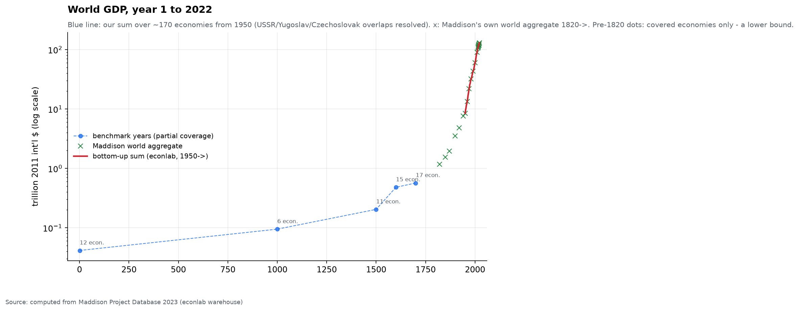
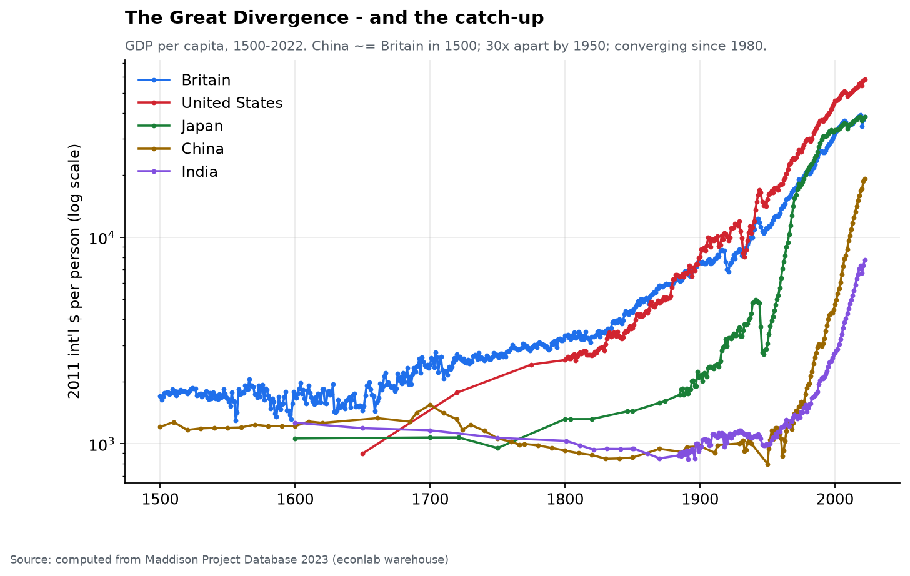
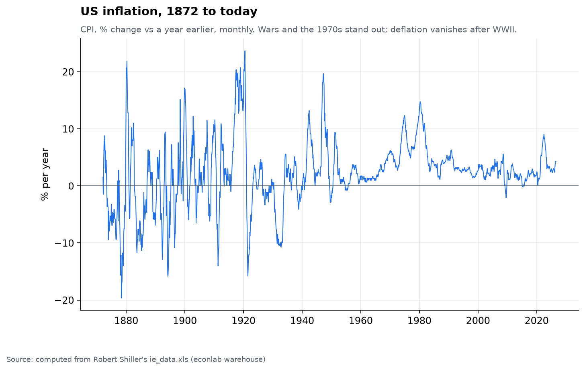
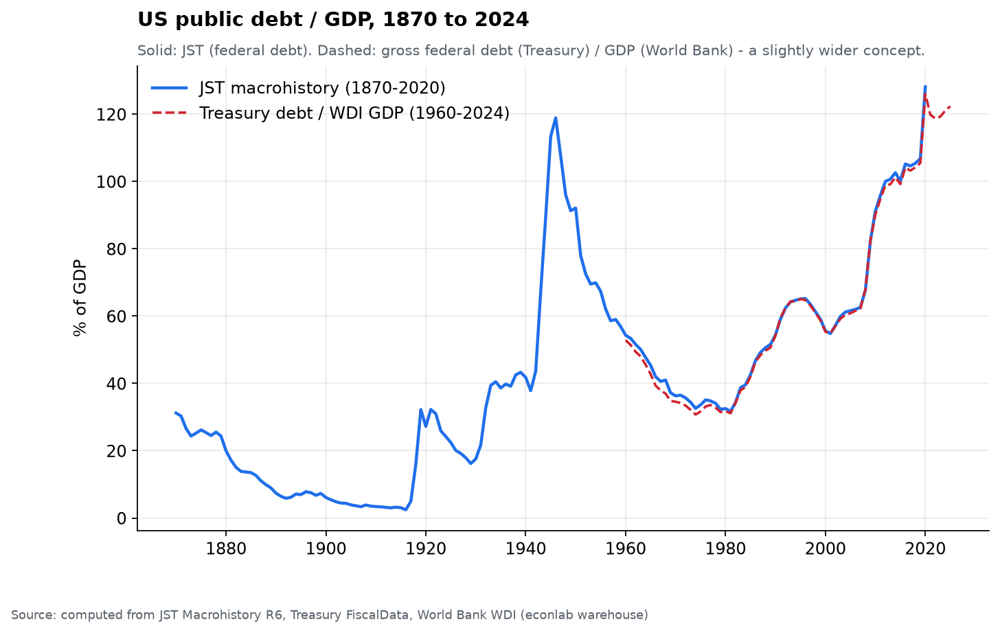

# Chapter 0 — The Lab: how every number in this report is made

*World Economy Lab. This chapter is the methods section: the machine, the
rules it obeys, and the live inventory of what it holds. Everything after
this page is output of this machine — no claim in the report rests on a
number the repo cannot recompute. Reproduce with:
`uv run econ refresh && uv run pytest && uv run econ figures && uv run econ compile`.*

## What this is

One question started this project: **how does the world economy actually
work, and how did it get this way?** — answered not by reading other
people's research but by pulling the primary data and performing the
calculations here. Two deliverables came out of it:

1. **This report** — thirteen chapters where every figure and every claim is
   computed in-repo from primary sources, and the load-bearing findings are
   pinned by automated tests.
2. **The apparatus** — a DuckDB warehouse + analysis library exposed as a
   CLI (`econ`) and an MCP server (`econlab`), so any question about the
   state of the world economy can be answered with a live query, long after
   the prose was written.

## The machine

```
data/raw/<source>/      immutable downloads + _manifest.json (url, sha256, fetched_at)
        │  parse()
data/tidy/<source>/     obs.parquet + catalog.parquet  (uniform long format)
        │  econ refresh
data/warehouse.duckdb   rebuilt artifact — never the source of truth, delete freely
        │
CLI · MCP · analysis/   chapters, figures, tests all read only the warehouse
```

Every source is a connector (`src/econlab/sources/<name>.py`) with the same
contract — `fetch(force)` (cached, manifest-stamped) and `parse()` → tidy
parquet. One uniform observation schema serves everything from Roman-era
GDP to yesterday's S&P close: `(series_id, entity, year, date?, value)`.

**The rules the machine enforces** (each one exists because breaking it
produced a real error during construction):

- **Unit discipline.** Every series carries a `unit_type` (nominal_usd ·
  real_usd · ppp_usd · lcu · index · percent · ratio · count · physical);
  transforms refuse to mix them. Unit confusion is the #1 failure mode in
  this domain. All magnitudes are normalized to base units at ingest (IMF
  billions, PWT millions, UN-WPP thousands, BACI thousand-USD all become
  ones).
- **Entity namespaces.** ISO3 for countries, `WLD` and regions flagged as
  aggregates (never summed with countries), `US-<postal>`/`US-<FIPS>` for
  states and counties, `$TICKER` for companies (the `$` exists because
  Sunoco's ticker SUN once shadowed the Soviet Union), slugs for market
  instruments, house names for dynasties.
- **Historical honesty.** Maddison carries USSR/Czechoslovakia/Yugoslavia
  in parallel with their successors — world sums must partition them or
  double-count; pre-1950 bottom-up world sums are lower bounds (colonial
  economies missing). Successor logic lives in one audited function.
- **Curated vs computed.** Numbers that live in archives and scholarship
  rather than APIs (Rothschild partnership capital, dynasty peaks, royal
  lines, the Land Report 100) enter as *curated tables* with per-row
  citations, and charts hatch or flag those bases — the reader always
  knows which kind of number they are looking at.
- **Tests pin claims.** The sanity suite re-derives the report's headline
  findings from the warehouse with generous tolerances — if a source
  revision or code change moves a finding, the build fails before the
  prose lies. It also guards against silently frozen sources (the
  Treasury's classic foreign-holders file stopped updating in 2023; a test
  now asserts recency on its replacement).
- **Free data only.** Every source is free; the only credential in the
  project is an optional FRED API key in `.env`.

## The inventory (live)

29 sources · **2,973 series** · **14.96M observations** · 9,922 entities ·
year 1 CE → 2101. Plus relational sidecars that don't fit the long format:
`trade` (856,827 bilateral flows), `billionaires`, `landowners`, and the
dynasty tables (`dynasty_peaks`, `deep_survivors`, `royal_lines`).

| Source | What it contributes | Obs | Span |
|---|---|---|---|
| wdi | World Bank WDI — ~1,500 indicators, all countries | 9.0M | 1960–2025 |
| unwpp | UN population 2024 — history + projections | 1.9M | 1950–2101 |
| edgar | SEC XBRL fundamentals, all US filers | 1.7M | 1967–2027 |
| energy | Energy Institute Statistical Review (OWID mirror) | 762k | 1900–2025 |
| pwt | Penn World Table — TFP, capital, labor share | 418k | 1950–2023 |
| wid | World Inequality Database — top shares | 356k | 1800–2025 |
| markets | Index/ticker prices (yfinance) | 147k | 1927–2026 |
| dfa | Fed Distributional Financial Accounts | 134k | 1989–2026 |
| fred | FRED — rates, money, prices | 124k | 1901–2026 |
| imf | IMF WEO via DataMapper (incl. forecasts) | 120k | 1950–2031 |
| jst | Jordà-Schularick-Taylor macrohistory + crises | 112k | 1870–2020 |
| maddison | GDP pc + population from year 1 | 39k | 1–2022 |
| agcensus/agsurvey/nass | USDA land values to 1850; county detail | 22k | 1850–2025 |
| baci | CEPII bilateral trade (also → `trade` table) | 13k | 1995–2024 |
| pinksheet | World Bank commodity prices (energy/metals/ag) | 12k | 1960–2025 |
| shiller | S&P, CAPE, rates, housing | 11k | 1871–2026 |
| bis | BIS debt-service ratios | 7k | 1999–2025 |
| fra | FAO forest ownership | 6k | 1990–2020 |
| boe | Bank of England millennium macrodata | 3k | 1086–2016 |
| census | US homeownership | 348 | 1967–2024 |
| bls | CPI item detail FRED lacks (childcare, TVs, physicians) | 1.3k | 1990–2025 |
| tic | Treasury TIC foreign holders (live table) | 273 | 2025–2026 |
| fiscaldata | US federal debt, every year | 237 | 1790–2025 |
| cofer | IMF reserve-currency composition (SDMX 2.1) | 220 | 1995–2025 |
| dynasties | Curated: Rothschild/Fugger/Medici accounts, royal lines | 109 | 1397–1904 |
| usland | US land cover + Land Report 100 | 20 | 2015–2023 |
| billionaires | Forbes real-time list snapshot | — | 2026 |

## First light

The four figures that proved the pipeline end-to-end on day one — each a
famous result reproduced from raw primary data, kept as the permanent
smoke test:






## The apparatus

```bash
uv run econ refresh [-s SOURCE] [--force]   # fetch -> tidy -> rebuild warehouse
uv run econ search "gdp per capita"         # full-text over the catalog
uv run econ get maddison/gdppc -e USA -e CHN --start 1900
uv run econ sql "SELECT ..."                # read-only DuckDB
uv run econ coverage                        # what's inside
uv run econ figures                         # regenerate all 115 report figures
uv run econ compile                         # -> report/world-economy-report.html
uv run pytest                               # 153 tests: findings must reproduce
```

The same verbs are exposed to any Claude session as MCP tools
(`econ_search`, `econ_get`, `econ_compare`, `econ_sql`, `econ_chart`,
`econ_coverage`) via the user-registered `econlab` server — ask a question
in plain language, get an answer computed from this warehouse.

**To extend:** write `sources/<name>.py` (SOURCE, TITLE, `fetch`, `parse`),
register it in `sources/__init__.py`, `econ refresh -s <name>`, then pin
what it claims with a test. Every chapter in this report started exactly
that way.

## The chapters

The report runs in **four movements**. Chapters 1–4 build the **macro picture** —
how the world got rich, and the national, monetary, and structural forces that
govern it. Chapters 5–8 turn to **distribution** — who owns what, who owes what,
and what it costs to live. Chapters 9–10 trace **power** — the institutions and
chokepoints where a few control the many. Chapters 11–12 **close** with
persistence across centuries and a synthesis that ends on the live state of the
world.

| # | Chapter | The question it answers |
|---|---|---|
| | ***I · The macro picture*** | |
| 1 | The Long Arc | How did the world get rich — when, where, how fast? |
| 2 | Nations & Macro | How do national economies grow, inflate, and borrow today? |
| 3 | Money & Markets | What do assets really return, and what do credit booms do? |
| 4 | Structural Forces | Demography, energy, trade — the currents that set the ceiling |
| | ***II · Distribution — who has what*** | |
| 5 | The Debt Ledger | Who owes, who owns the debt, and who pays the interest? |
| 6 | Wealth & People | How is income and wealth distributed — here and globally? |
| 7 | Who Owns the Land | Who holds the ground itself — acres, values, over time? |
| 8 | What Things Cost | Prices of home, fuel, food, care — vs the paycheck, by place & income |
| | ***III · Power — who controls*** | |
| 9 | Balance Sheets of Power | How financial institutions evolved, and the power they now hold |
| 10 | The Chokepoints | Where a few entities control the many — across the whole economy |
| | ***IV · Persistence & synthesis*** | |
| 11 | Dynasties | Can wealth and power persist across centuries? |
| 12 | How It Got This Way | The synthesis — 1870→today, plus the live state of the world |

*Next: Chapter 1 — The Long Arc: two millennia of growth in a single line, and where the hockey stick really begins.*
