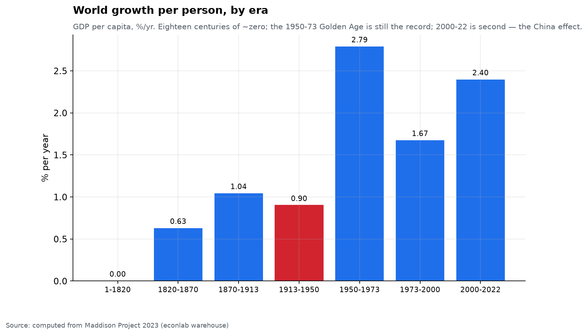
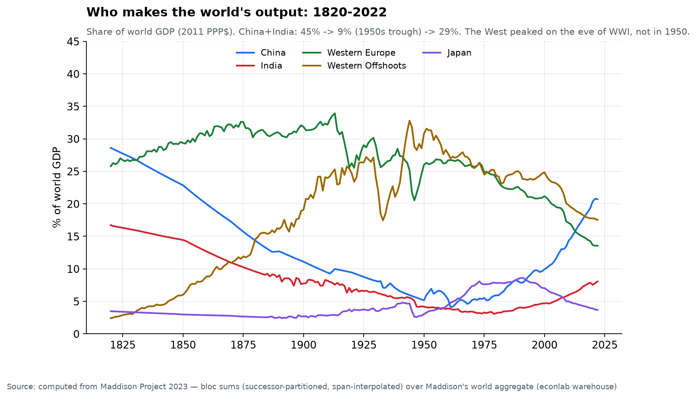
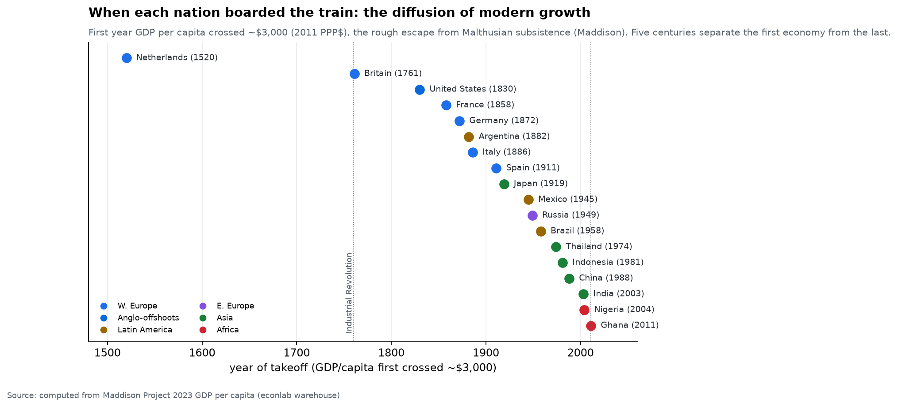
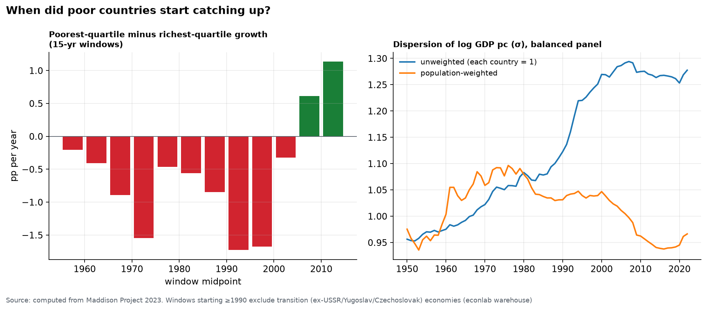
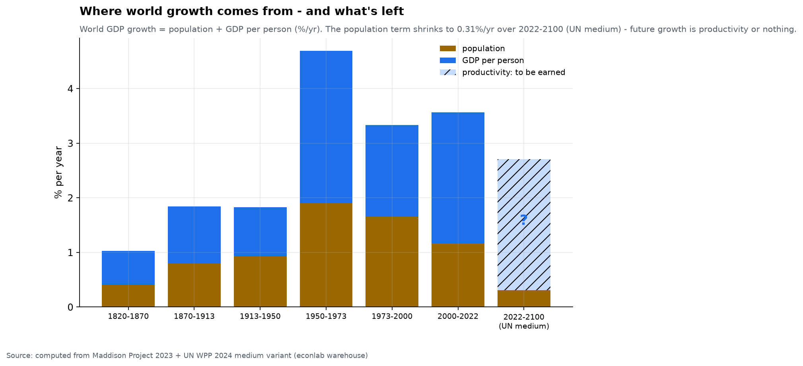

# Chapter 1 — The Long Arc: growth over two millennia

*World Economy Lab. Generated 2026-07-17 from the econlab warehouse; every
number computed in-repo (module: `econlab/analysis/ch01_longarc.py`; pinned by
tests). Reproduce: `uv run econ refresh && uv run econ figures`.*

**The questions.** Is growth normal? Who has made the world's output across
history, and how violently has that changed? When — precisely — did poor
countries start catching up? And where can growth still come from once
population stops growing?

## Method, briefly

- GDP in 2011 international (PPP) dollars throughout (Maddison Project 2023).
- Bloc numerators are our own sums over the successor-partitioned country
  panel (USSR/Yugoslavia/Czechoslovakia counted exactly once), with each
  economy log-interpolated *within its own observed span* — India's 1700→1884
  benchmark gap is bridged, never extrapolated.
- The denominator for shares is Maddison's own world aggregate (1820→2022),
  so missing colonial-era small economies don't inflate bloc shares.
- Convergence uses the **rolling poor-vs-rich growth gap** (poorest-quartile
  minus richest-quartile mean growth over 15-year windows) as the primary
  statistic — regression betas from a 1990 baseline are poisoned (see F3).

## F1 — Growth is the anomaly

From year 1 to 1820, income per person grew ~**0.002%/yr** (covered
economies) — eighteen centuries to go roughly nowhere. Then:

| Era | World GDP pc growth (%/yr) |
|---|---|
| 1–1820 | ~0.00 |
| 1820–1870 | 0.63 |
| 1870–1913 | 1.04 |
| 1913–1950 | 0.90 |
| **1950–1973** | **2.79 — the record ("Golden Age")** |
| 1973–2000 | 1.67 |
| 2000–2022 | 2.40 — second place, the China era |

Two things worth internalizing: the postwar Golden Age remains unmatched, and
the much-mourned "slow modern era" (2000–2022) was actually the second-fastest
period in human history for the *average* person — because of where the
growth happened, not who reports the news.

## F2 — Who makes the world's output

Computed shares of world GDP:

| | 1820 | 1913 | 1950 | 1973 | 2022 |
|---|---|---|---|---|---|
| China + India | **45.3%** | 17.6% | 9.4% | 8.6% *(trough)* | **28.8%** |
| West (W. Europe + Offshoots) | 28.2% | **59.2%** *(peak)* | 56.8% | 52.6% | 31.1% |
| Japan | 3.5% | 2.9% | 3.0% | 8.1% | 3.7% |

Three corrections to folklore, straight from the data: the West's share
peaked **on the eve of WWI**, not in 1950; China+India's trough was in the
*1970s*, not 1950; and in 2022 the two Asian giants and the whole West
produce nearly the same share of world output — roughly the 1820
configuration, restored after a two-century detour. (In MPD2023's 2011$ the
1820 China+India share is 45%, a bit below the 49% folklore number that came
from the older 1990$ benchmarks — revisions matter.)

## F3 — When each nation boarded the train

If growth is the anomaly (F1), *when did the anomaly reach each country?*
Computing the first year each nation's GDP per capita crossed ~$3,000
(2011 PPP$) — a rough marker for having escaped Malthusian subsistence and
entered sustained modern growth — dates the "takeoff," and the diffusion is
one of the most orderly patterns in all of economic history:

| Era | Who boarded |
|---|---|
| 1500s–1700s | **Netherlands (1520)**, **Britain (1761)** — the first modern economies |
| 1800s | United States (1830), France (1858), Germany (1872), Argentina (1882), Italy (1886) |
| Early 1900s | Spain (1911), **Japan (1919)** — the first non-Western takeoff |
| Mid 1900s | Mexico (1945), Russia (1949), Brazil (1958) |
| Late 1900s | Thailand (1974), Indonesia (1981), **China (1988)** |
| 2000s | **India (2003)**, Nigeria (2004), Ghana (2011) |

**Five centuries separate the first economy from the last.** The train left
the station in the Dutch Golden Age, gathered the rest of Western Europe and
its offshoots through the 1800s, reached Japan in 1919, and only in the last
two generations swept through Asia and began to touch Africa. Two readings
of the same picture: the pessimist sees how *late* most of humanity boarded;
the optimist sees that the interval between takeoffs is *collapsing* — Britain
needed a century to follow the Netherlands, but China, India, and Nigeria
boarded within twenty years of one another. Growth is still diffusing, and
faster than ever. (The last stragglers — much of Sub-Saharan Africa — are the
unfinished business of Chapter 5's poverty map.)

## F4 — Convergence began around 2000, not 1990 (and not 1950)

The poor-minus-rich growth gap is **negative in every 15-year window from
1950 to 2000** — poor countries fell further behind for half a century,
worst in 1985–2000 (**−1.73pp/yr**). The flip comes with windows starting
around 2000: **+0.61pp** (2000–15), **+1.14pp** (2005–20).

**The poisoned-1990 lesson** (why naive analysis gets this wrong): a β
regression from a 1990 base gives ≈ 0 (+0.02) — but 1990 starting incomes
for the ex-Soviet bloc are pre-collapse peaks, and Africa's worst decade
straddles the start. Shift the base and β turns properly negative: −0.13
(1995→), −0.20 (2000→), −0.21 (2005→). Transition economies are excluded
from post-1990 windows in our primary statistic; the base-year sensitivity
is reported rather than hidden.

## F5 — Countries diverged; people converged

The two σ paths (right panel above) tell different true stories:
**unweighted** dispersion (each country = 1) *rose* from 0.96 (1950) to 1.28
(2022) — the typical pair of countries is further apart than ever. But
**population-weighted** dispersion peaked around 1980 (~1.08) and has fallen
to 0.97 — because the two most populous countries on Earth moved from the
bottom of the distribution toward the middle. "Is the world converging?" has
two honest answers; state which average you mean.

## F6 — The population engine is switching off

World GDP growth decomposes as population + productivity (per-capita)
growth. The population term: 1.90%/yr in the Golden Age → 1.16 in 2000–22 →
**0.31%/yr for 2022–2100** (UN medium). World population peaks at
**10.29 billion in 2084** — computed directly from the WPP projection in the
warehouse — and declines thereafter. Every future era's growth bar is
productivity, or it is nothing.

## Caveats

- Pre-1820 "world" values are sums over covered economies (12 at year 1) —
  lower bounds with the right order of magnitude, labeled as such.
- Benchmark-gap interpolation (China 1820–70, India 1700–1884) smooths
  within-span paths; it cannot invent turning points between benchmarks.
- σ paths use the balanced 1950∩2022 panel (142 economies) to avoid
  entry/exit artifacts; the level is sensitive to that choice, the shape not.
- All shares inherit MPD2023's 2011-PPP benchmarks; older 1990$ numbers
  differ by a few points (see F2).

*Next: Chapter 2 — Nations & macro today: growth, inflation, debt, and
imbalances across ~200 countries, with the IMF's forward projections.*
