# Chapter 2 — Nations & macro today

*World Economy Lab. Generated 2026-07-19; module `econlab/analysis/ch02_nations.py`,
findings pinned by tests. IMF projection years are shaded in figures.*

**The questions.** What does the country landscape look like right now — who
is catching up and who is falling behind? How was inflation tamed, and how
fragile was the taming? Whose debts ratcheted? How does the world's money
actually flow between nations — and what currency does it flow in? And under
it all: does the arithmetic (r−g) make any of this sustainable?

## F1 — The development landscape, 2023–25

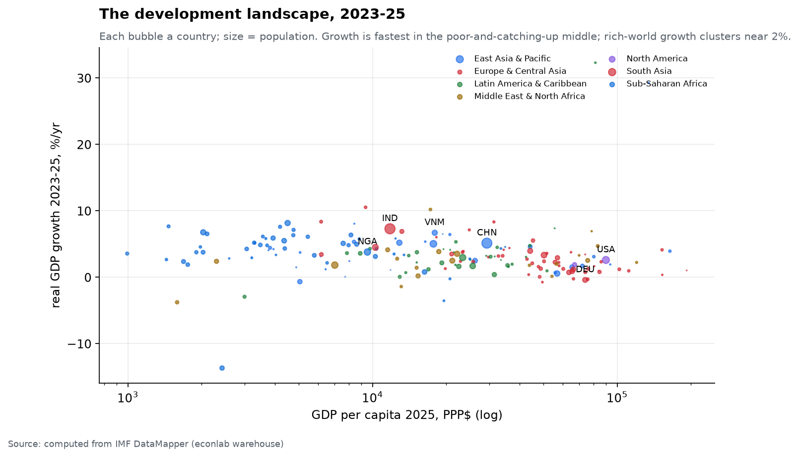

Growth now lives in the poor-and-catching-up middle: India ~7%/yr, Vietnam and
much of South/Southeast Asia 5–7%, China ~5% (slowing but still double the
rich world), the US ~2.7%, Germany hugging zero. Sub-Saharan Africa grows in
the 3–7% range — but from income levels 30–80× below the frontier, and (Ch. 1)
only since ~2000 fast enough to close the gap. The cross-section is a snapshot;
the story is the *movie* — which is F2.

## F2 — The convergence ladder: three fates

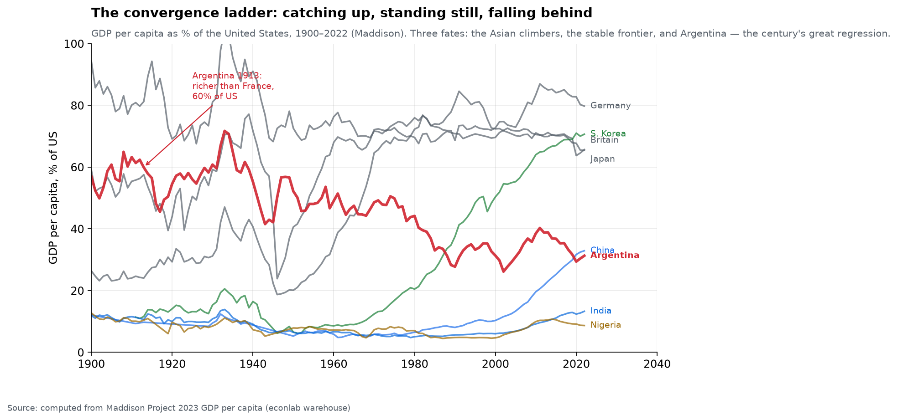

Run each country's GDP per capita as a share of the US, 1900→2022 (Maddison),
and every nation falls into one of three fates:

- **The climbers.** South Korea went from ~10% of US income in 1960 to **71%**
  today — the single greatest catch-up in the record. China ran from ~5% (1980)
  to **33%**; the whole East Asian miracle is this one line-shape repeated.
- **The frontier.** Germany (80%), Japan (65%), Britain (66%) have oscillated
  in a band just below the US for a century — the rich world converged *with
  each other* long ago and has stayed there.
- **The regression.** And then **Argentina** — the cautionary tale of the
  whole chapter. In **1913 Argentina was at 60% of US income, richer per head
  than France or Germany**, one of the ten richest countries on Earth. It then
  spent a century falling: 52% (1950), 44% (1980), **31% (2022)** — down to
  China's level. No war destroyed it; a century of institutional dysfunction,
  inflation, and default did. Convergence is not automatic, and development can
  run in reverse.

## F3 — The taming of inflation, and the relapse

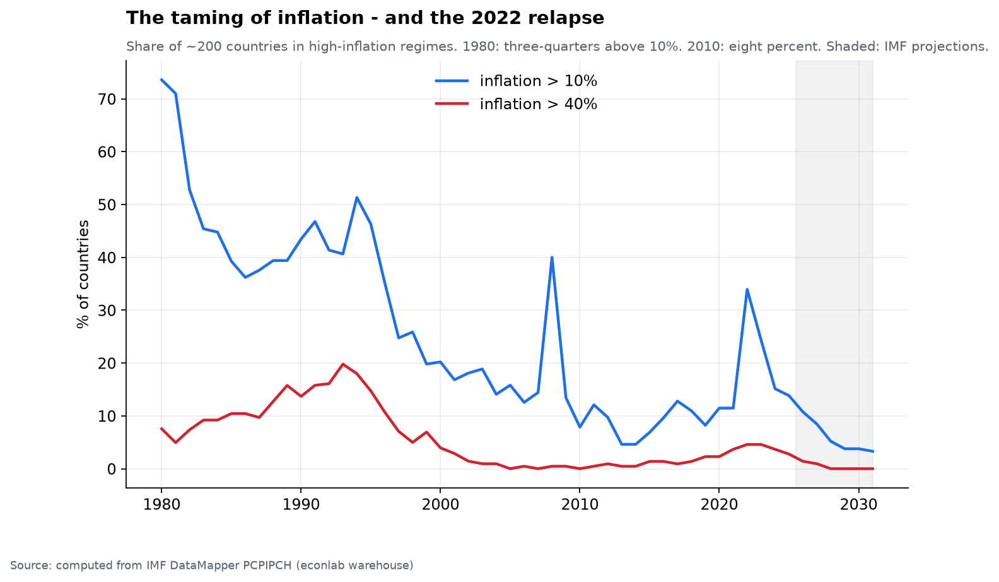

Computed from ~200 countries' CPI paths:

- **1980: 74% of countries had inflation above 10%**; 12 above 40%.
- **2010: 8%** above 10%, none above 40% — the great disinflation was global,
  not just Volcker's America.
- **2022: 34%** above 10% again — the largest relapse since the early 1990s —
  fading to 14% by 2025.

The catalog of catastrophes (worst WEO country-years) shows what the tail
looks like when it fails completely:

| Country | Year | Annual CPI |
|---|---|---|
| Venezuela | 2018 | **65,374%** |
| DR Congo | 1994 | 23,773% |
| Venezuela | 2019 | 19,906% |
| Nicaragua | 1987 | 13,110% |
| Bolivia | 1985 | 11,750% |
| Peru | 1990 | 7,482% |

Every one is a fiscal collapse financed by the printing press. **Inflation's
extreme tail is always a fiscal phenomenon** — a government that cannot tax or
borrow enough prints the difference, and the currency dies.

## F4 — The debt ratchet

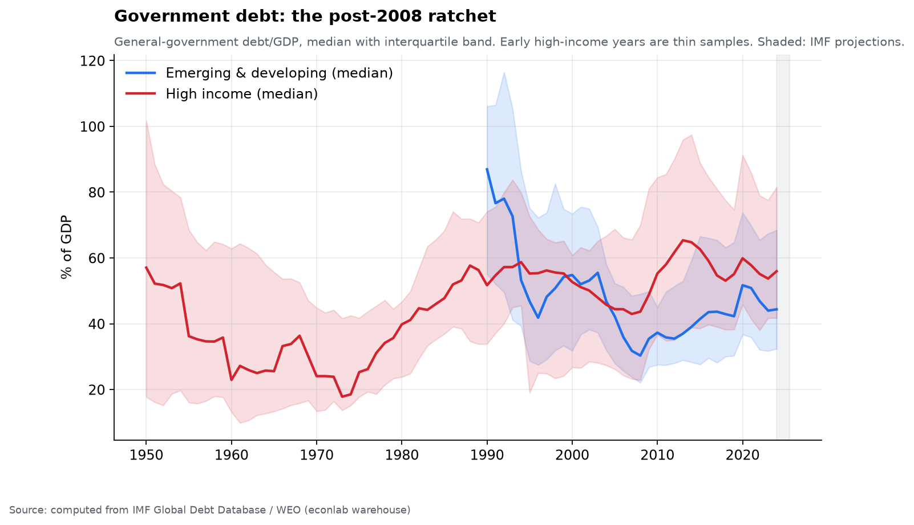

Median general-government debt/GDP for high-income countries: 40% (1980) →
43% (2007) → **60% (2020)** → 56% (2024). Each crisis ratchets the level up;
no peacetime consolidation has ever brought it durably back down. Emerging
economies run structurally lower ratios (39% median, 2024) — not prudence, but
harder borrowing constraints and periodic restructurings (the sovereign
default ledger is Chapter 5). Whether these levels are dangerous depends
entirely on F7's r−g.

## F5 — Global imbalances: the world lends to one country

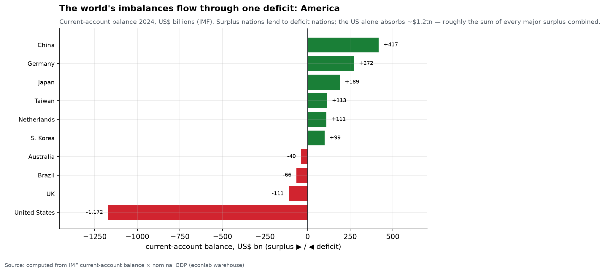

Money flows between nations through the current account — a surplus country is
lending to the rest of the world, a deficit country borrowing from it. In 2024
the surpluses cluster in the exporters and agers: **China +$417bn, Germany
+$272bn, Japan +$189bn**, Taiwan, Netherlands, Korea. And on the other side of
the ledger, absorbing nearly all of it, sits one country: **the United States,
−$1,172bn** — a deficit roughly equal to *the sum of every major surplus
combined*.

This is the modern monetary order in one bar chart. The world's savers
(export-led Asia, surplus Europe, the oil states) send their capital to the
US, which runs the deficit that lets everyone else run a surplus, and pays for
it by issuing the world's reserve asset — Treasuries. It is stable as long as
the surplus nations keep wanting dollars. Which raises F6.

## F6 — What the world holds: dollar dominance, slowly eroding

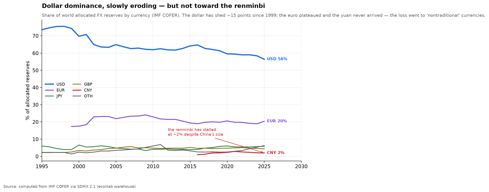

The currency composition of the world's ~$12-trillion of official FX reserves
(IMF COFER), the hardest measure of monetary hegemony there is:

| | USD | EUR | JPY | GBP | CNY |
|---|---|---|---|---|---|
| 1999 | **71%** | 18% | 6% | 3% | — |
| 2025 | **56%** | 20% | 6% | 4% | **2%** |

Two facts, both important. First, **the dollar's dominance is real but
eroding** — down ~15 points in a quarter-century, a slow structural drift as
central banks diversify. Second, and more surprising: **the loss has not gone
to the renminbi.** Despite China being the world's largest exporter and second
economy, the yuan has stalled at ~2% of reserves — capital controls and an
unconvertible currency keep it from reserve status. What actually gained were
the "nontraditional" currencies (Canadian and Australian dollars, the Swiss
franc, and a rising "other" bucket): the world is hedging *away* from the
dollar, but toward a basket, not toward a single successor. There is no
challenger; there is only diversification.

## F7 — r − g: the quiet variable that decides everything

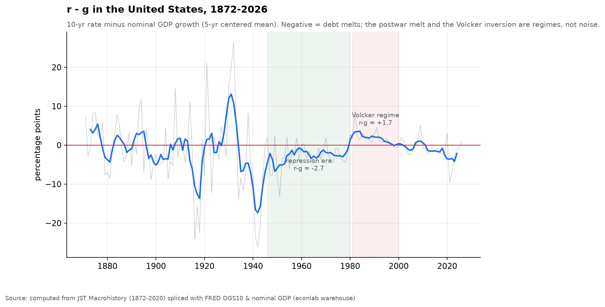

Whether the debts of F4 melt or compound depends on the gap between the
interest rate and nominal growth. Computed for the US, 1872→2026, the regimes
are stark:

| Era | mean r − g |
|---|---|
| 1880–1913 (classical) | −0.9pp |
| 1919–1939 (interwar deflation) | **+1.9pp** |
| 1946–1980 (financial repression) | **−2.7pp** — the WWII debt *melted* |
| 1981–2000 (Volcker regime) | **+1.7pp** — debt compounds |
| 2001–2020 | −0.5pp |
| 2024–26 (current) | ≈ **−1.3pp** (10Y ~4.3% vs nominal growth ~5.5–6%) |

The postwar miracle of "growing out of" 119% debt/GDP was mostly *melting*
out of it: a decade of negative real rates did what no budget surplus ever
has. Today's configuration (US public debt ~121% of GDP, r−g mildly negative)
is stable only while growth and inflation stay above the Treasury curve — a
bet, not a law, and the same bet the whole imbalance system in F5 quietly
depends on.

But the "r" in that table is the *market* 10-year — not what the Treasury actually
pays. Because the government continuously rolls over a stock of old, low-coupon
debt, its **effective funding cost is a slow-moving average** that lags the market
by years.

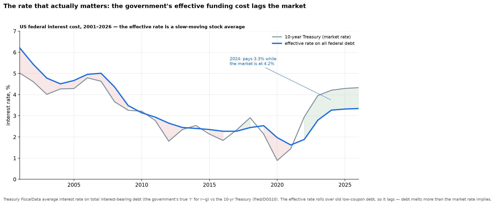

In 2024 the market 10-year sat at **4.2%** while the Treasury's **effective rate on
all its debt was just 3.3%** — nearly a point cheaper — and through the 2010s the
effective rate held near 2.3–2.5% as it slowly ground down old high-coupon bonds.
This *sharpens* the melt: measured against the rate the government truly pays,
current r−g is closer to **−2pp** than the −1.3pp the market rate implies, and the
melt reverses only years after yields do (the effective rate did not bottom until
2021, long after market yields had). But the lag cuts both ways — as the cheap
2020–21 borrowing matures into today's higher coupons, the effective rate is
climbing back toward the market, so the melt is real but **decaying**.

## F8 — Tracing the money out: how far US public funds reach

F5 showed the world lending *to* America. Trace the arrow the other way — how far
does US public money reach *out* into the world? Take the most direct channel,
bilateral development aid, and the ledger is striking:

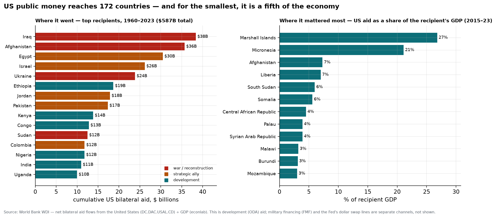

Since 1960 the United States has sent **$587 billion in bilateral aid to 172
countries** — roughly nine in ten nations on Earth. *Where* it went is US foreign
policy written as a spreadsheet: the biggest lines are the **wars** (Iraq $38B,
Afghanistan $36B, Ukraine $24B and rising), the **Camp David settlement** that has
anchored the Middle East since 1979 (Egypt $30B, Israel $26B, Jordan $18B), and a
long tail of **development** across sub-Saharan Africa and South Asia (Ethiopia,
Kenya, Congo, Nigeria). The money follows the geopolitics of each decade — Vietnam
and India in the 1960s, the Camp David allies after 1979, Iraq and Afghanistan
through the 2000s, Ukraine now.

But the number that shows *impact* is not the dollar total — it is aid **as a share
of the recipient's own economy.** For the smallest and most fragile states, a line
item in the US budget is a fifth of national income: the Compact of Free
Association islands — **Marshall Islands (27% of GDP), Micronesia (21%), Palau
(4%)** — are effectively US-funded, and fragile states like **Afghanistan, Liberia,
South Sudan and Somalia** run **6–7% of GDP** on American aid. For them,
Washington's appropriations bill is a macroeconomic variable.

Two caveats keep this honest, and both point the same way — *understated*. This is
**development (ODA) aid only.** It misses **military financing** (the weapons money
that is most of what Israel and Egypt actually receive, and much of Ukraine's), and
it misses the largest, least-visible channel of all: the **Federal Reserve's dollar
swap lines**, which at their 2008 and 2020 crisis peaks lent foreign central banks
several hundred billion dollars each — the US acting as the world's lender of last
resort in dollars (a channel this report has not yet computed). Add those, and the
reach of US public money into the world is far wider than even this map of 172
countries suggests.

## F9 — The biggest channel of all: the Fed as the world's lender of last resort

Aid is the *visible* channel. The largest one is nearly invisible, costs almost
nothing in the end, and reaches the entire dollar-funded planet: the **Federal
Reserve's central-bank liquidity swap lines**. The mechanism is simple and
strange. Outside the United States, banks hold *trillions* of dollars of assets
funded by *short-term dollar borrowing* — the offshore "eurodollar" system — yet
no foreign central bank can print dollars. When that funding market freezes, the
Fed lends dollars to a foreign central bank (taking its currency as collateral,
so the Fed bears no FX risk), which relends them to its own banks; the dollars
come back, with interest, at maturity. It is the US quietly acting as the
world's central bank.

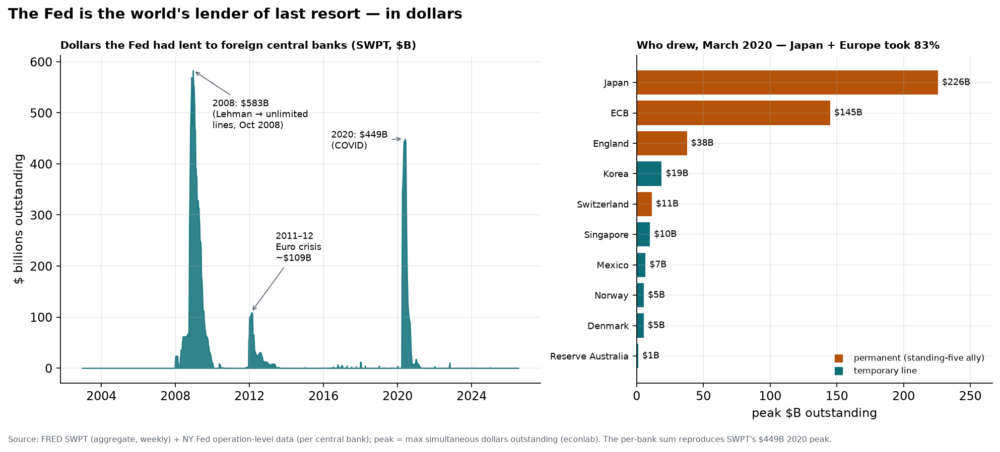

The scale, in the two crises that mattered, is staggering. After Lehman in
September 2008 the balance exploded from **$62B to $583B in about twelve weeks**
— the Fed removed all limits on October 13, 2008 and made the lines *unlimited* —
and at the peak those swaps were **26% of the Fed's entire balance sheet**: a
quarter of it was dollars out on loan to *foreign* central banks. A smaller
mountain (~$109B) rose during the 2011–12 euro crisis, and a third (**$449B**) in
the COVID dollar crunch of March 2020. To feel the size, set it against F8: the
Fed lent **more to the world in the single week of December 2008 ($583B) than the
United States gave in development aid to all 172 countries over the entire 63
years** ($587B). Its crisis liquidity in *one week* ≈ six decades of the aid
budget.

*Who* the dollars flowed to is computable to the counterparty (the per-bank sum
reproduces the aggregate to the dollar). In March 2020, **the Bank of Japan
($226B) and the ECB ($145B) took 83%** of it — not because Japan and Europe are
poor, but because *their* banks are the largest dollar borrowers outside America.
The rest went in smaller lines to England, Korea, Switzerland, Singapore, Mexico.

And here is the quiet power. A swap line is **membership in the dollar's inner
circle**, granted at US discretion in three tiers. Five central banks hold
**permanent, unlimited** lines (since October 2013): the ECB, the Bank of Japan,
the Bank of England, the Swiss National Bank, and the Bank of Canada — the
closest allies. A rotating set gets **temporary** lines when Washington chooses
to open them (Korea, Singapore, Mexico, Brazil, Australia, and a few others, in
2008 and again in 2020). Everyone else is **outside** — including, pointedly, the
world's second-largest economy: **China has never had a Fed swap line.** For the
excluded, 2020 offered only a lesser substitute (the FIMA repo facility — post
your Treasuries, get dollars), and China's own answer has been to build a
parallel **renminbi** swap network of its own across ~40 countries. So the
deepest reach of US public money into the world is not a grant or a weapon; it is
the Fed's willingness — or refusal — to backstop your banking system in dollars.
It is repaid, it is discretionary, and it is the single most powerful lever the
United States holds over the global economy (a chokepoint in the sense of
Chapter 10, operated from Chapter 9's balance sheet).

## F10 — The dollar erodes — but there is no successor

F9 ended with China, shut out of the Fed's dollar network, building a renminbi
one of its own. Does it work? The reserve managers of the world have voted, and
the answer is a quiet no.

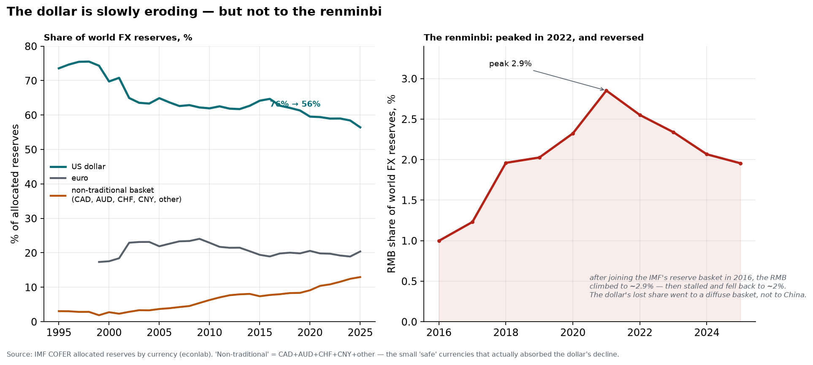

The dollar's dominance *is* eroding — its share of world FX reserves has fallen
from **76% (2000) to 56%** today, the slow "de-dollarization" the headlines love.
But follow where the lost share went, and the story inverts. The **euro** has held
flat at ~20% for two decades. The **renminbi**, after joining the IMF's reserve
basket in 2016, climbed to a peak of just **2.9% in 2022 — and has since fallen
back to ~2%.** It is not the successor; it stalled and reversed, tripped by
Beijing's capital controls and the lesson every reserve manager took from the 2022
freezing of Russia's reserves (hold too much of a currency and its issuer can turn
it off). What actually absorbed the dollar's decline is a **diffuse basket of
small, safe currencies** — the Canadian and Australian dollars, the Swiss franc,
the Korean won — which together rose from ~3% to **~13%**.

So the "monetary cold war" is real but lopsided. The US holds the swap lines that
backstop the world (F9); China holds a payments network and swap lines of its own,
but a currency the world still will not hold in size. De-dollarization is
happening — as *diversification*, not *replacement*. There is, as yet, no second
dollar.

## The economics of war: how it "profits," and who

There is a phrase that sounds like cynicism until you look at the data — *war is
profitable*. It is hard to square with what war plainly **is**: cities flattened,
a generation killed, capital burned. How can destruction pay? The resolution is
that **"profitable" and "destructive" are not opposites — they are answers to
different questions.** War does not create wealth; a tank builds nothing, and a
bombed city must be rebuilt from zero. What war does is **move** wealth — violently,
and toward a specific and predictable set of hands. The cost falls on one group
(the dead, the occupied, the taxpayer); the profit accrues to another (the supplier,
the arms-maker, the oil producer, the creditor). The lab can name those hands.

## F11 — Same war, opposite fates: the arsenal and the battlefield

Start with the cleanest case in the record — World War II — and simply plot each
combatant's real GDP per capita through it.

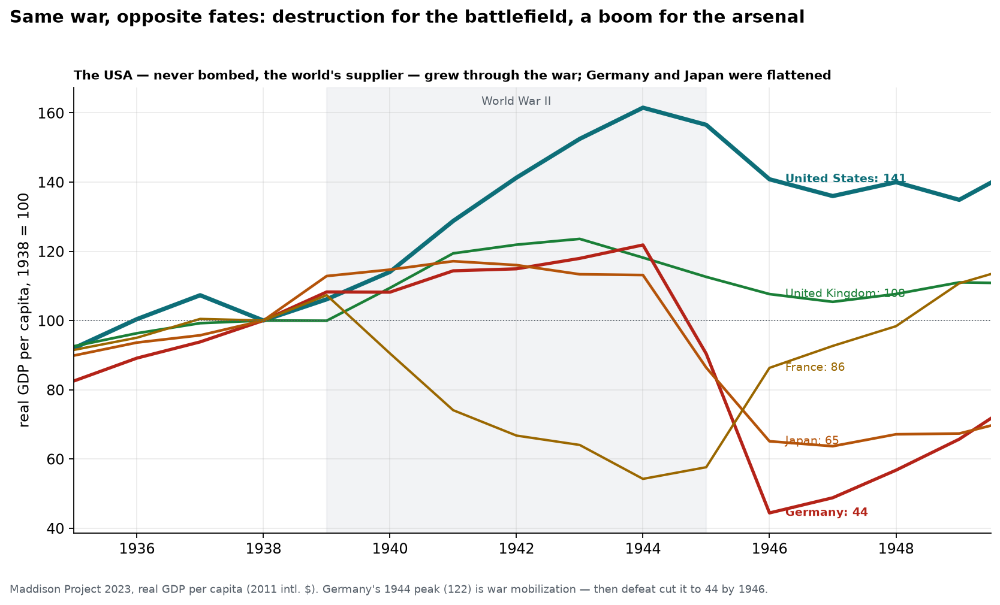

The lines split by **geography, not by who won**. The United States — never bombed,
turned into the "arsenal of democracy" that sold and lent to everyone — grew its
real output per head by **61% by 1944** and was still **41% above pre-war** in 1946.
Britain, the supplier that wasn't invaded, ended the war **8% above** its 1938 level.
And the nations the war was *fought on* were gutted: France, occupied, fell to
**54%** of its 1938 level in 1944; Japan
to **65%**; Germany, whose war-mobilized economy actually *peaked* at 122 in 1944
(mobilization is stimulus — hold that thought), then **collapsed to 44%** in defeat.
Same war, a three-fold gap in outcome. This is the first and biggest "who profits":
**the nation far enough from the fighting to be the supplier rather than the
battlefield.** WWII is why the 20th century became American — the war transferred
the role of world creditor and hegemon across the Atlantic. War is profitable to
the arsenal.

## F12 — Who profits from selling war: a five-nation oligopoly

The second set of hands sells the weapons themselves — and it is a remarkably
short list.

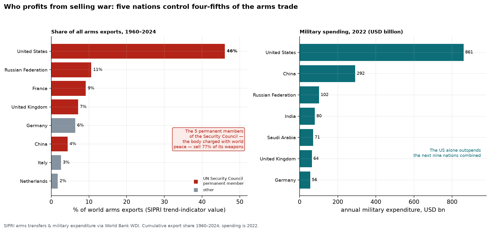

Across 1960–2024, the **United States alone supplied 46%** of all the arms exported
on Earth; the **top five sellers account for 79%**. And the punchline writes itself:
**five of the top six arms exporters are the permanent members of the UN Security
Council** — the United States, Russia, France, the United Kingdom and China — the
five nations vested with the authority to *keep world peace*. Together the P5 sell
**77% of the world's weapons.** The same states also buy the most: US military
spending in 2022 was **$861 billion**, more than the next nine nations combined.
This is why the "military-industrial complex" is not a slogan but an accounting
identity — a permanent, government-guaranteed market whose suppliers are
concentrated in a handful of powers. War is profitable to the arms industry, and to
the states that house it.

## F13 — War is the oil shock: the fragility you feel at the pump

The third channel is the one you asked about — the way a distant conflict reaches
into an ordinary household. It runs through commodities, and above all through oil.

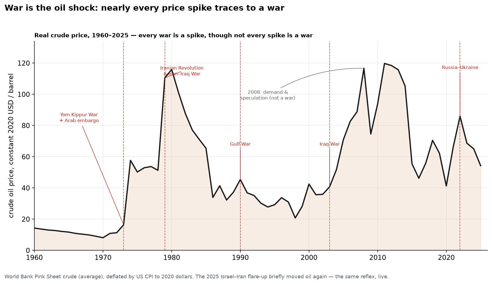

Deflate the crude price to constant dollars and lay the wars on top, and the
correlation is almost embarrassing: the **1973** Yom Kippur War and Arab embargo
took real oil up **~5×**; the **1979** Iranian Revolution and Iran–Iraq War drove it
to its all-time real peak; the **1990** Gulf War, the **2003** Iraq War and the
**2022** invasion of Ukraine each printed a spike. *Nearly every war is an oil
shock* — though, honestly, **not every shock is a war** (2008 was demand and
speculation). The 2025 Israel–Iran flare-up you noticed was the same reflex firing
in real time. Here the profit flows to **oil producers and traders**, and the cost
is paid by every consumer of energy at once — which is exactly why a skirmish in the
Gulf can feel like a tax on the entire world economy. That fragility is not a bug;
it is the mechanism.

## F14 — Widen the shock: which wars spike *food*, not just fuel?

Oil is only the most visible war commodity. Run the same real-price test across
fifteen commodities — energy, grains, metals, precious metals, softs — for the four
big war shocks, and a sharper rule appears.

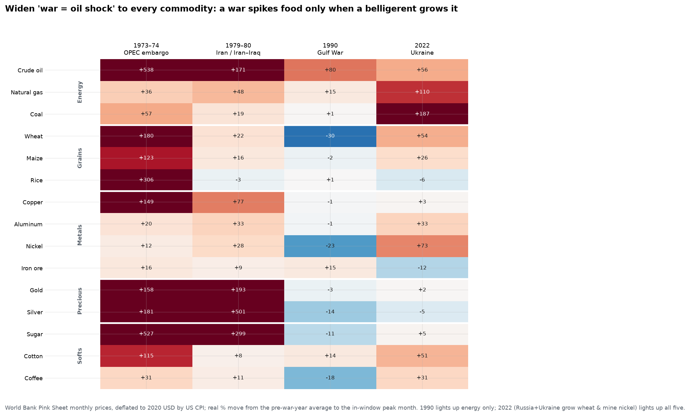

**A war spikes a commodity when a belligerent supplies it — and not otherwise.**
The **1990 Gulf War was a pure energy shock**: real oil jumped **+80%** and gas
+15%, but wheat *fell* **−30%**, maize −2%, nickel −23% — the war frightened the oil
market while the recession it helped trigger pulled everything else *down*. The
**2022 invasion of Ukraine is the opposite — it lit up every category at once**:
coal +187%, gas +110%, oil +56%, **wheat +54%, maize +26%**, nickel +73%, cotton
+51%. The difference is who was fighting: Russia and Ukraine are not just an oil
region, they are among the world's largest exporters of **wheat, natural gas, and
metals** (Russian nickel and palladium, Ukrainian grain), so the war taxed the
world's bread and heat, not only its fuel. The 1970s OPEC shocks were broadest of
all (oil +538%, but also sugar +527%, rice +306%, and — as the 1979–80 panic turned
monetary — silver +501%, gold +193%). The lesson generalizes the oil finding: **the
reach of a war into your daily life is set by the export basket of the combatants.**

## F15 — The cost side: the peace dividend that only the US gave back

War's profit has a mirror image — its standing *cost*, the share of a nation's
output it pours into arms even in peacetime. That cost is not fixed; it collapsed
once in living memory.

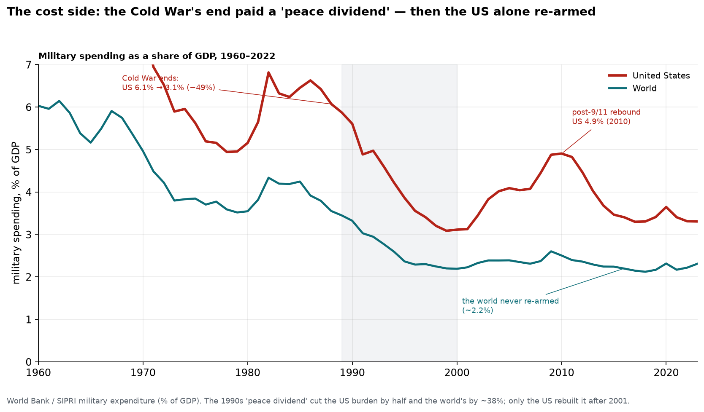

When the Cold War ended, the world cashed a **"peace dividend."** US military
spending fell from **6.1% of GDP in 1988 to 3.1% by 1999 — nearly halved** — and the
world's from 3.6% to ~2.2% (−38%). Those freed points of GDP flowed into the 1990s
expansion. But the two lines then diverge permanently: after 9/11 the **US rebuilt
its burden to 4.9% (2010)** and has stayed near the world's double, while the rest
of the world **never re-armed**, holding around 2.2% for two decades. The "arsenal"
of F11 is also the one that keeps paying to *be* the arsenal — carrying a military
burden the countries it protects have quietly declined to match.

**So: how is war profitable, and to whom?** Not to humanity, and not on net — the
world is poorer for it. War is profitable the way a fire is profitable to the people
who sell water: it is a **transfer**, from the many who bear its cost to the few
positioned to sell what it consumes — **weapons, oil, and credit** — and to the
nations far enough from the front to be the supplier rather than the battlefield.
The layman's confusion is not confusion at all; it is the correct moral intuition
(war destroys) meeting the accountant's fine print (destruction has beneficiaries).
Both are true, and the data shows exactly where the seam between them lies.

## Caveats

- GDD high-income medians before ~1970 rest on thin samples (n≈8 in 1950).
- WEO inflation is annual-average CPI; hyperinflation peaks measured monthly
  are far worse than the annual figures shown.
- The convergence ladder uses Maddison GDP-per-capita; pre-war Argentina and
  other early figures carry wider error bands than the modern series, but the
  *direction* (a 30-point fall relative to the US) is unambiguous.
- COFER covers only *allocated* reserves (~93% of the total); the "unallocated"
  remainder is not attributed to currencies. Shares are of the allocated pool.
- r−g uses the 10-yr Treasury as "r" — the government's actual average funding
  rate is smoother and lags the market rate.
- The WWII GDP series (F11) are Maddison reconstructions with wide error bands in
  the 1940s (especially the USSR, omitted here); the *direction and scale* of the
  arsenal/battlefield split, not any single year, is the finding.
- SIPRI arms-export shares (F12) are "trend-indicator values" — a volume proxy for
  military capability transferred, not a dollar sales figure; they measure who arms
  the world, not industry revenue. Cumulative 1960–2024 folds the USSR into Russia.
- The war/oil link (F13) is associational, and oil is only the most visible war
  commodity (wheat, gas and metals spike too); 2008 shows the correlation is not
  one-to-one.

*Next: Chapter 3 — Money & markets: what assets have actually returned over the long run, and the price of risk.*
