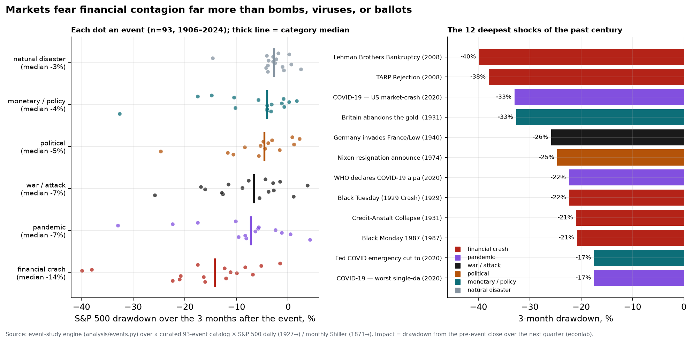
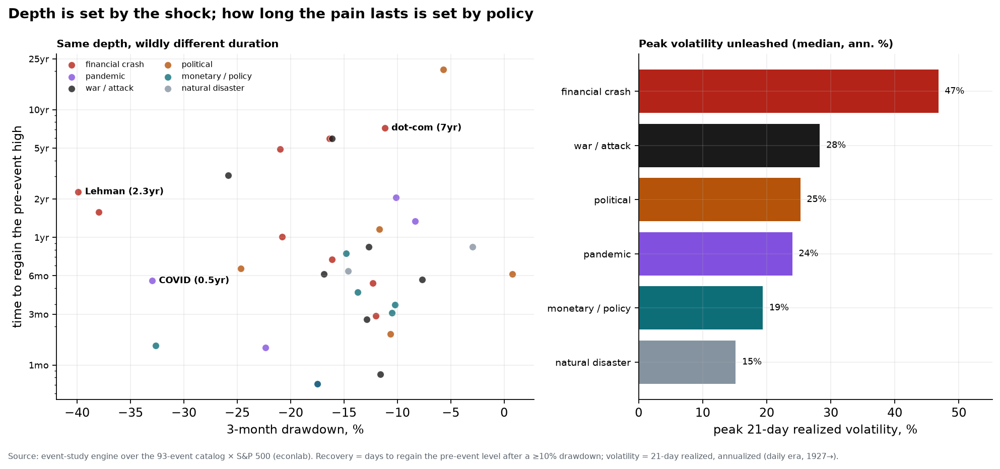
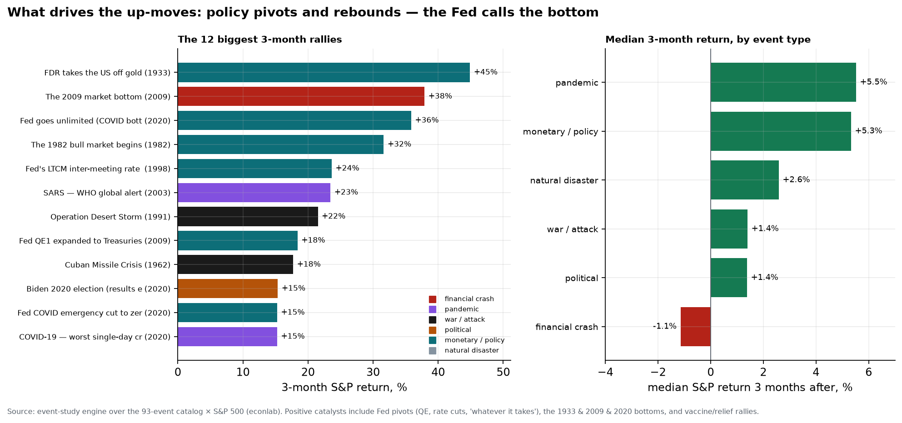

# Chapter 3 — Money & markets

*World Economy Lab. Generated 2026-07-19; module `econlab/analysis/ch03_money.py`,
findings pinned by tests.*

**The questions.** What do assets actually return over long horizons — and
what risk do you carry for that return? What has happened to the price of
money across three centuries? Do valuations predict anything? What warns of
a crisis before it arrives? This chapter is built almost entirely from two
of the deepest series in the warehouse — Shiller's monthly S&P back to 1871
and the Jordà-Schularick-Taylor macro-history of 18 economies since 1870 —
plus the Bank of England's three-century rate record.

## F1 — The rate of return on everything (reproduced)

Pooled over 16–18 economies, 1870–2020, real annual returns computed from JST
total-return series against each country's CPI:

| Asset | mean real return |
|---|---|
| **Equities** | **6.9%/yr** |
| **Housing** | **6.9%/yr** |
| Government bonds | 2.4%/yr |
| Bills | 1.0%/yr |

The headline of Jordà-Knoll-Kuvshinov-Schularick-Taylor's *Rate of Return on
Everything*, reproduced from primary data: risky assets ≈ 7% real for 150
years — **housing as much as equities, with roughly half the volatility**,
the most under-appreciated fact in the table — and the ~5pp gap over safe
assets **is** Piketty's r > g in asset form. Wealth that is invested
compounds far faster than economies grow (world real GDP ≈ 3%); Chapter 6
shows precisely what that does to the distribution of who owns it.

That 7% is a *pooled average across a century and a half*. What it hides —
the decades you spend waiting for it, and the price of money that sits
underneath it — is the rest of this chapter.

## F2 — Three centuries of the price of money

The "safe" row of F1 is not a constant. The long-term government bond yield —
British consols from 1703, the US 10-year from 1871 — traces a
three-century **downward drift** with one violent interruption:

| | 1703 | 1800 | 1900 | 1946 | 1981 | 2016 | 2024 |
|---|---|---|---|---|---|---|---|
| UK consol | 6.0% | 4.7% | 2.6% | 2.6% | **13.0%** | 2.0% | — |
| US 10-year | — | — | 3.1% | 2.2% | **13.9%** | 1.8% | 4.2% |

For 250 years the cost of long money sat between 2% and 6% and slid gently
downward — the deepening of markets, the taming of default risk, the
accumulation of capital all pushing the same way. Then came the **Great
Inflation of 1965–1982**, which drove both yields to ~14% — the highest in
the entire record — followed by a 40-year collapse to the near-zero rates of
the 2010s. The lesson runs against intuition: **the low rates that framed
every debate of the 2010s were not the anomaly; the double-digit rates of
our parents' era were.** Today's 4% is, in three centuries of context,
almost exactly normal.

## F3 — The catalog of crashes: the price of that 7%

The 7% of F1 is earned by surviving the drawdowns of F3. Deflating the S&P by
the CPI — asking what stocks were *really* worth, not the nominal index —
reveals **12 real drawdowns of 20% or more since 1871**, and the worst were
far worse and far longer than folklore admits:

| Peak | Trough | Real depth | Back to peak | Years underwater |
|---|---|---|---|---|
| Sep 1929 | Jun 1932 | **−81%** | Nov 1958 | **29** |
| Sep 1906 | Dec 1920 | −70% | Sep 1928 | 22 |
| Dec 1968 | Jul 1982 | −63% | Jan 1992 | 23 |
| Aug 2000 | Mar 2009 | −59% | Nov 2014 | 14 |

Two things only the *real* (inflation-adjusted) view shows. First, the
**Great Inflation of 1968–82 was a −63% stock-market crash** — one of the
worst in history — yet it is nearly invisible in nominal charts, because
inflation kept the index numeral rising while it destroyed two-thirds of its
purchasing power. Second, the **dot-com bust and the 2008 crisis were a
single 14-year real drawdown**: the market never regained its 2000 real peak
before 2007 took it down again. The comforting "stocks always come back" is
true — but "back" has twice meant *a quarter-century*, long enough that
whether you retired rich depended less on what you owned than on what decade
you were born. The scatter's diagonal is the whole moral: **the deeper the
crash, the longer you wait.**

## F4 — Valuations predict the decade, not the year

Given F3's stakes, can you see a bad decade coming? Partly. Every month
1881–2016 plotted: starting CAPE (the cyclically-adjusted P/E) against the
*next ten years'* realized real total return. The fit:
**forward return ≈ 13.0 − 0.38 × CAPE** — each CAPE point costs ~0.4pp/yr off
the following decade. The scatter is wide (valuation is nearly useless for
the next *year*), but the decade slope is unmistakable and it is the closest
thing to a law that market forecasting has.

**July 2026: CAPE = 41.4 — the 99th percentile of 145 years.** The naive
fitted implication is ≈ **−2.6%/yr real for 2026–2036**. The only comparable
starting points — 1929, 1998–2000, 2021 — delivered −5 to +2%/yr over their
following decades, and two of the three are the crashes in F3. This is
arithmetic, not prophecy: **high prices on the same cash flows are borrowed
future returns.** The buyer at the 99th valuation percentile is not wrong
that the companies are excellent; he is wrong that excellence bought at any
price still returns 7%.

## F5 — The yield curve: the one alarm that keeps working

If CAPE times the *decade*, the yield curve times the *cycle*. The 10-year
minus 2-year Treasury spread normally sits positive (long money costs more
than short); when it **inverts** — short rates above long — a recession has
almost always followed within 6–18 months. Every US recession since the
series began in 1976 (six of them, shaded) was preceded by an inversion. No
other single indicator has that record.

The most recent inversion — 2022–2024, the deepest since Volcker — duly
appeared on schedule, and then the recession it "predicted" did not arrive
on the usual timetable: the soft landing of 2024–25 is the most interesting
data point on the chart, the possible first false alarm in half a century, or
merely a long lag. We are, in a real sense, still inside this observation.
(As of mid-2026 the curve has re-steepened to about +0.4pp — the classic
post-inversion, mid-easing shape.)

## F6 — Credit booms precede crises (Schularick–Taylor, reproduced)

The curve warns of recessions; credit growth warns of *financial* crises,
the far more dangerous kind. Across 18 economies and 150 years: in the 1–2
years before a systemic banking crisis, trailing 5-year real credit growth
averaged **7.4%/yr**, versus **4.5%** in all other times. A logit of crisis
onset on credit growth (hand-rolled IRLS — no black boxes) gives **β = +4.7**:
moving credit growth from 4.5% to 7.4% roughly **doubles** the near-term
crisis odds off a ~6% base rate. "This time the lending is sound" has been
wrong for a century and a half; rapid credit growth remains the single best
early-warning indicator known — better than prices, better than the curve,
for the specific catastrophe of a banking collapse.

## F7 — Corporate concentration: real, but smaller than folklore

Finally, who earns the profits that all this capital chases? Measured
honestly — top-10 share of the **top-500** US filers' revenues (a fixed
universe; shares of *all* filers would be a coverage artifact, since EDGAR's
XBRL population tripled over 2010–2024) — concentration bottomed in 2018 at
19.4% and has climbed every year since to **22.8% in 2025**. Rising, clearly;
but revenue concentration is far milder than the market-cap concentration
that dominates headlines. Profits and valuations concentrate much faster than
sales — a handful of firms earn a modest share of revenue but a commanding
share of *profit*, which is exactly why the index is top-heavy (Chapter 9
weighs those balance sheets directly).

## F8 — What actually moves markets: a century of shocks

Chapter 10 measured the market's reaction to a *conference* — the Fed's Jackson
Hole symposium moves the S&P 1.4× a normal day; Davos moves it less. Generalize
that method into a reusable **event-study engine** (`analysis/events.py`): given
any date, measure the S&P's drawdown from the pre-event close over the following
quarter. Point it at a curated catalog of **93 major events since 1906** across
six categories, run against daily prices back to 1927 (monthly Shiller data
carries the older ones), and the question — *what actually moves markets: wars,
pandemics, crashes, elections, disasters?* — becomes a computation.

The answer is emphatic and counterintuitive: **markets fear financial contagion
far more than bombs, viruses, or ballots.** Only one category has a consistently
large impact — **financial crashes, at a −14% median 3-month drawdown**, with the
worst tail of all (Lehman −40%, the TARP rejection −38%, 1929, Credit-Anstalt,
Black Monday all between −20% and −40%). Everything else is mild and clusters near
zero: **pandemics and wars ~−7%, political events −5%, monetary/policy −4%, and
natural disasters just −3%** — markets shrug off earthquakes, hurricanes and even
nuclear accidents almost entirely, because the damage is localized and insured.
The geopolitical shocks that dominate the headlines barely register: **Pearl
Harbor −13%, 9/11 −12%, the Cuban Missile Crisis −6%**, most elections and terror
attacks a few percent at most.

Two things qualify the picture. First, the outliers *are* real — COVID (−33%),
the fall of France (−26%), Britain leaving gold (−33%) — so *any* category can
produce a crash when it threatens the financial system or the whole economy, not
just one region. Second, and decisively: for every category *except* financial
crashes, the median S&P is **back in positive territory within three months** —
the dip is transient, and "buy the panic" has been the right trade for wars,
disasters, and elections for a century. Only a genuine financial crash leaves the
market net-down a quarter later, because only a crash breaks the machine that
prices everything else. The apparatus is reusable and interactive: point
`econ event "<date>"` at any date and it reports what the market did next.

## F9 — The aftermath: how long the pain lasts, and what ends it

F8 measured the *hit*. Extend the engine to the *aftermath* — the volatility a
shock unleashes, how long the market takes to climb back to its pre-event high,
and the return over the following year — and a second, more useful story appears.

**Depth and duration are different variables.** COVID and the 1929 crash were
almost exactly as deep (both ~−33% in three months), yet the market regained its
pre-COVID high in **six months** and its pre-1929 high in **twenty-three years** —
the same wound, a 46× difference in how long it bled. A shock's depth is set by
the event; its *duration* is set by what happens next. Lehman took 2.3 years, the
dot-com peak 7, the 1930 Smoot-Hawley tariff (which helped turn a crash into the
Depression) more than 20 — while the sharp, policy-answered shocks (COVID, the
1998 and 2020 Fed pivots) healed in months. And crashes don't just fall furthest;
they unleash the most *fear*: median peak realized volatility of **47%** for
financial crashes, versus 28% for wars and just **15% for natural disasters**,
which markets barely flinch at.

So what *ends* the pain — what drives the moves back up?

Overwhelmingly, **policy.** Of the twelve biggest three-month rallies of the past
century, **seven are Federal Reserve or monetary pivots** — FDR taking the dollar
off gold in 1933 (**+45%**, the largest of all), the Fed going unlimited at the
COVID bottom (+36%), the 1982 Volcker-ease that launched the great bull, the 1998
LTCM cut, the QE1 announcements — and most of the rest are *rebounds* from a low
(the March-2009 bottom, +38%) or "the worst is over" moments (Desert Storm, the
resolution of the Cuban Missile Crisis, the SARS bottom). By event type, every
category has a *positive* median three-month return **except one: financial
crashes** (−1%). Wars (+1.4%), disasters (+2.6%), monetary pivots (+5.3%) and
pandemics (+5.5%) all tend to be bought.

But the tempting lesson — "buy every panic" — is too simple, and the data says
so. Buying the *first* shock of a systemic crash did **not** pay: across the
fifteen deepest drawdowns, the median return a year later was still **−2.5%**,
because the great bears (1929, 2008) kept falling for a year or more. The enormous
rebounds came from the *bottom* — and the bottom is **called by policy**; 2009 and
2020 turned the week the Fed acted. Put the two figures together and the apparatus
delivers one sentence: **markets are wounded by financial contagion and healed by
the central bank — the shock sets the depth, and the Fed sets the duration.**

## Caveats

- JST returns are annual and survivorship-light but not survivorship-free
  (Russia 1917 and similar total losses are absent — real-world equity risk
  is worse than the pooled 7% suggests).
- The crash catalog uses real *price* (dividends excluded, the standard
  drawdown convention); total-return recoveries are somewhat faster because
  reinvested dividends compound through the trough.
- The long-rates series splices UK consols and US Treasuries — two different
  instruments and credits; it shows the *level and trend* of long money, not
  a single continuous asset.
- CAPE regression is descriptive; overlapping 10-yr windows overstate
  statistical precision (the slope, not the t-stat, is the point).
- The yield-curve record is only six US cycles — a strong pattern on a small
  sample; the 2024–25 non-recession may yet revise it.
- Pre-2016 EDGAR concentration remains composition-contaminated even in the
  fixed universe; the post-2018 trend is the reliable part.

*Next: Chapter 4 — Structural Forces: the demographic, energy, and trade currents that set the ceiling on growth.*
