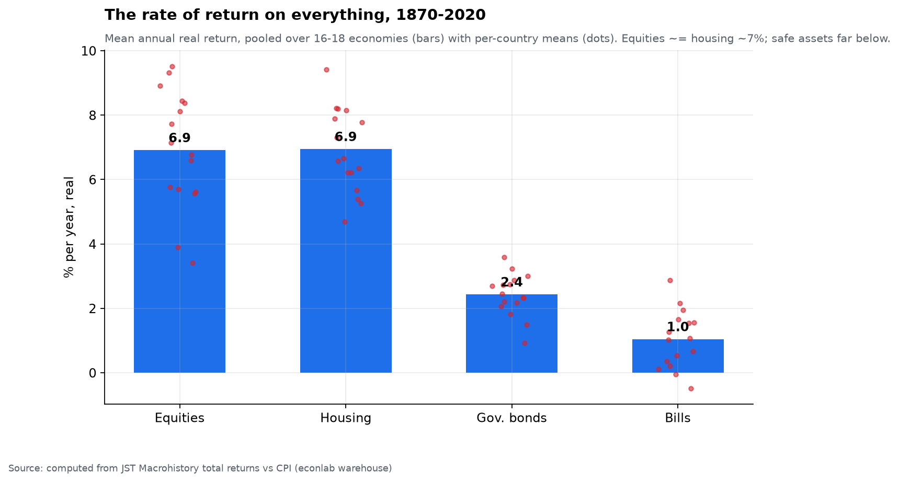
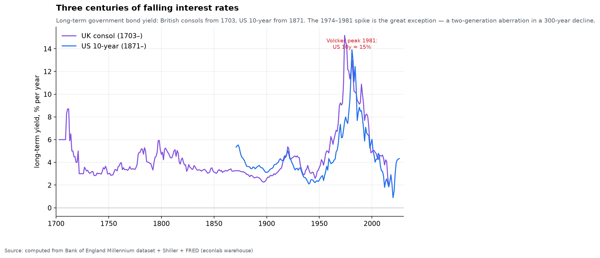
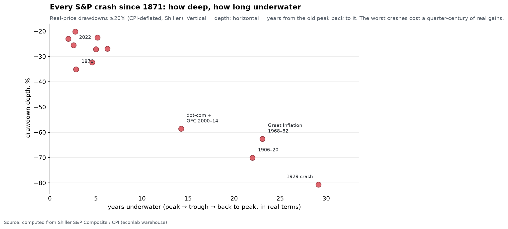
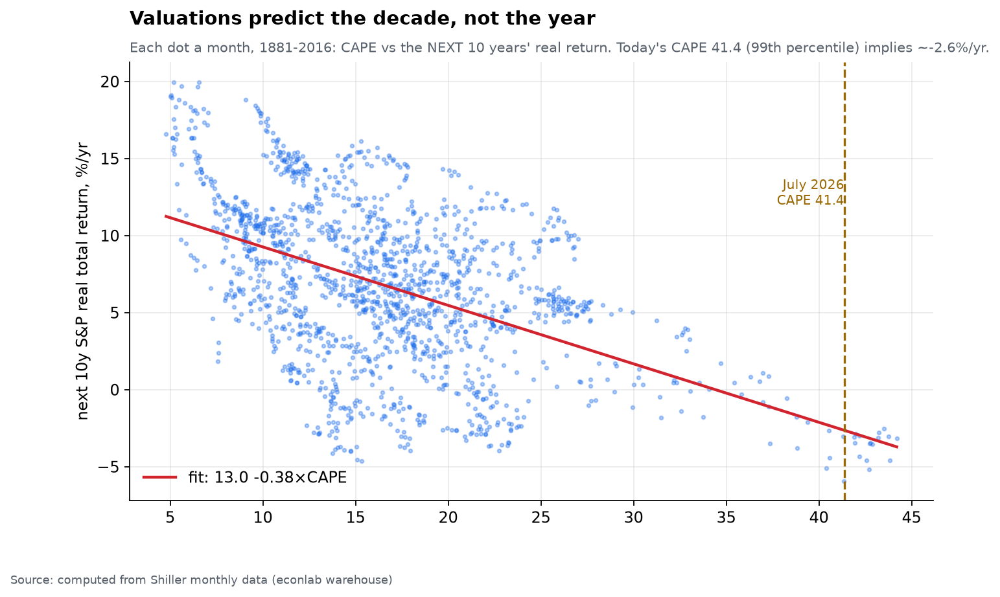
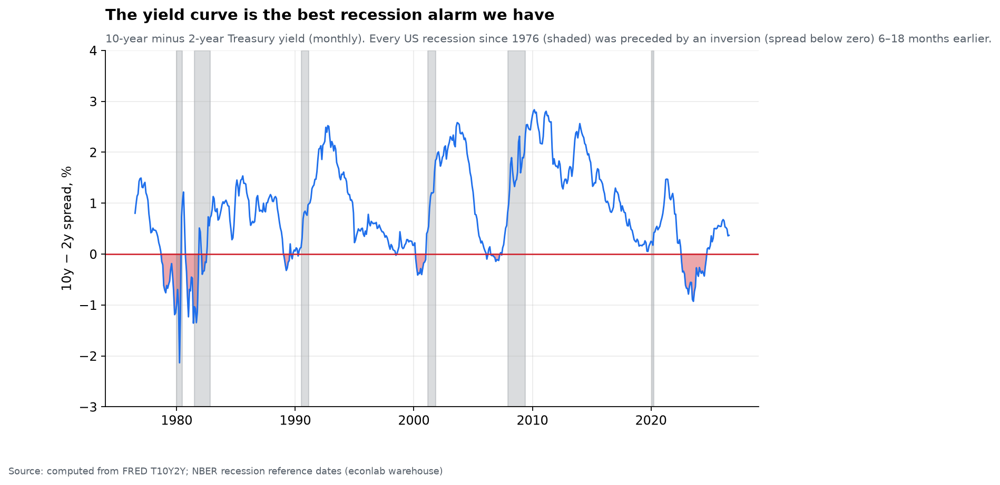
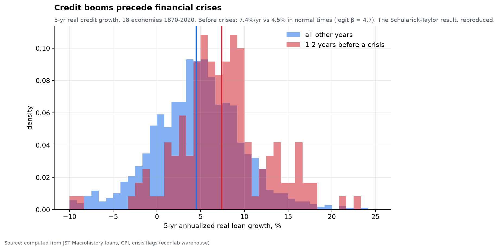
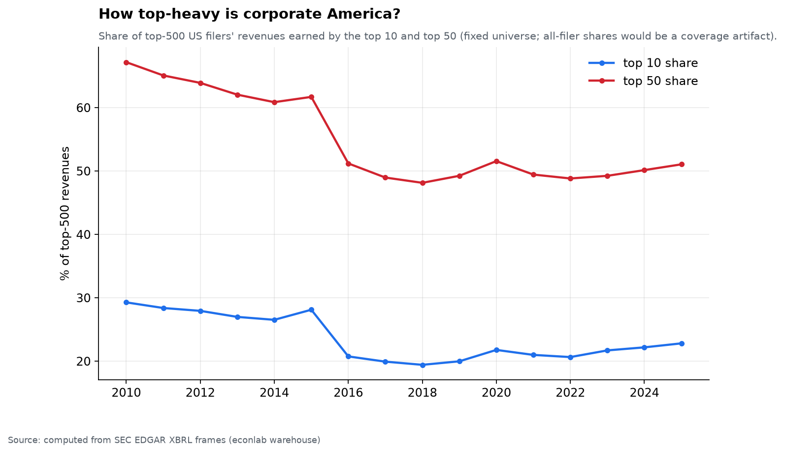

# Chapter 3 — Money & markets

*World Economy Lab. Generated 2026-07-19; module `econlab/analysis/ch03_money.py`,
findings pinned by tests.*

**The questions.** What do assets actually return over long horizons — and
what risk do you carry for that return? What has happened to the price of
money across three centuries? Do valuations predict anything? What warns of
a crisis before it arrives? This chapter is built almost entirely from two
of the deepest series in the warehouse — Shiller's monthly S&P back to 1871
and the Jordà-Schularick-Taylor macro-history of 18 economies since 1870 —
plus the Bank of England's three-century rate record.

## F1 — The rate of return on everything (reproduced)

Pooled over 16–18 economies, 1870–2020, real annual returns computed from JST
total-return series against each country's CPI:

| Asset | mean real return |
|---|---|
| **Equities** | **6.9%/yr** |
| **Housing** | **6.9%/yr** |
| Government bonds | 2.4%/yr |
| Bills | 1.0%/yr |

The headline of Jordà-Knoll-Kuvshinov-Schularick-Taylor's *Rate of Return on
Everything*, reproduced from primary data: risky assets ≈ 7% real for 150
years — **housing as much as equities, with roughly half the volatility**,
the most under-appreciated fact in the table — and the ~5pp gap over safe
assets **is** Piketty's r > g in asset form. Wealth that is invested
compounds far faster than economies grow (world real GDP ≈ 3%); Chapter 5
shows precisely what that does to the distribution of who owns it.

That 7% is a *pooled average across a century and a half*. What it hides —
the decades you spend waiting for it, and the price of money that sits
underneath it — is the rest of this chapter.

## F2 — Three centuries of the price of money

The "safe" row of F1 is not a constant. The long-term government bond yield —
British consols from 1703, the US 10-year from 1871 — traces a
three-century **downward drift** with one violent interruption:

| | 1703 | 1800 | 1900 | 1946 | 1981 | 2016 | 2024 |
|---|---|---|---|---|---|---|---|
| UK consol | 6.0% | 4.7% | 2.6% | 2.6% | **13.0%** | 2.0% | — |
| US 10-year | — | — | 3.1% | 2.2% | **13.9%** | 1.8% | 4.2% |

For 250 years the cost of long money sat between 2% and 6% and slid gently
downward — the deepening of markets, the taming of default risk, the
accumulation of capital all pushing the same way. Then came the **Great
Inflation of 1965–1982**, which drove both yields to ~14% — the highest in
the entire record — followed by a 40-year collapse to the near-zero rates of
the 2010s. The lesson runs against intuition: **the low rates that framed
every debate of the 2010s were not the anomaly; the double-digit rates of
our parents' era were.** Today's 4% is, in three centuries of context,
almost exactly normal.

## F3 — The catalog of crashes: the price of that 7%

The 7% of F1 is earned by surviving the drawdowns of F3. Deflating the S&P by
the CPI — asking what stocks were *really* worth, not the nominal index —
reveals **12 real drawdowns of 20% or more since 1871**, and the worst were
far worse and far longer than folklore admits:

| Peak | Trough | Real depth | Back to peak | Years underwater |
|---|---|---|---|---|
| Sep 1929 | Jun 1932 | **−81%** | Nov 1958 | **29** |
| Sep 1906 | Dec 1920 | −70% | Sep 1928 | 22 |
| Dec 1968 | Jul 1982 | −63% | Jan 1992 | 23 |
| Aug 2000 | Mar 2009 | −59% | Nov 2014 | 14 |

Two things only the *real* (inflation-adjusted) view shows. First, the
**Great Inflation of 1968–82 was a −63% stock-market crash** — one of the
worst in history — yet it is nearly invisible in nominal charts, because
inflation kept the index numeral rising while it destroyed two-thirds of its
purchasing power. Second, the **dot-com bust and the 2008 crisis were a
single 14-year real drawdown**: the market never regained its 2000 real peak
before 2007 took it down again. The comforting "stocks always come back" is
true — but "back" has twice meant *a quarter-century*, long enough that
whether you retired rich depended less on what you owned than on what decade
you were born. The scatter's diagonal is the whole moral: **the deeper the
crash, the longer you wait.**

## F4 — Valuations predict the decade, not the year

Given F3's stakes, can you see a bad decade coming? Partly. Every month
1881–2016 plotted: starting CAPE (the cyclically-adjusted P/E) against the
*next ten years'* realized real total return. The fit:
**forward return ≈ 13.0 − 0.38 × CAPE** — each CAPE point costs ~0.4pp/yr off
the following decade. The scatter is wide (valuation is nearly useless for
the next *year*), but the decade slope is unmistakable and it is the closest
thing to a law that market forecasting has.

**July 2026: CAPE = 41.4 — the 99th percentile of 145 years.** The naive
fitted implication is ≈ **−2.6%/yr real for 2026–2036**. The only comparable
starting points — 1929, 1998–2000, 2021 — delivered −5 to +2%/yr over their
following decades, and two of the three are the crashes in F3. This is
arithmetic, not prophecy: **high prices on the same cash flows are borrowed
future returns.** The buyer at the 99th valuation percentile is not wrong
that the companies are excellent; he is wrong that excellence bought at any
price still returns 7%.

## F5 — The yield curve: the one alarm that keeps working

If CAPE times the *decade*, the yield curve times the *cycle*. The 10-year
minus 2-year Treasury spread normally sits positive (long money costs more
than short); when it **inverts** — short rates above long — a recession has
almost always followed within 6–18 months. Every US recession since the
series began in 1976 (six of them, shaded) was preceded by an inversion. No
other single indicator has that record.

The most recent inversion — 2022–2024, the deepest since Volcker — duly
appeared on schedule, and then the recession it "predicted" did not arrive
on the usual timetable: the soft landing of 2024–25 is the most interesting
data point on the chart, the possible first false alarm in half a century, or
merely a long lag. We are, in a real sense, still inside this observation.
(As of mid-2026 the curve has re-steepened to about +0.4pp — the classic
post-inversion, mid-easing shape.)

## F6 — Credit booms precede crises (Schularick–Taylor, reproduced)

The curve warns of recessions; credit growth warns of *financial* crises,
the far more dangerous kind. Across 18 economies and 150 years: in the 1–2
years before a systemic banking crisis, trailing 5-year real credit growth
averaged **7.4%/yr**, versus **4.5%** in all other times. A logit of crisis
onset on credit growth (hand-rolled IRLS — no black boxes) gives **β = +4.7**:
moving credit growth from 4.5% to 7.4% roughly **doubles** the near-term
crisis odds off a ~6% base rate. "This time the lending is sound" has been
wrong for a century and a half; rapid credit growth remains the single best
early-warning indicator known — better than prices, better than the curve,
for the specific catastrophe of a banking collapse.

## F7 — Corporate concentration: real, but smaller than folklore

Finally, who earns the profits that all this capital chases? Measured
honestly — top-10 share of the **top-500** US filers' revenues (a fixed
universe; shares of *all* filers would be a coverage artifact, since EDGAR's
XBRL population tripled over 2010–2024) — concentration bottomed in 2018 at
19.4% and has climbed every year since to **22.8% in 2025**. Rising, clearly;
but revenue concentration is far milder than the market-cap concentration
that dominates headlines. Profits and valuations concentrate much faster than
sales — a handful of firms earn a modest share of revenue but a commanding
share of *profit*, which is exactly why the index is top-heavy (Chapter 6
weighs those balance sheets directly).

## Caveats

- JST returns are annual and survivorship-light but not survivorship-free
  (Russia 1917 and similar total losses are absent — real-world equity risk
  is worse than the pooled 7% suggests).
- The crash catalog uses real *price* (dividends excluded, the standard
  drawdown convention); total-return recoveries are somewhat faster because
  reinvested dividends compound through the trough.
- The long-rates series splices UK consols and US Treasuries — two different
  instruments and credits; it shows the *level and trend* of long money, not
  a single continuous asset.
- CAPE regression is descriptive; overlapping 10-yr windows overstate
  statistical precision (the slope, not the t-stat, is the point).
- The yield-curve record is only six US cycles — a strong pattern on a small
  sample; the 2024–25 non-recession may yet revise it.
- Pre-2016 EDGAR concentration remains composition-contaminated even in the
  fixed universe; the post-2018 trend is the reliable part.

*Next: Chapter 4 — The Debt Ledger: who owes, who owns the debt, and who pays
the interest.*
