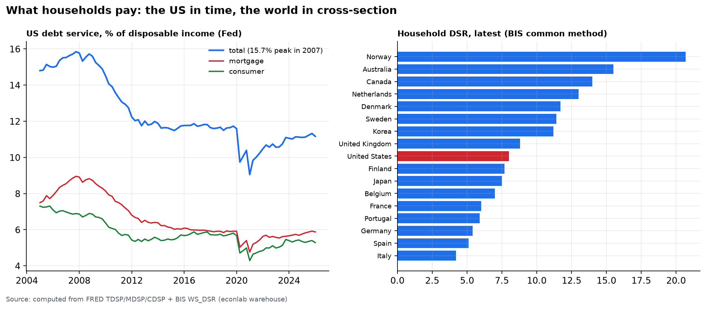
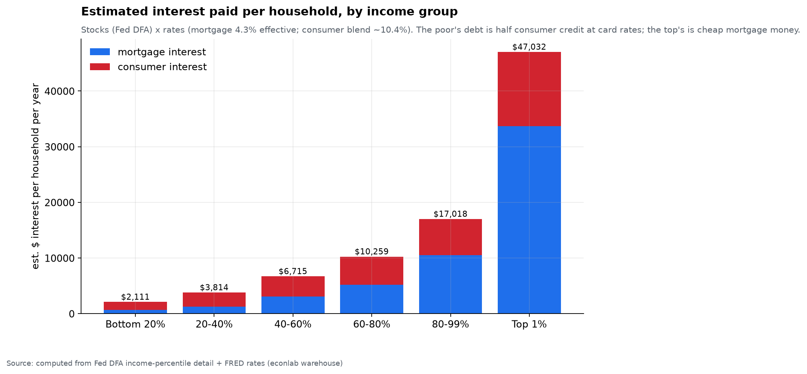

# Chapter 4 — The Debt Ledger: who owes, who owns, who pays

*World Economy Lab. Generated 2026-07-17; module `econlab/analysis/ch04_debt.py`,
findings pinned by tests. Companion to Chapter 6: there the asset side of
power, here the liability side — and the interest that flows between them.*

## F1 — Who owes: nations, people, companies

| Government debt, 2024 | $T | %GDP | per person |
|---|---|---|---|
| United States | **35.4** | 121% | **$104,085** |
| China | 16.7 | 88% | $11,800 |
| Japan | 9.9 | **237%** | $80,039 |
| UK / France / Italy | 3.7 / 3.6 / 3.2 | 101–135% | $52–55k |

Corporate side, from the SEC ledger: the largest borrower in America is
**Fannie Mae ($4.15T of long-term debt)** — the mortgage system itself —
followed by the big banks (Morgan Stanley $363B, BofA $326B, Citi $316B).

## F2 — Who owns the US federal debt

$39.1T decomposed: **$27.0T domestic private investors** (funds, banks,
pensions, households) · **$9.3T foreign** (TIC cross-validates FRED within
1%) · **$4.7T Federal Reserve** (post-QT, from ~$8.5T). America mostly owes
itself; foreign holders peaked at 34% (2014) and have *fallen* to ~24%.

Among foreigners (May 2026): **Japan $1,143B → UK $949B → China $659B**.
Two anti-folklore facts: **China has cut its holdings 36% since early 2022
and now ranks third** — it holds under 1.7% of US federal debt; and the
Belgium/Cayman/Luxembourg entries (~$450B each) are custody chains, not
national positions — the honest limit of ownership data. (Wiring this
uncovered a trap: Treasury's classic `mfh.txt` mirror **froze in March
2023**; the live table is `slt_table5.txt`, and a staleness test now guards it.)

## F3 — What US households pay

Measured (Fed): **11.2% of disposable income** goes to debt service — 5.9pp
mortgage + 5.3pp consumer. The 2007 peak was 15.7%; the 2021 floor 9.8%.

Computed (stocks × rates, assumptions stated): **≈ $1.13T of interest per
year**, ≈ $8,600/household:

| Type | Stock | Rate | Interest/yr |
|---|---|---|---|
| Mortgages | $13.85T | 4.3% *(effective; new loans 6.5%)* | $596B |
| Credit cards | $1.34T | **20.9%** (Fed-measured) | $281B |
| Auto | $1.57T | 7.5% (Fed-measured) | $117B |
| Student | $1.78T | 5.5% (assumption) | $98B |
| Other | $0.46T | 8.0% (assumption) | $37B |

Credit cards: **7% of the debt, 25% of the interest.**

Cross-country (BIS common methodology — right panel): the US at **8.0%** is
mid-pack. **Norway 20.7%, Australia 15.5%, Canada 14.0%** — the
variable-rate, expensive-housing economies — vs Italy at 4.2%. Household
debt stocks agree: Switzerland 125% of GDP, Australia 112%, **US 69%** (the
US actually deleveraged after 2008). America's burden problem is
*composition*, not level.

## F4 — Who pays what: income

| Income group | Interest/hh/yr | Blended rate | Consumer share of debt |
|---|---|---|---|
| Bottom 20% | $2,111 | **7.0%** | 45% |
| Middle (40–60%) | $6,715 | 6.3% | 33% |
| 80–99% | $17,018 | 5.5% | 20% |
| Top 1% | $47,032 | **5.2%** | 14% |

**The poor borrow expensive; the rich borrow cheap.** Nearly half the bottom
quintile's debt is 10–21% consumer credit; 86% of the top 1%'s is ~4%
mortgage money — leverage against assets returning 7% real (Ch. 3). The same
households who own 1.1% of equities (Ch. 6) pay the highest price for money:
the ownership channel, running in reverse.

**Debt → interest → income, year-aligned (2024 debt stocks, 2024 Census mean
money income):**

| Bracket | Income/hh | Debt/hh | Interest/hh | **Debt/income** | **Interest/income** |
|---|---|---|---|---|---|
| Bottom 20% | $18,460 | $28,757 | $2,022 | **1.56×** | **11.0%** |
| 20–40% | $49,380 | $53,552 | $3,778 | 1.08× | 7.7% |
| 40–60% | $84,390 | $103,661 | $6,580 | 1.23× | 7.8% |
| 60–80% | $136,800 | $167,608 | $10,165 | 1.23× | 7.4% |
| Top 20% | $316,100 | $331,155 | $18,226 | 1.05× | **5.8%** |

Both ratios are regressive: the bottom quintile is simultaneously the *most
leveraged relative to income* (1.56×) and pays the *highest interest share*
(11.0% — nearly double the top's 5.8%) — while holding the least debt in
dollars. The middle class clusters at ~1.1–1.2× and ~7.5%. (CPS money income
misses top capital income — true top ratios are even lower — and misses
in-kind transfers at the bottom; group-level rates understate what
low-income borrowers actually pay. The offsets don't cancel: every
refinement steepens the gradient.)

## F5 — The interest burden through time: regressivity is post-2008

Estimated interest ÷ mean bracket income, 1994→2024, with time-varying rates
(mortgage: 10-yr trailing mean of the 30-yr rate as effective-rate proxy;
consumer: card/auto rates weighted by the national stock mix):

| | 1995 | 2007 | 2010 | 2016 | 2021 | 2024 |
|---|---|---|---|---|---|---|
| Bottom 20% | 9.7% | 13.2% | **18.1%** | 9.6% | 9.8% | **12.2%** |
| 60–80% | 10.9% | **13.8%** | 10.6% | 6.6% | 6.1% | 8.2% |
| Top 20% | 9.4% | 11.2% | 9.8% | 6.0% | **4.8%** | 6.3% |

Three eras, one story:

1. **Before 2008 the burden was roughly classless** — in 1995 the gap
   between bottom and top was 0.3pp, and at the credit-boom peak the
   *60–80%* bracket was the most burdened (13.8%): mortgage debt was
   democratic, and so was its cost.
2. **2008–2010 hit the bottom asymmetrically**: their income crashed while
   their debt stayed — the bottom quintile's burden spiked to **18.1%** in
   2010, the worst reading for any group in the record.
3. **The cheap-money decade rescued the mortgage classes and skipped the
   poor.** Refinancing at 3% halved the burden for every bracket that
   borrows against houses (Top 20%: 11.2% → 4.8%). Credit-card rates never
   fell below ~7%, so the bottom quintile's floor stayed ~9.5%. Then
   2022–24 card rates (record ~21%) reopened the scissors: **12.2% vs 6.3%
   — a 6.0pp gap, the widest outside the crisis itself.**

The regressive interest burden is not an eternal fact — it is a *policy
era*. It was manufactured after 2008 by a rescue channel (cheap secured
credit) that the bottom quintile structurally cannot access.

## F6 — Who pays what: race, age, education

- **Race:** Black households carry *more consumer debt per household
  ($48.5k) than White households ($37.3k)* but less than half the mortgage
  debt — **49% of their borrowing is expensive money vs 25%** (blended ~7.3%
  vs ~5.8%). Same interest bills, opposite functions: one builds home
  equity, the other finances the gap. This *understates* the disparity,
  since within each debt type minority borrowers face above-average rates.
- **Age:** the lifecycle peak is 40–54 (**$12,148/hh/yr**); under-40s carry
  a 33% consumer share (student debt); 70+ fades to $3,886.
- **Education:** college households borrow the most (**$219k/hh**) at the
  best composition (24% consumer) — big cheap debt is a privilege of
  collateral and income. No-HS households borrow least, yet 40% of it is
  expensive.

## Caveats

- Interest-only estimates; the 11.2% ratio includes principal. BIS DSR uses
  a common 18-yr amortization assumption (that's *why* it's comparable) —
  the Fed's 11.2% and BIS's 8.0% are both correct answers to different
  questions.
- Mortgage effective rate (4.3%) is a stated assumption — the stock is
  dominated by pandemic-era coupons; using the 6.5% new-loan rate would be
  wrong. Group-level estimates apply aggregate rates to group stocks;
  true within-group rates worsen every disparity shown.
- Student-loan interest is currently distorted by federal
  forbearance/IDR plans; the 5.5% is contractual, not necessarily paid.
