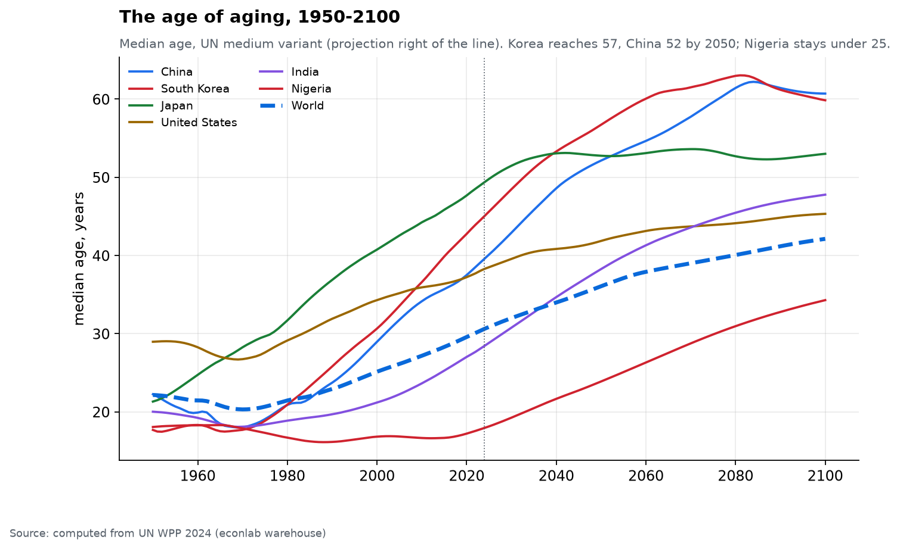
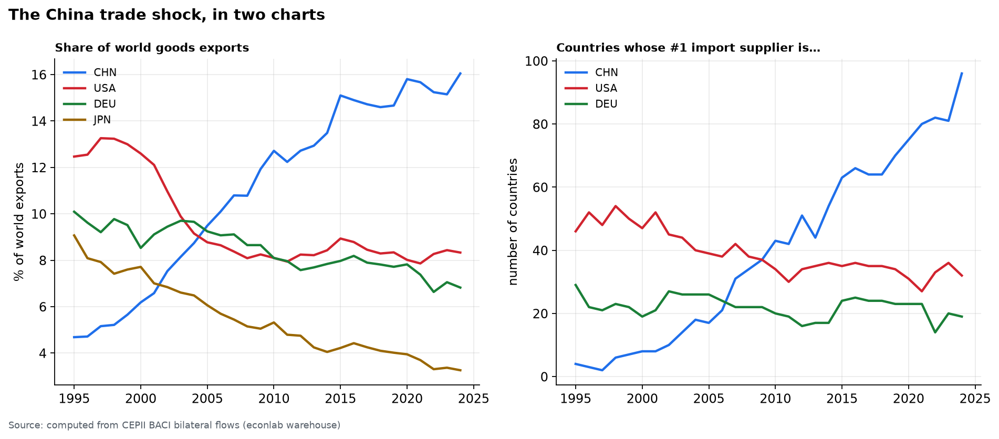
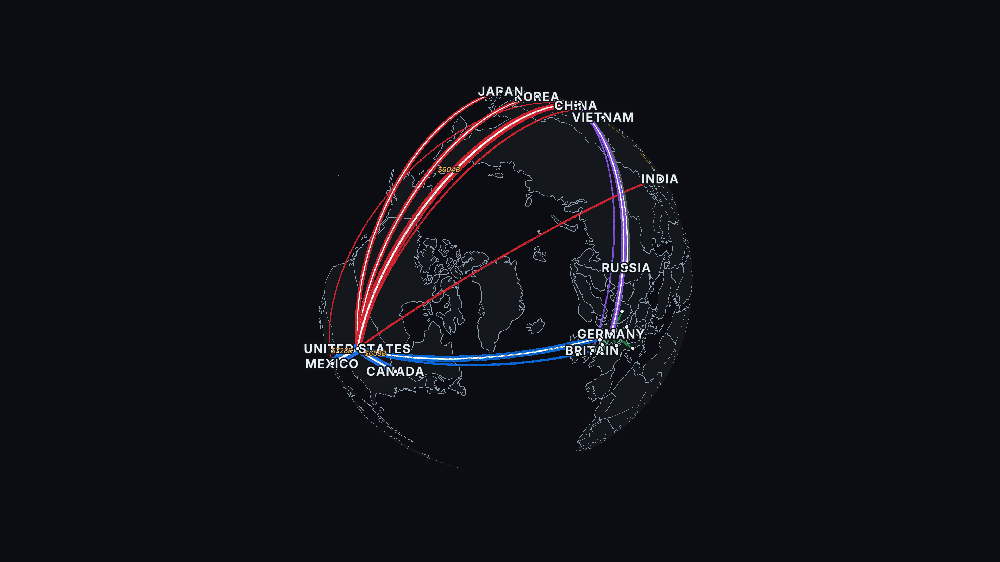
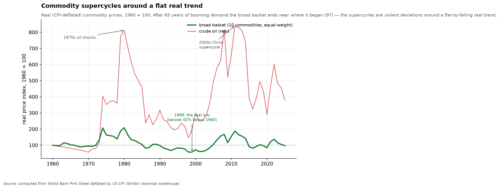
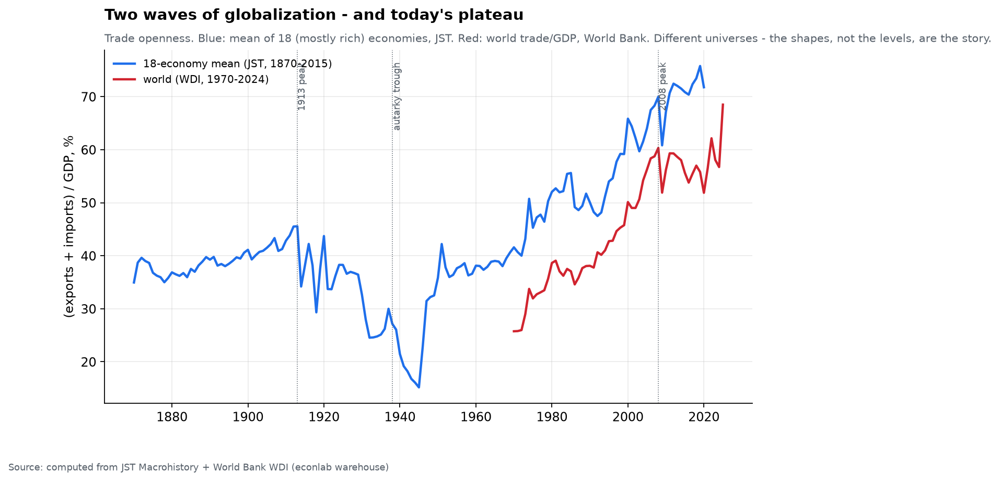

# Chapter 4 — Structural forces

*World Economy Lab. Generated 2026-07-17; module `econlab/analysis/ch04_structure.py`,
findings pinned by tests.*

**The questions.** What do demography, energy, and the geography of trade —
the slow variables — say about the next half-century?

## F1 — The age of aging

Median ages, computed from UN WPP 2024 (medium variant):

| | 1980 | 2020 | 2050 | 2100 |
|---|---|---|---|---|
| South Korea | 20.9 | 42.8 | **56.7** | 59.8 |
| China | 20.9 | 37.5 | **52.1** | 60.7 |
| Japan | 31.7 | 47.7 | 52.8 | 53.0 |
| United States | 29.1 | 37.2 | 41.9 | 45.3 |
| India | 18.9 | 27.0 | 38.3 | 47.8 |
| Nigeria | 16.7 | 17.2 | **23.9** | 34.3 |
| World | 21.5 | 29.6 | 36.1 | 42.1 |

The headline is not that the world ages — it's the *spread*. By 2050 China
is a median-52 society competing with a median-42 America and a median-24
Nigeria. China gets old at income levels far below where Japan and Korea did
— aging before it is rich is the century's defining demographic experiment.
The US's relative youth (immigration + fertility) is a compounding economic
asset that rarely makes the geopolitical ledger.

## F2 — Energy is what development is made of

Two computed facts that must be held together: (1) the cross-section is
brutally tight — **no rich, low-energy country exists**; income per head and
energy per head move together across three orders of magnitude. (2) The
world's energy *intensity* of GDP fell **42% since 1973** (3.1 → 1.8 TWh per
$bn) — efficiency improves relentlessly, ~1.1%/yr. Decoupling is real but
*relative*: total energy use still rises, because growth outruns efficiency.
Any climate arithmetic that ignores either fact is propaganda.

## F3 — The China trade shock, measured two ways

From 857k bilateral flows: China's share of world goods exports went
**~4.7% (1995) → 16.0% (2024)**, passing the US in ~2007 and Germany before
that. But shares understate the rewiring. Count, for each country, its #1
import supplier:

| #1 supplier for… | 2000 | 2010 | 2024 |
|---|---|---|---|
| **China** | **8** | 43 | **96 countries** |
| United States | 47 | 34 | 32 |
| Germany | 19 | 20 | 19 |

In one generation the modal answer to "who supplies your economy?" flipped
from Washington to Beijing. The handover year was ~2009. This — not tariffs,
not summits — is what hegemonic transition looks like in a customs ledger.

**The flows, drawn.** The warehouse's bilateral table rendered as geography
(via MapMaker, Cesium 3D, Arctic-centered so all three engines share the
frame — scene generated by `econlab/analysis/moneymap.py`):

The 27 largest goods corridors of 2024, width ∝ √value: **red** transpacific
(the sheaf over the pole — China/Japan/Korea/Vietnam/Taiwan ↔ North America,
led by US–China $604B), **blue** North America internal (US–Mexico **$728B**
and US–Canada **$658B** — the two largest corridors on Earth), **light blue**
transatlantic, **purple** Europe↔Asia, **green** the intra-European lattice,
**amber** intra-Asian. Undirected pair totals; schematic anchor points;
southern-hemisphere corridors (e.g. China–Australia) fall outside this
framing and are noted, not drawn.

## F4 — Commodity supercycles around a flat real trend

The China trade shock of F3 had a price tag, paid in raw materials. Deflating
the World Bank's commodity prices by US CPI — the real price of stuff, 1960 =
100 — reveals the structure underneath the headlines. A broad basket of ten
industrial and agricultural commodities did *not* trend upward across 65
years of tripling population and booming demand; it ends at **97, essentially
where it began**, confirming the old Prebisch-Singer intuition that raw
materials tend to get *cheaper* relative to manufactures over the long run
(technology and substitution outrun scarcity).

But the flat trend hides violent **supercycles** — decade-long swings driven
by the lag between demand surges and new supply:

| | Basket (1960=100) | Real oil |
|---|---|---|
| 1974 (first oil shock) | 207 | 404 |
| 1980 (second oil shock) | 208 | **812** |
| **1999 (the real low)** | **58** | 197 |
| 2011 (China peak) | 187 | 839 |
| 2025 | 97 | 380 |

Two supercycles dominate the record: the **1970s oil shocks**, when real oil
quadrupled then doubled again (OPEC + war), and the **2000s China
supercycle**, when the takeoff of F3 tripled the real basket between its 1999
low and 2011 peak — the largest commodity boom since the 1970s, and this time
led by *industrial* metals and ores, not oil alone. The **1999 low** is the
quiet punchline: after two decades of the post-1980 bear market, real
commodities were **42% below their 1960 level** — cheaper than at any point
in the series — just as China's demand was about to turn. Whoever bought
mines and oil fields in 1999 rode the single greatest commodity bull market
in modern history; whoever extrapolated the flat trend missed it entirely.

## F5 — Two waves of globalization, one plateau

Openness ((X+M)/GDP): the first wave crested in **1913** (45% across the JST
economies), collapsed to 27% by 1938 — trade integration *un-happened* in a
generation — and the second wave crested in **2008** (world trade 60.3% of
GDP). Since then: 51.9% (2020), 56.7% (2024). Not deglobalization —
*plateau-ization*, with the composition shifting (Ch. 4 F3) even while the
level stalls. 1913 is the standing warning: integration has reversed before,
and it took two world wars and thirty years to rebuild.

## Caveats

- WPP projections are the *medium* variant; 2100 fertility uncertainty is
  wide (world pop 2100 spans ~9–12B across variants).
- Energy-GDP uses market real GDP (2015$); PPP GDP would lower measured
  intensity in poor countries but not the trend.
- BACI covers goods only — services trade (~25% of the total, US-tilted)
  softens but does not reverse F3.
- JST openness averages 18 rich economies; the WDI line is the whole world —
  levels aren't comparable, shapes are.

*Next: Chapter 5 — The Debt Ledger: who owes, who owns the debt, and who pays to service it.*
