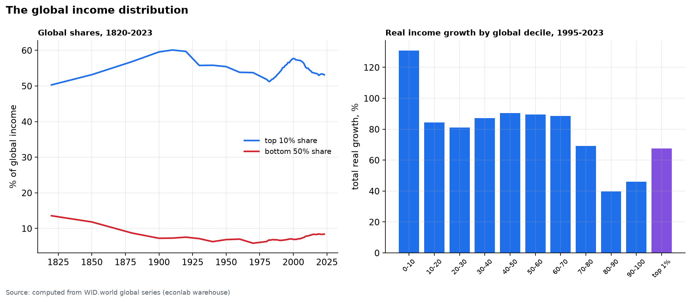
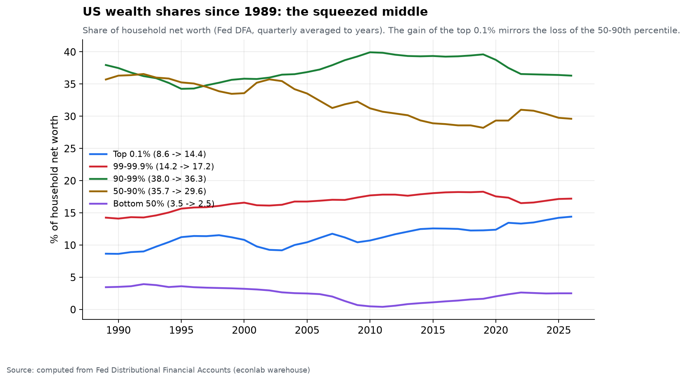
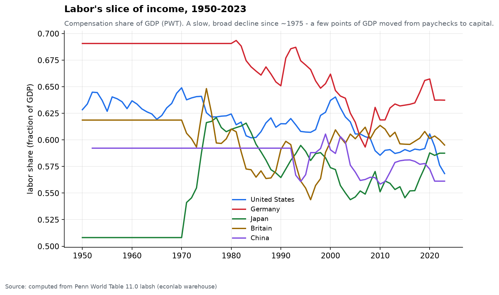

# Chapter 4 — Wealth & people

*World Economy Lab. Generated 2026-07-17; module `econlab/analysis/ch04_wealth.py`,
findings pinned by tests.*

**The questions.** Who gets the income, who owns the wealth, how has that
changed over a century — and what happened to labor's slice of the pie?

## F1 — The top 1%: America's U, Europe's L

Pre-tax income share of the top 1%, computed from WID:

| | 1913 | 1929 | 1975 | 2022 |
|---|---|---|---|---|
| United States | 20.4% | 22.2% | **10.4%** | **20.7%** |
| France | — | 20.1% | 9.2% | 12.1% |

Both countries compressed mid-century (wars, taxes, unions, inflation). Only
the Anglosphere round-tripped: the US top-1% share is back to 1913 within a
rounding error, while France sits at 12%. Same technology, same globalization
— different institutions. Concentration is a policy outcome, not physics.

## F2 — The global distribution: colonial peak, China dividend

The global top-10% income share (all humans ranked together, 1820→2023):
~50% (1820) → **~60% peak around 1900–1913** — the colonial maximum — →
~51% trough (1980) → ~58% echo-peak (2000) → **53% and falling**. Global
inequality's decline since 2000 is Chapter 1's convergence wearing a
different hat: between-country gaps are closing faster than within-country
gaps are widening.

The growth-incidence ("elephant") curve, 1995–2023, computed from global
deciles: poorest decile **+131%**, emerging middle +85–90%, then the trough
at the **80–90th percentile: +40%** — the rich world's middle class — and
the trunk: global top 1% **+68%**. The two grievances of our era (left-behind
Western middles, booming elites) are one curve's two ends.

## F3 — US wealth since 1989: the squeezed middle

Fed Distributional Financial Accounts, share of household net worth:

| Group | 1989 | 2026 Q1 | Δ |
|---|---|---|---|
| Top 0.1% | 8.6% | **14.4%** | +5.8pp |
| 99–99.9% | 14.2% | 17.2% | +3.0pp |
| 90–99% | 38.0% | 36.3% | −1.7pp |
| **50–90%** | **35.7%** | **29.6%** | **−6.1pp** |
| Bottom 50% | 3.5% | 2.5% | −1.0pp |

The mirror image is exact: what the top 0.1% gained is what the upper-middle
class (50–90th percentile) lost. The bottom half barely had wealth to lose —
2.5 cents of every dollar of American net worth, for 65 million households.

## F4 — Labor's slice

PWT labor shares: US **0.637 (1960) → 0.568 (2023)** — seven points of GDP,
roughly $2T/yr at today's size, shifted from paychecks to capital. Germany
−5pp since 1960; China declining through its boom; Japan the exception
(postwar catch-up raised it first). Combine with Ch. 3's r ≈ 7% on capital
and the distributional arithmetic of F1–F3 follows almost mechanically:
capital compounds faster than wages grow, and capital is what the top owns.

## Caveats

- WID pre-1980 global series lean on sparse fiscal data; levels are
  estimates, turning points are robust.
- "Pre-tax" shares exclude taxes/transfers: post-tax US concentration is
  lower (though the U-shape survives).
- DFA starts in 1989 — it cannot see the mid-century compression.
- PWT labor share includes an imputation for the self-employed; levels vary
  by method, the decline does not.

*Next: Chapter 5 — Structural forces: aging, energy, and the reshaped map of trade.*
