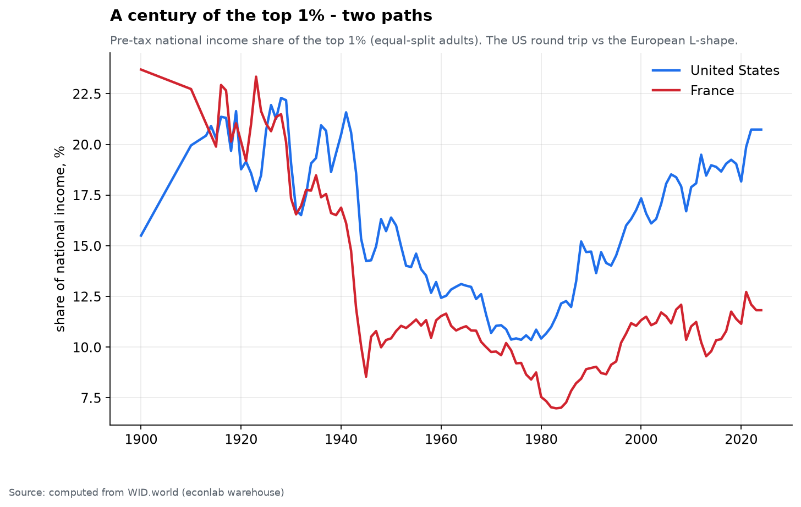
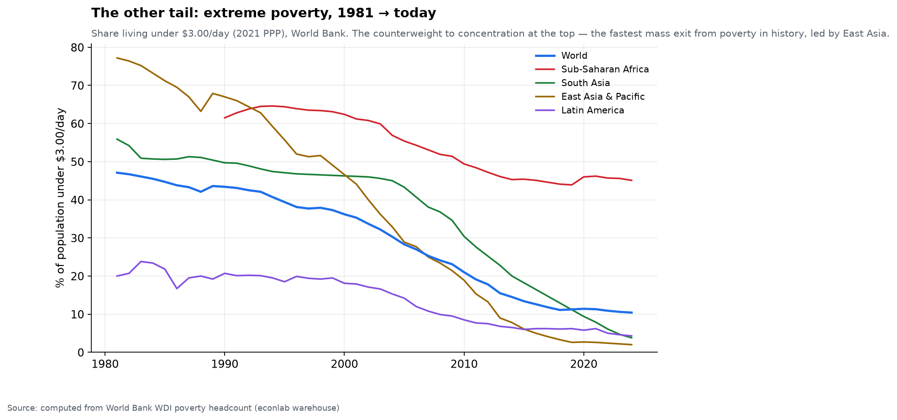
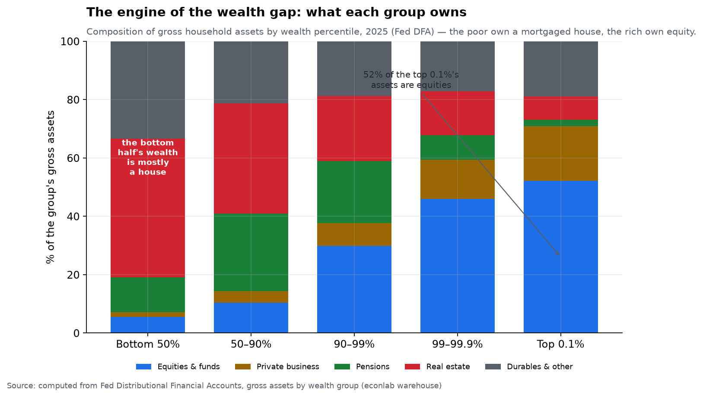
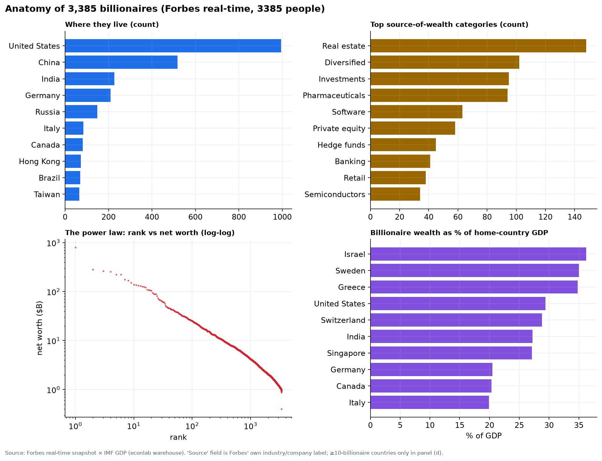

# Chapter 5 — Wealth & people

*World Economy Lab. Generated 2026-07-19; module `econlab/analysis/ch05_wealth.py`,
findings pinned by tests.*

**The questions.** Who gets the income? Who owns the wealth — and *why does
the gap between the two persist and widen*? This chapter separates the two
ledgers (income is a flow, wealth is a stock), finds the mechanism that
turns a good decade in the stock market into a worse distribution, and then
zooms to both tails: the 3,385 billionaires at the very top and the two
billion people who left extreme poverty at the very bottom.

Income and wealth are not the same inequality. Income (what you earn this
year) is far less concentrated than wealth (what you own). In the US the
top 1% take ~21% of income but own ~35% of net worth, and the gap between
those two numbers is the whole story of this chapter: **wealth begets
wealth faster than work earns it.**

## F1 — Income: America's U, Europe's L

Pre-tax income share of the top 1%, computed from WID:

| | 1913 | 1929 | 1975 | 2022 |
|---|---|---|---|---|
| United States | 20.4% | 22.2% | **10.4%** | **20.7%** |
| France | — | 20.1% | 9.2% | 12.1% |

Both countries compressed mid-century — wars, taxes, unions, and inflation
between them roughly halved the top 1% share by 1975. Then they diverged.
Only the Anglosphere round-tripped: the US top-1% share is back to its 1913
level within a rounding error, while France stalled at 12%. Same
technology, same globalization, same demographic forces — different
institutions. **Concentration is a policy outcome, not physics.**

The income spread shows up in the ordinary distribution too, not just the
top 1%. US mean household income by quintile (Census, nominal):

| | Middle fifth | Top fifth | Top 5% | Top÷middle |
|---|---|---|---|---|
| 1967 | $7,077 | $17,820 | $28,110 | 2.5× |
| 2024 | $84,390 | $316,100 | $560,000 | **3.7×** |

The top fifth pulled from 2.5× the middle to 3.7× over two generations —
and the top 5% line (up 20-fold nominal) ran furthest of all.

## F2 — The global ladder: colonial peak, China dividend

Rank every human by income and the global top-10% share traces an arc:
~50% (1820) → **~60% peak around 1900–1913** — the colonial maximum, the
most unequal the human race has ever been — → ~51% trough (1980) → ~58%
echo-peak (2000) → **53% and falling**. Global inequality's decline since
2000 is Chapter 1's convergence wearing a different hat: between-country
gaps are now closing faster than within-country gaps are widening.

The growth-incidence ("elephant") curve, 1995–2023, computed from global
deciles, shows *who* got that convergence: poorest decile **+131%**, the
emerging middle (China, India, the 30th–60th global percentiles) **+85–90%**,
then the trough at the **80–90th percentile: +40%** — the working and
middle classes of the rich world — and the trunk lifting again at the
**global top 1%: +68%**. The two grievances of our era — the left-behind
Western middle and the runaway global elite — are the same curve's two
ends, and the person at the 85th global percentile (a factory worker in
Ohio or Lyon) is the one the last thirty years passed by.

## F3 — The other tail: the great escape

Concentration at the top is only half the distribution; the bottom moved
too, and faster than any period in history. Share of population under
**$3.00/day** (2021 PPP), World Bank:

| Region | 1981 | 2024 |
|---|---|---|
| **World** | **47.1%** | **10.4%** |
| East Asia & Pacific | 77.2% | **2.0%** |
| South Asia | 55.9% | ~4% |
| Sub-Saharan Africa | 61.4% | **45.2%** |
| Latin America | 20.0% | ~4% |

Nearly half of humanity was extremely poor in 1981; barely a tenth is now,
even as the world added ~3.6 billion people. East Asia did the heavy
lifting — a fall from 77% to 2% is the single largest and fastest
improvement in material welfare ever recorded, and it is the same event as
China's GDP takeoff in Chapter 1 and its trade dominance in Chapter 8, seen
from the household. The unfinished business is Sub-Saharan Africa, which
*fell only from 61% to 45%* while its population more than tripled — so the
**number** of extremely poor Africans rose even as the **rate** fell. The
frontier of extreme poverty has become almost entirely African.

## F4 — US wealth: the squeezed middle

Now the stock, not the flow. Fed Distributional Financial Accounts, share
of household net worth:

| Group | 1989 | 2026 Q1 | Δ |
|---|---|---|---|
| Top 0.1% | 8.6% | **14.4%** | +5.8pp |
| 99–99.9% | 14.2% | 17.2% | +3.0pp |
| 90–99% | 38.0% | 36.3% | −1.7pp |
| **50–90%** | **35.7%** | **29.6%** | **−6.1pp** |
| Bottom 50% | 3.5% | 2.5% | −1.0pp |

The mirror image is almost exact: what the top 0.1% gained (+5.8pp) is what
the upper-middle class — the 50th–90th percentile, the mass affluent —
lost (−6.1pp). The bottom half barely had wealth to lose: **2.5 cents of
every dollar of American net worth**, split among 65 million households.
This is not the top pulling away from the poor; it is the top pulling away
from the *middle*.

## F5 — The engine: what each group actually owns

This is the mechanism, and it is the most important figure in the chapter.
It answers *why* F4 happens by asking what each group's wealth is physically
made of. Composition of gross household assets, 2025 (DFA):

| Asset class | Bottom 50% | 50–90% | 90–99% | 99–99.9% | Top 0.1% |
|---|---|---|---|---|---|
| Equities & funds | 5.5% | 10.4% | 29.9% | 45.9% | **52.2%** |
| Private business | 1.6% | 4.0% | 7.8% | 13.5% | 18.8% |
| Pensions | 11.9% | 26.5% | 21.1% | 8.3% | 2.1% |
| **Real estate** | **47.5%** | 37.8% | 22.3% | 15.1% | 7.9% |
| Durables & other | 33.4% | 21.3% | 18.8% | 17.1% | 19.0% |

Read across any row and the gradient is monotonic. **The bottom half's
wealth is a mortgaged house and a car** — 47% real estate, 33% durables,
just 6% equities. **The top 0.1%'s wealth is a portfolio of businesses** —
52% listed equities plus 19% private business, 71% in productive capital,
under 8% in a home. The middle sits in between with its one big financial
asset: a pension (26% for the 50–90th group).

The consequence is arithmetic. When the S&P triples — as it did in the
2010s — the top 0.1%'s dominant asset triples, the bottom half's near-zero
equity stake is unmoved, and the middle's house appreciates at maybe 4% a
year. **The wealth gap doesn't need anyone to get richer or poorer; it
widens automatically whenever capital markets outrun house prices and
wages,** which Chapter 3's r ≈ 7% real return on equities says is the
normal state of the world. F4 is not a policy failure layered on top of F5
— it *is* F5, compounded over 35 years.

## F6 — The very top: 3,385 billionaires

The apex of the wealth stock, from the Forbes real-time snapshot — four
cuts of the same 3,385 people:

- **Where they live.** The US alone has **994** (29% of the world's
  billionaires), then China (518), India (227), Germany (209), Russia
  (148). Billionaire geography is the map of large plus financialized
  economies.
- **Where the money comes from.** By count, the top source-of-wealth
  categories are **real estate (148), diversified/investments (~200
  combined), pharmaceuticals (94), software (63), and finance** (private
  equity + hedge funds + banking ≈ 145). Old money is land and banks; new
  money is software and chips — but real estate is still the single most
  common answer.
- **The power law.** Rank vs net worth is a near-perfect straight line on
  log-log axes — a Pareto distribution. The concentration is fractal:
  **the top 10 people alone hold $2.68T, or 13.5% of all $19.8T** of
  billionaire wealth, and the curve looks the same whether you plot the top
  10 or the top 3,000.
- **Weight at home.** As a share of home-country GDP the ranking reorders
  entirely: **Israel (36%), Sweden (35%), Greece (35%)**, the US (29%),
  Switzerland (29%), India (27%). In a handful of small, rich economies the
  domestic billionaires' paper wealth rivals a third of everything the
  country produces in a year.

For scale: $19.8T of billionaire net worth is larger than the annual GDP of
every nation on Earth except the US and China. (This is the living edge of
Chapter 11's dynasties question — today's billionaires are next century's
candidate dynasties, and the same forces that built these fortunes will
decide which survive.)

## F7 — Labor's slice

Finally, the split between the two ways of getting income — wages vs
capital — at the level of whole economies. PWT labor shares (compensation
as a fraction of GDP):

- **US 0.637 (1960) → 0.568 (2023)** — seven points of GDP, roughly $2T a
  year at today's output, shifted from paychecks to capital returns.
- **Germany** −5pp since 1960; **China** declining right through its boom;
  **Japan** the exception (postwar catch-up raised its labor share first).

Stack this on F5 and the chapter closes as a single circuit: labor's share
of *income* has fallen a few points a decade, capital's share has risen the
same amount, capital earns Chapter 3's ~7% real, and capital is
overwhelmingly what the top owns (F5). Wages grow with the economy; capital
compounds ahead of it; so the distribution of the *stock* (F4) drifts
upward almost mechanically, decade after decade, unless a war, a tax, or an
inflation resets it — which is exactly the mid-century compression F1
recorded, and exactly what has not happened since.

## Caveats

- WID pre-1980 global series lean on sparse fiscal data; levels are
  estimates, turning points are robust.
- "Pre-tax" shares exclude taxes and transfers: post-tax US concentration
  is lower (though the U-shape survives).
- DFA starts in 1989 — it cannot see the mid-century compression, only the
  divergence since.
- The DFA composition (F5) is gross assets; net-worth composition is even
  more skewed for the bottom half (whose home equity is offset by a
  mortgage). "Durables & other" bundles cars, consumer durables, and small
  residual asset classes.
- Forbes billionaire figures are a live snapshot, self-reported and
  estimate-heavy; the "source" field is Forbes' own label and mixes
  industries with individual company names. Treat the shape (power law,
  geography, %-of-GDP ordering) as robust and any single net-worth figure
  as approximate.
- PWT labor share imputes a wage for the self-employed; the level varies by
  method, the decline does not.

*Next: Chapter 6 — The Balance Sheets of Power: the institutions big enough
to hold the system.*
