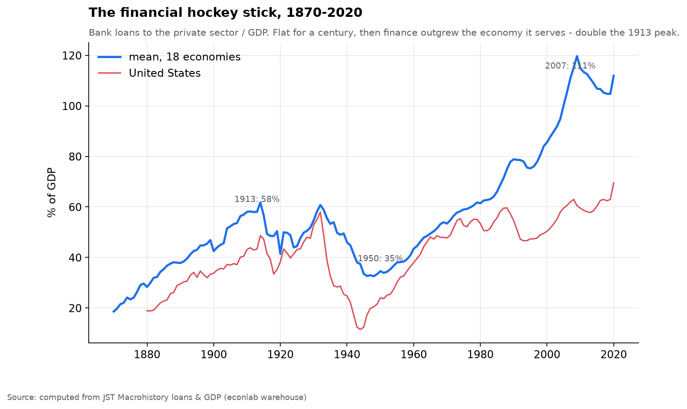
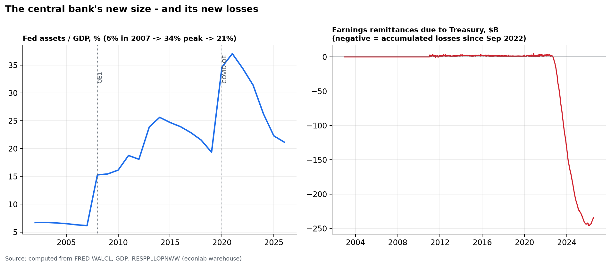

# Chapter 6 — The Balance Sheets of Power

*World Economy Lab. Generated 2026-07-17; module `econlab/analysis/ch06_power.py`,
findings pinned by tests. The question — who holds financial power — is answered
here through what ledgers can actually measure: balance sheets, credit
aggregates, and ownership records. What ledgers cannot measure is named at the end.*

## F1 — Private banks: finance outgrew its economy

Bank lending to the private sector, averaged over 18 economies: **18% of GDP
(1870) → 58% (1913) → 35% (1950, repressed) → 111% (2007)** — and it has
stayed there. The financial hockey stick is *the* structural fact behind
modern banking power: banks are no longer intermediaries at the economy's
margin; their balance sheets are larger than the annual product of the
societies they lend to. Chapter 3 showed what this correlates with — crisis
frequency returned exactly as credit/GDP broke its historical range, and the
2000s put 72% of economies into systemic crisis.

Concentration inside the system: the top-5 US bank holding companies carry
**$14.0T of assets against $25.6T for all commercial banks (~54%)** — with
the caveat that holding companies include broker-dealer arms, so the true
subset share is somewhat lower. Either way: half the system sits in five
firms, each individually "too big to fail" — a status that is itself a
public subsidy, priced into their funding costs.

## F2 — The central bank: from referee to balance sheet of last resort

The Fed's footprint: **6% of GDP (2007) → 34% at the 2022 peak → 21% today**
— a peacetime quintupling with no precedent. QE made the central bank the
marginal buyer of the government's own debt and the largest holder of
mortgage risk; the line between monetary and fiscal policy is now an
accounting convention.

The right panel is the part almost nobody watches: **earnings remittances to
the Treasury**. For a century the Fed's seigniorage profits flowed to the
taxpayer ($50–100B/yr). When rates rose in 2022, interest paid *to banks* on
reserves exceeded the portfolio's income — the Fed has since accumulated
**−$246B** in deferred losses (still −$234B today). Read it plainly: the
public balance sheet currently pays private banks billions per year in
risk-free interest on reserves the public itself created. This is a
measurable, ongoing transfer — power as plumbing.

## F3 — Who owns the market (the capital channel)

From the Fed's own distributional accounts: of all US household corporate
equity and fund holdings, the **top 1% of households own ~50%** (top 0.1%
alone: 24%), the next 9% own 37% — so the **top decile holds ~87% of the
stock market**. The bottom half of the country owns **1.1%**. Every policy
that supports asset prices — QE, rate cuts, buyback-friendly tax treatment —
is, distributionally, a policy for the top decile, whatever its other
merits. This is the mechanical link between Chapter 3's 7% real equity
return and Chapter 5's wealth concentration: the return compounds to whoever
already holds the assets.

## F4 — Individuals and families at the summit

The long arc (WID): the US top-1% wealth share ran **~37% (1850s) → 49%
(1929 peak) → 22% (1978 trough) → 35% (2024)**; the top 0.1% alone:
25% → 7% → **18%** — most of the way back to Gilded Age configuration.

The snapshot (Forbes, unofficial estimates, July 2026): **3,385 billionaires
hold $19.8T — about 16% of world GDP**. The top ten *individuals* hold
$2.7T. US billionaires alone hold **$8.6T — double the $4.3T net worth of
the entire bottom half of American households** (67 million households).
One person (Musk, $798B) holds roughly what the bottom 12% of America does.
Dynasties are visible in the ledger too: inheritance-heavy fortunes (Arnault
& family, Walton, Mars) persist across generations — wealth at this scale is
self-perpetuating at Chapter 3's compounding rates, since consumption cannot
dent it.

## F5 — What finance *earns* (a check on folklore)

Among the top-500 US filers by net income, financial firms (banks, brokers,
insurers, exchanges, card networks, asset managers) earned a **flat ~14–16%
share (2012→2024)**. The power of modern finance shows up less in its own
profit share than in its *pass-through* position: five banks intermediating
half the system, three index managers voting enormous slices of every S&P
500 company, a central bank backstopping the whole structure. Rent extraction
at chokepoints doesn't require headline profits.

## What the ledgers cannot measure (honesty section)

Lobbying intensity, revolving-door careers, index-fund voting power (13F
data — a natural warehouse extension), offshore holdings (WID estimates
these partially), and the agenda-setting power of being *the* counterparty
governments need in a crisis. These channels are real and mostly
unquantified here; the balance-sheet facts above are the measurable floor of
financial power, not its ceiling.

## Caveats

- Forbes worths are estimates with wide bands; treat ranks and magnitudes,
  not third digits. Country = citizenship.
- Top-5 bank share mixes holding-company and commercial-bank concepts (~5pp
  overstatement).
- DFA covers US households only; WID wealth shares before 1913 lean on
  sparse estate data.
- The Fed's "losses" are deferred assets, not insolvency — a central bank
  issuing its own currency cannot go bankrupt in it; the cost is fiscal
  (foregone remittances), which is exactly why it belongs in this chapter.

*Continued in Chapter 4 — The Debt Ledger: who owes, who owns, who pays.*
