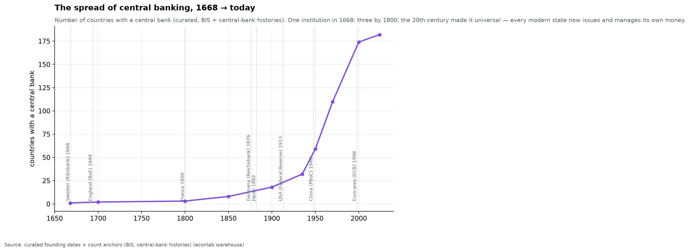
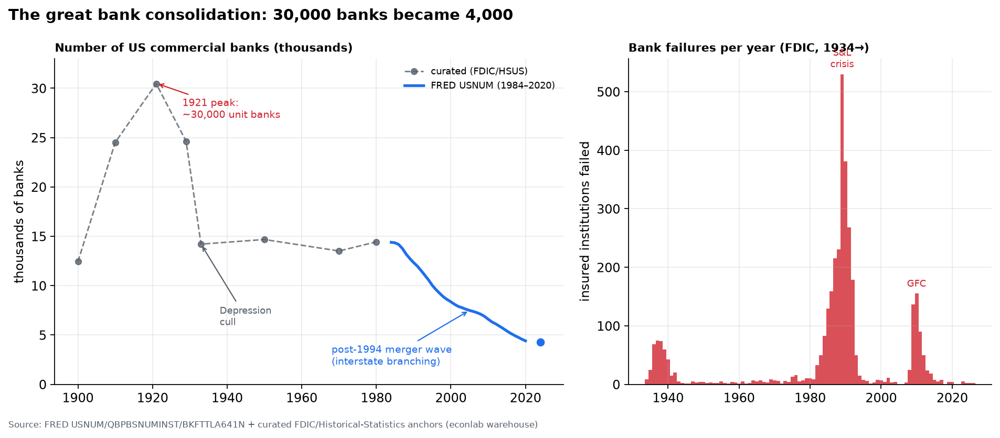
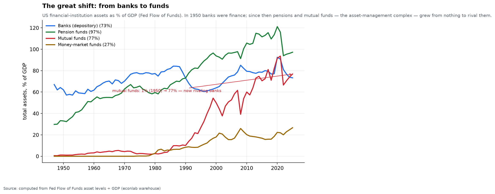
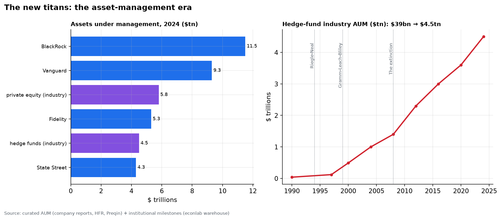
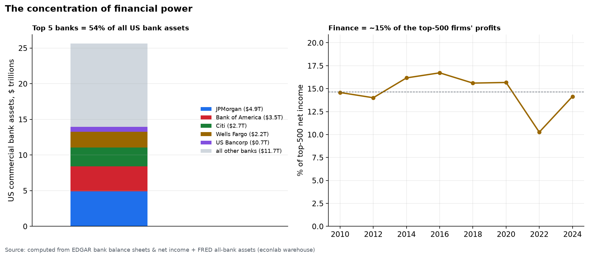
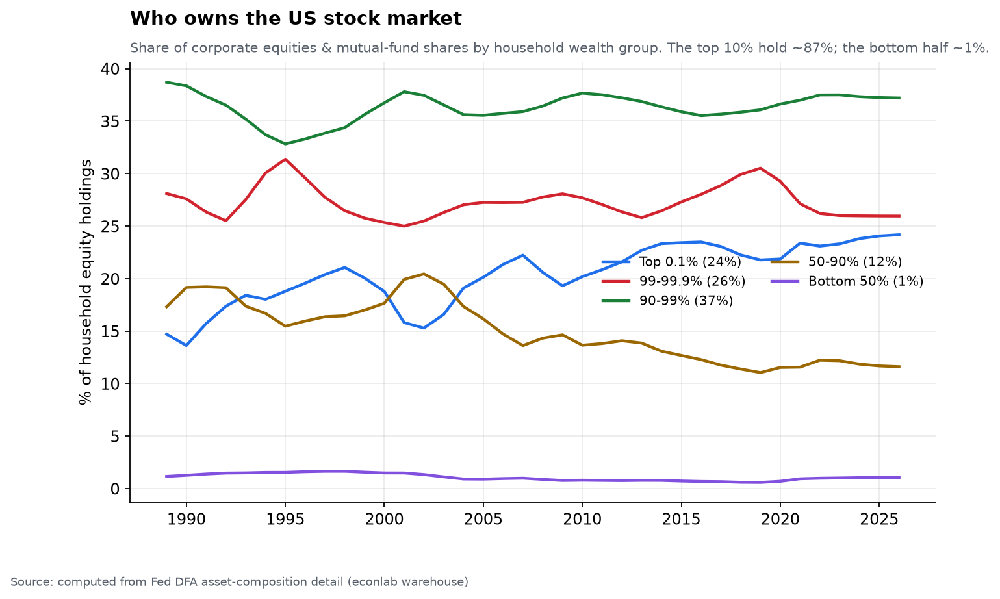
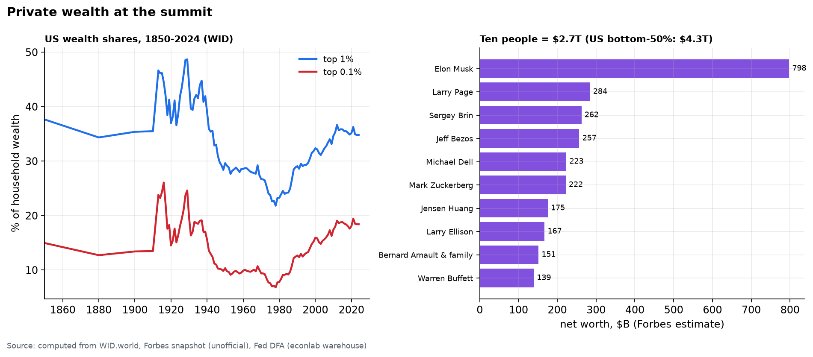
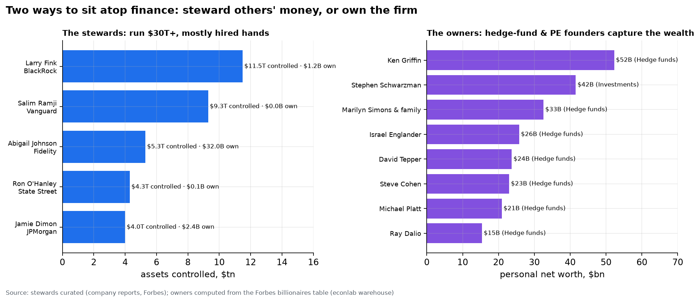
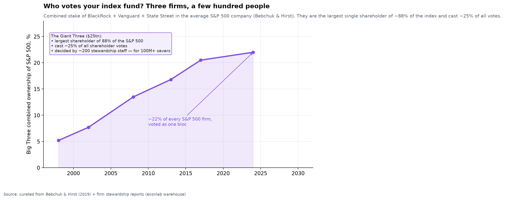

# Chapter 9 — The Balance Sheets of Power

*World Economy Lab. Generated 2026-07-19; module `econlab/analysis/ch09_power.py`,
findings pinned by tests. Two halves: **Part I** traces how financial
institutions *evolved* — the forms themselves, from the first central bank to
the trillion-dollar asset manager — and **Part II** measures the power those
forms now hold, through what ledgers can actually count. What ledgers cannot
count is named at the end.*

**The question.** What *are* the institutions that run finance — banks,
central banks, holding companies, brokerages, mutual funds, hedge funds,
private equity, the index giants — and how did they become what they are? The
striking fact is how *young* most of the modern financial system is: the forms
that dominate today (the universal "umbrella" bank, the index fund, the
multi-trillion asset manager, the systemic hedge fund) are almost all
post-1970 inventions grafted onto a banking system whose deep roots run back
three and a half centuries.

# Part I — The evolution of the forms

## E1 — The deep history: central banking goes from one to universal

Modern finance begins with a public institution, not a private one. The
**Riksbank (Sweden, 1668)** and the **Bank of England (1694)** invented the
central bank — a lender to the state that also anchored the currency and,
eventually, the banking system. For over a century they were nearly alone:

| Countries with a central bank | |
|---|---|
| 1668 | **1** (Sweden) |
| 1800 | 3 |
| 1900 | 18 |
| 1950 | 59 |
| 2024 | **182** |

The idea spread slowly (France 1800, Germany 1876, Japan 1882, the **US
Federal Reserve only in 1913** — a late adopter, after two central banks were
allowed to lapse in the 19th century) and then, in the 20th century,
*universally*: decolonization and the fiat-money era made a national central
bank as standard as a flag. The **ECB (1998)** is the newest twist — a central
bank above the nation-state. Every institution in the rest of this chapter
operates inside a perimeter one of these 182 central banks defines and
backstops.

## E2 — The great bank consolidation: 30,000 banks became 4,000

American commercial banking took the opposite path from central banking —
from *many* to *few*. Anti-branch-banking laws (states feared concentrated
money power) bred tens of thousands of tiny single-office "unit banks":

| US commercial banks | |
|---|---|
| 1900 | ~12,400 |
| **1921** | **~30,500** *(all-time peak)* |
| 1933 | ~14,200 *(after the Depression cull)* |
| 1984 | ~14,400 |
| Today | **~4,300** |

Two great cullings. The first was the **Depression**, which erased ~9,000
banks in three years (the right panel's failure counts begin in 1934, after
the worst of it, and still show the S&L crisis of 1986–92 and the 2008 wave).
The second was **deliberate deregulation**: the Riegle-Neal Act (1994) finally
allowed interstate branching, unleashing a thirty-year merger wave that halved
the bank count from ~14,000 to ~4,300. The result is the concentration Part II
measures — the same number of *branches* serving the country, but owned by a
tenth as many *companies*, five of which now hold half the assets.

## E3 — Finance outgrew the economy it serves

While the *number* of banks collapsed, the *size* of banking exploded. Bank
lending to the private sector, averaged over 18 economies: **18% of GDP (1870)
→ 58% (1913) → 35% (1950, financially repressed) → 111% (2007)** — and it has
stayed there. The financial hockey stick is *the* structural fact behind
modern banking power: banks are no longer intermediaries at the economy's
margin; their balance sheets are larger than the annual product of the
societies they lend to. Chapter 3 showed the price of this — banking-crisis
frequency returned to 1930s levels exactly as credit/GDP broke its historical
range.

## E4 — The great shift: from banks to funds

The most important structural change of the last half-century is invisible if
you only watch banks: finance stopped being *bank*-centred. Total assets as a
share of GDP, by institution type (Fed Flow of Funds):

| % of GDP | 1950 | 1980 | 2024 |
|---|---|---|---|
| Banks (depository) | 62% | 77% | 73% |
| Pension funds | 33% | 60% | **97%** |
| **Mutual funds** | **1%** | 2% | **77%** |
| Money-market funds | 0% | 3% | 27% |

In 1950, banks *were* finance and mutual funds were a rounding error (1% of
GDP). Since then the **asset-management complex** — pensions, mutual funds,
money-market funds — grew from almost nothing to *rival and exceed the banks*.
Mutual-fund assets went from 1% of GDP to **77%**, crossing the banking system
around 2020. This is the rise of **market-based finance** (what the crisis of
2008 taught us to call "shadow banking"): credit and savings increasingly flow
through *markets and funds* rather than *deposits and loans*. It is why the
2008 run happened not on bank branches but on money-market funds and
repo — the panic hit the new plumbing, not the old.

## E5 — The new titans: the asset-management era and the death of the standalone bank

The institutions that inherited the shift are new, and enormous. **BlackRock
alone manages $11.5 trillion** — more than the GDP of every country but the
US and China; Vanguard $9.3T; Fidelity and State Street $4–5T each. Whole
*industries* that barely existed in 1990 now rival them: **private equity
~$5.8T, hedge funds ~$4.5T** — the latter up from **$39 billion in 1990**, a
115-fold rise in a generation.

Behind the AUM sits a revolution in institutional *form*, driven by five
milestones:

- **1933 Glass-Steagall** split commercial banking (deposits, loans) from
  investment banking (underwriting, trading) — a wall that stood 66 years.
- **1975 "May Day"** deregulated brokerage commissions, birthing the discount
  broker (Schwab) and eventually zero-commission retail trading.
- **1994 Riegle-Neal** allowed interstate branching (E2's merger wave).
- **1999 Gramm-Leach-Bliley** repealed Glass-Steagall, legalizing the
  **universal "umbrella" bank** — the financial holding company that owns a
  commercial bank, an investment bank, an asset manager, and an insurer under
  one roof (Citigroup was the template).
- **2008 — the extinction of the standalone investment bank**: Bear Stearns
  and Merrill were absorbed, Lehman failed, and Goldman Sachs and Morgan
  Stanley converted to *bank holding companies* to reach the Fed's backstop.
  The 150-year-old Wall Street partnership model ended; everything is now
  inside the regulated-bank perimeter or the lightly-regulated fund perimeter.

# Part II — The present balance sheets of power

## P1 — Concentration inside the system

The consolidation of E2 produced a system where the **top-5 US bank holding
companies hold ~$14.0T of assets against $25.6T for all commercial banks —
about 54%** (with the caveat that holding companies bundle broker-dealer arms,
so the true deposit-bank share is somewhat lower). Half the system sits in
five firms, each individually "too big to fail" — a status that is itself a
public subsidy, priced into their funding costs. The right panel adds the
profit view: the financial sector captures **~15% of the entire top-500's
profits** in a typical year — a share that spikes in booms and briefly
collapsed to 10% in 2022's rate shock. A sector that *intermediates* the
economy earning a seventh of the largest firms' combined profits is the
clearest single measure of finance's weight.

## P2 — The central bank: from referee to balance sheet of last resort

The Fed's footprint: **6% of GDP (2007) → 34% at the 2022 peak → 21% today** —
a peacetime quintupling with no precedent. QE made the central bank the
marginal buyer of the government's own debt and the largest holder of mortgage
risk; the line between monetary and fiscal policy is now an accounting
convention. The right panel is the part almost nobody watches: **earnings
remittances to the Treasury**. For a century the Fed's seigniorage profits
flowed to the taxpayer ($50–100B/yr); when rates rose in 2022, interest paid
*to banks* on reserves exceeded the portfolio's income, and the Fed has since
run **−$246B** in deferred losses. Read plainly: the public balance sheet
currently pays private banks billions a year in risk-free interest on reserves
the public itself created — power as plumbing.

## P3 — Who owns the market (the capital channel)

From the Fed's distributional accounts: of all US household corporate equity
and fund holdings, the **top 1% own ~50%** (top 0.1% alone: 24%), the next 9%
own 37% — so the **top decile holds ~87% of the stock market**; the bottom
half owns **1.1%**. Every policy that supports asset prices — QE, rate cuts,
buyback-friendly taxation — is distributionally a policy for the top decile.
This is the mechanical link between Chapter 3's 7% real equity return and
Chapter 6's wealth concentration: the return compounds to whoever already
holds the assets — and, increasingly (E4–E5), through funds the Big Three
manage and *vote*.

## P4 — Individuals and families at the summit

The long arc (WID): the US top-1% wealth share ran **~37% (1850s) → 49% (1929
peak) → 22% (1978 trough) → 35% (2024)**; the top 0.1% alone: 25% → 7% →
**18%** — most of the way back to Gilded Age configuration. The snapshot
(Forbes, July 2026): **3,385 billionaires hold $19.8T — ~16% of world GDP**;
US billionaires alone hold **$8.6T, double the $4.3T net worth of the entire
bottom half of American households**. Wealth at this scale is self-perpetuating
at Chapter 3's compounding rates — the living edge of Chapter 11's dynasties.

## P5 — What finance *earns* (a check on folklore)

Among the top-500 US filers by net income, financial firms earned a **flat
~14–16% share (2012→2024)**. The power of modern finance shows up less in its
own profit line than in its *pass-through* position: five banks intermediating
half the system, three index managers voting enormous slices of every S&P 500
company, a central bank backstopping the whole structure, a fund complex
(E4–E5) now larger than the banks. Rent extraction at chokepoints doesn't
require headline profits.

## P6 — Who actually decides: the stewards and the owners

All the assets in this chapter are directed by a remarkably small number of
people — and they hold power in two entirely different ways.

**The stewards run other people's money.** The person who directs the single
largest pool of capital on Earth — Larry Fink, BlackRock's **$11.5 trillion** —
is worth about $1.2B, a *hired executive* of a public company. Vanguard's CEO
controls $9.3T and personally captures *nothing* from it (Vanguard is
mutually owned by its own funds). State Street's and JPMorgan's chiefs run
$4T+ apiece on ~$0.1–2.4B of personal wealth. These are professional managers
exercising *delegated* power over savings that belong to hundreds of millions
of other people. (The exception proves the rule: Abigail Johnson both runs
*and owns* Fidelity, hence her $32B — a family firm, not a public one.)

**The owners run their own money — and keep it.** The other model is the
founder-partnership. The hedge-fund and private-equity founders — **Ken
Griffin (Citadel, $52B), Stephen Schwarzman (Blackstone, $42B), Jim Simons's
estate ($33B), Israel Englander, David Tepper, Steve Cohen, Ray Dalio** — own
their firms outright, make every capital-allocation decision themselves, and
capture the economics directly. That is why they, not the trillion-dollar
stewards, dominate the finance section of the billionaire list: ownership, not
assets-under-management, is what converts financial power into personal
fortune.

**And then there is the votes problem — the most concentrated decision-making
power in the modern economy, and the least noticed.** Because index funds must
hold every company in their benchmark, the three big index managers —
BlackRock, Vanguard, State Street — have become the **largest single
shareholder of ~88% of the S&P 500**, together owning **~22% of the average
member and casting ~25% of the votes** at its annual meeting. Their combined
stake has quadrupled since 1998 (from ~5%) and is still rising. Those votes —
on directors, mergers, executive pay, climate and governance resolutions
across essentially every large public company in America — are decided not by
the 100-million-plus savers whose money it is, but by a **few hundred
"stewardship" staff** at three firms. This is the answer to "who runs these
entities" taken to its logical end: the index revolution democratized *owning*
the market while quietly *centralizing the control of it* into the narrowest
governance chokepoint capitalism has ever had. And the loop closes on itself —
the Big Three are also among the largest owners of the banks in P1 and of each
other, so the index stewards ultimately sit above even the bank CEOs who sit
atop everything else.

## What the ledgers cannot measure (honesty section)

Lobbying intensity, revolving-door careers, the *company-by-company* detail of
index-fund voting (P6 measures the aggregate; per-firm 13F voting records are a
natural warehouse extension), offshore holdings, and the agenda-setting power
of being *the* counterparty governments need in a crisis.
These channels are real and mostly unquantified here; the balance-sheet facts
above are the measurable floor of financial power, not its ceiling.

## Caveats

- Pre-1984 bank counts and central-bank/AUM figures are **curated** from
  published sources (FDIC Historical Statistics, BIS, company reports, HFR,
  Preqin) — cited and flagged; the *shapes and orders of magnitude* are robust,
  exact figures are approximate and vary by definition (e.g. "bank" vs "insured
  institution," AUM vs net assets).
- The Flow-of-Funds "great shift" mixes institution types with overlapping
  claims (pensions hold mutual funds, which hold bank deposits); the shares are
  gross assets by sector, not a partition of a fixed pie.
- Forbes worths are estimates with wide bands; treat ranks and magnitudes.
- Top-5 bank share mixes holding-company and commercial-bank concepts (~5pp
  overstatement). The Fed's "losses" are deferred assets, not insolvency — the
  cost is fiscal (foregone remittances), which is why it belongs here.

*Next: Chapter 10 — The Chokepoints: where a few control the many.*
