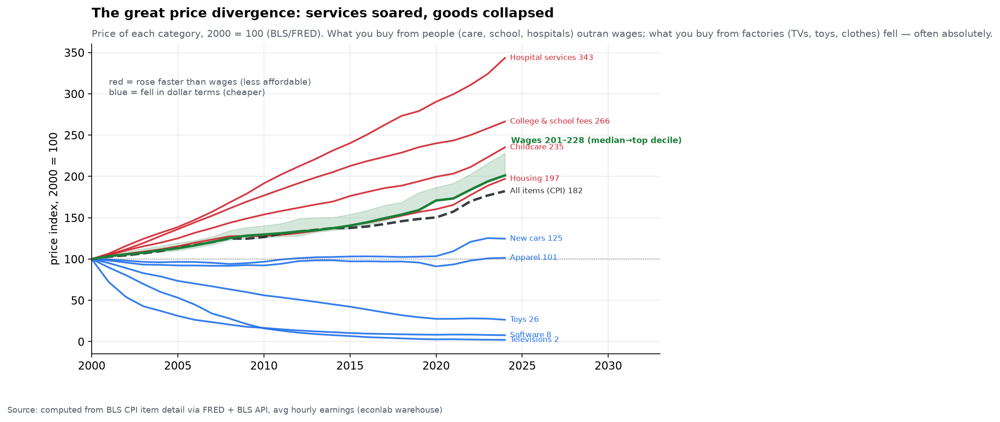
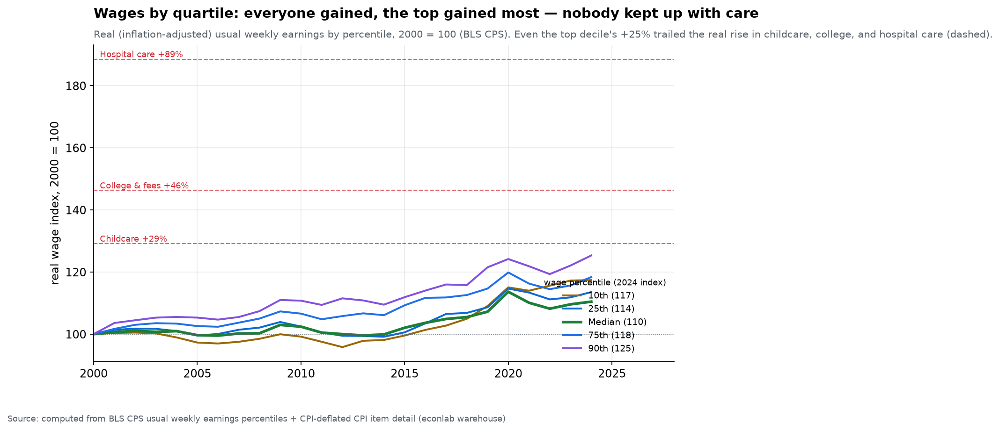
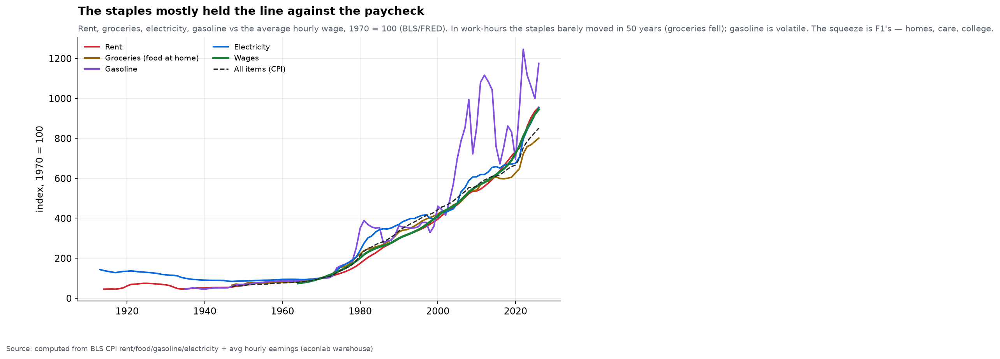
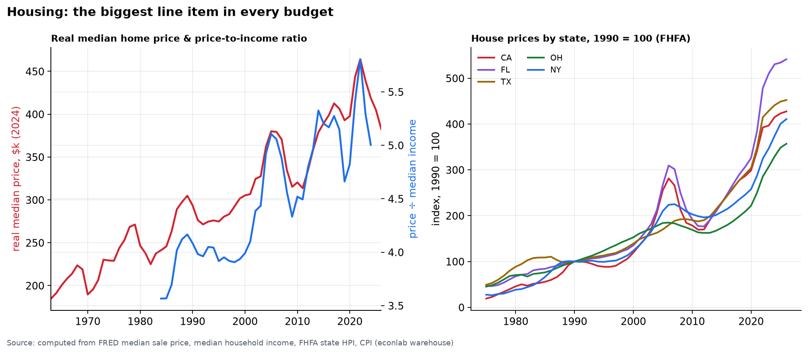
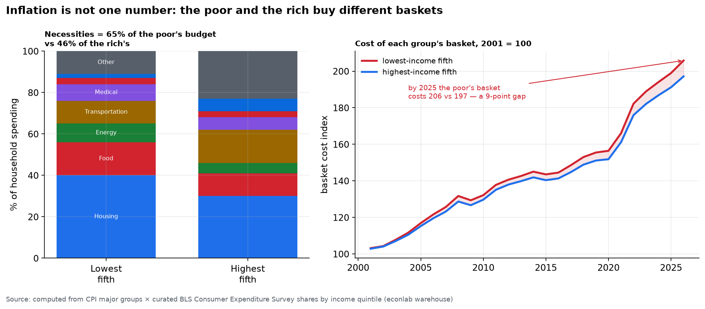

# Chapter 9 — What Things Cost

*World Economy Lab. Generated 2026-07-19; module `econlab/analysis/ch09_cost.py`,
findings pinned by tests. Sources: BLS CPI item detail (via FRED and the BLS
API), FHFA & Census house prices, average hourly earnings and CPS usual-weekly-
earnings percentiles, and the BLS Consumer Expenditure Survey for spending
shares.*

**The questions.** Forget the single inflation number on the news. What has
actually happened to the price of the things a person *cannot avoid buying* —
a home, fuel, groceries, childcare, healthcare, clothes — measured against
the paycheck, as far back as the data reaches, and broken out by *where you
live* and *how much you earn*? The answer is not "everything got more
expensive." It is stranger and more unequal than that.

**The long backdrop.** Over any long horizon the price *level* only goes one
way. A US dollar of 1913 buys about **three cents' worth today** — consumer
prices are up ~32× in 112 years (BLS CPI 9.9 → 322). Reach back further and
the Bank of England's millennium dataset shows English prices up roughly
**1,200-fold since 1209** — eight centuries in which the number on the price
tag rose almost without interruption. But the price *level* is the boring
part. What matters to a household is **relative** prices — what got dearer or
cheaper against everything else, and against wages — and there the last
half-century tells a sharply divided story.

## F1 — The great divergence: services soared, goods collapsed

Index every category to 100 in the year 2000 and the single most important
picture in this chapter emerges — a fan that splits cleanly in two:

| Since 2000 (2000 = 100) | 2024 |
|---|---|
| Hospital services | **343** |
| College & school fees | 266 |
| Childcare | 235 |
| **Wages (median → top decile)** | **201 → 228** |
| Housing | 197 |
| All items (CPI) | 182 |
| New cars | 125 |
| Apparel | **101** *(flat for 24 years)* |
| Toys | 26 |
| Software | 8 |
| **Televisions** | **2** |

The dividing band is the wage distribution — its median grew to 201, its top
decile to 228 (the green band; the whole distribution, and why it is a *band*,
is F2). **Everything you buy from *people* — hospital care, schooling,
childcare — rose faster than even the best-paid workers' wages. Everything you
buy from *factories* — cars, clothes, toys, electronics — fell behind, and
much of it fell *absolutely*.** A
television costs about **1/50th** of its 2000 price (quality-adjusted);
software an eighth; toys a quarter; a shirt costs literally the same number
of dollars it did in 2000, which after two decades of wage growth means it
is far cheaper in work-time. Meanwhile hospital care more than tripled.

This is the mechanism behind the modern paradox that people feel poorer while
owning more *stuff*: the stuff (goods) genuinely got cheaper, but the
**services that structure a life** — keeping your child cared for, your body
repaired, your kid in college — outran every wage. It is Baumol's cost
disease meeting globalization: manufactured goods ride automation and cheap
Asian labor (Chapter 8's China shock) down the cost curve, while
labor-intensive human services, which can't be offshored or automated, ride
wages up. What you can put in a shipping container got cheaper; what requires
a person in the room got dearer.

## F2 — Wages by quartile: everyone gained, the top gained most, nobody kept up with care

"The wage" is a fiction — there are many wages, and splitting the paycheck
into percentiles (full-time usual weekly earnings, BLS CPS) changes the story
twice. Indexed to 2000:

| Wage percentile | Nominal 2024 | **Real 2024** |
|---|---|---|
| 10th (bottom) | 214 | +17% |
| 25th | 207 | +14% |
| **Median (50th)** | **201** | **+10%** |
| 75th | 216 | +18% |
| 90th (top) | 228 | **+25%** |

**First correction — the middle grew slowest.** Nominal wage growth was
*U-shaped*: the 10th percentile (+114%) and the 90th (+128%) both outran the
**median (+101%)**. The bottom's gain is recent and real — the 2020–2023 labor
market compressed the distribution, lifting low wages fastest — but across the
full quarter-century the pattern is a hollowed middle, wage polarization made
visible.

**Second correction — real wages did *not* stagnate.** Deflated by CPI, *every*
percentile gained purchasing power: from **+10% (median)** to **+25% (top
decile)** over 2000–2024. The popular claim that "wages have gone nowhere for
decades" is, at least since 2000 and at least in cash earnings, simply false —
the gains are just modest and tilted to the top (the 90th percentile gained
2.5× what the median did).

**But — nobody kept up with care.** Here is the number that matters. In *real*
terms (dashed lines on the chart), childcare rose **+29%**, college **+46%**,
and hospital care **+89%** over the same window. **Even the top decile's +25%
real wage gain fell short of all three.** For a median worker (+10%) or a
25th-percentile worker (+14%), childcare alone (+29% real) swallowed the entire
raise and more. This is the precise, defensible statement of the
"affordability crisis": it is not that wages fell, and not that everything got
dearer — it is that **the specific services a family cannot forgo outran the
income gains of every group, top to bottom.**

## F3 — The staples mostly held the line against the paycheck

Here is the surprise the aggregate hides. Track the four unavoidable
staples — rent, groceries, electricity, gasoline — against the average hourly
wage since 1970 (all indexed to 100):

| 1970 → 2024 (1970 = 100) | index | vs wage (~950) |
|---|---|---|
| Gasoline | 1,175 | outran (but wildly volatile) |
| Rent | 955 | ~tracked |
| Electricity | 954 | ~tracked |
| **Average wage** | **~950** | — |
| Groceries (food at home) | 801 | **fell** (cheaper in work-hours) |

Over fifty years, **rent, electricity, and groceries roughly tracked or
lagged the wage** — in hours-of-work terms a production worker buys about as
much rent and electricity today as in 1970, and *more* groceries (US food is
among the cheapest on Earth as a share of income, a direct dividend of
Chapter 8's agricultural productivity). Gasoline is the exception, but its
line is dominated by *volatility* — the 1970s shocks, 2008, 2022 — not a
trend; it ends only modestly ahead of wages.

So the felt "cost-of-living crisis" is **not** mainly in these CPI staples.
It is concentrated exactly where F1 and F2 said: in **home prices** (not rent —
prices; see F4), **healthcare, childcare, and college**. The squeeze is real,
but it is specific, and mistaking it for across-the-board unaffordability
misreads what the data shows.

## F4 — Housing: the biggest line item, and the location story

Housing is where "as granular as you can go by location" pays off, because
housing is the least national of all prices. Two facts at the US level, then
the map.

**The level.** The real (inflation-adjusted) median home price roughly
**doubled** — from ~$185k (1963, in 2024 dollars) to ~$383k (2024) — even as
the house itself barely changed. And the **price-to-income ratio** climbed
from ~3.6 (mid-1980s) to **5.0** today: the median home costs five years of
median household income, up from three and a half. This — not rent CPI — is
the homebuyer's squeeze, and it is why F3's renters and this section's buyers
experience "housing cost" so differently.

**The location.** Indexed to 1990, state house prices fan out enormously.
The Sun Belt led: **Florida (~535) and Texas (~450)** roughly quintupled,
pulled by migration and construction booms; California (~420) and New York
(~410) followed; **Ohio (~350)** and the industrial Midwest lagged. A dollar
of house bought in Cleveland in 1990 grew far less than the same dollar in
Miami — the single largest driver of *where* Americans can afford to live,
and a quiet engine of the wealth gaps in Chapter 5 (home equity is the bottom
half's main asset, and its growth depended entirely on which state you bought
in).

## F5 — Inflation is not one number: the poor and the rich buy different baskets

The headline CPI is a single average over a single "representative" basket —
but nobody buys the average basket. The socioeconomic core of this chapter is
that **your inflation rate depends on what you buy, and what you buy depends
on what you earn.**

The lowest-income fifth spends **~65% of its budget on necessities** (housing
40%, food 16%, energy 9%); the highest-income fifth spends **~46%**, with far
more going to transportation, education, and discretionary "other" (left
panel). Re-weight the CPI's major groups by each group's actual spending
(BLS Consumer Expenditure Survey shares) and you get two different inflation
rates. The result (right panel): the low-income basket's cost rose **106%
since 2001**, the high-income basket's **97%** — a **9-percentage-point gap**,
and it opens most in exactly the shocks that hit necessities hardest (the
2008 and 2022 food-and-energy spikes, where the poor's annual rate ran up to
~0.5pp above the rich's).

Two honest caveats make this *understated*, not overstated. First, this uses
broad CPI groups; at the *item* level the poor buy cheaper varieties whose
prices have often risen faster ("cheapflation"), widening the true gap.
Second, the poor spend a larger share of income on the necessities that can't
be deferred, so the same inflation bites a subsistence budget harder than a
comfortable one even at equal rates. Inflation is regressive twice over — in
the basket, and in the ability to absorb it.

## Caveats

- CPI item indices are quality-adjusted (hedonic): the television index
  falling to ~2 means *2024's TV at 2024's quality* costs ~1/50th of 2000's
  TV at 2000's quality — a real gain, but part of it is "you get vastly more
  television," not just a lower shelf price.
- Wages here are average hourly earnings of production & nonsupervisory
  workers (the longest consistent series, from 1964) — not median or total
  compensation; benefits (especially health insurance) have grown faster than
  cash wages, so total-comp comparisons look somewhat better for workers.
- The inflation-by-income split uses **curated** BLS Consumer Expenditure
  Survey shares mapped to CPI major groups — an approximation (shares vary a
  few points by year and the group mapping is coarse); the *direction and
  ordering* are robust, the exact 9-point gap is indicative.
- House-price series (FHFA, Case-Shiller, Census median) measure somewhat
  different things (repeat-sales index vs median transaction) and are spliced
  only for the level narrative, not treated as one continuous series.

*Next: Chapter 10 — The Chokepoints: where a few control the many.*
