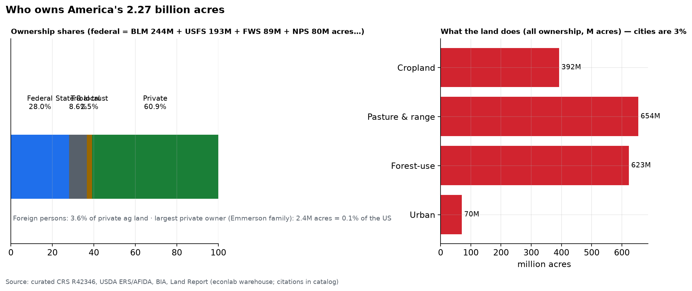
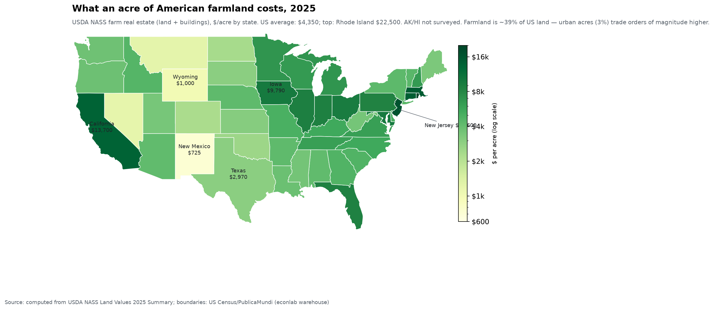
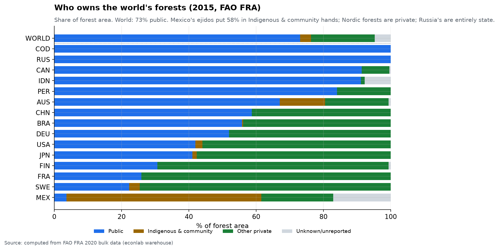

# Chapter 9 — Who Owns the Land

*World Economy Lab. Generated 2026-07-18; module `econlab/analysis/ch09_land.py`,
findings pinned by tests. Land is the one asset class with no global ledger —
this chapter computes what is computable (the US stack; the world's forests,
the only globally-reported ownership data) and curates the rest with named
citations (CRS, USDA, BIA, national cadastres) rather than inventing.*

## F1 — America's 2.27 billion acres

| Owner | Share | Detail |
|---|---|---|
| **Private** | **~61%** | ~1.38B acres |
| **Federal** | **28%** | BLM 244M · Forest Service 193M · Fish & Wildlife 89M · Park Service 80M · DoD 9M acres |
| State & local | 8.6% | trust lands, parks, forests |
| Tribal trust | 2.5% | ~56M acres (BIA) |

Sub-facts, each cited in the catalog: **foreign persons hold 3.6% of private
agricultural land** (USDA AFIDA 2023, ~46M acres, ~⅓ Canadian — the China
folklore is <1%). The **largest private landowner** (Stan Kroenke, 2.7M
acres after buying ~1M New Mexico acres from the Singleton heirs in Dec
2025) holds **0.12% of the country**; the **entire Land Report 100 together
holds 43.3M acres = 1.9% of the US** (3.1% of private land — see appendix).
American land is concentrated in the *state*, not in individuals: the
federal estate alone is **15× the hundred largest private owners combined**.
And the list is an inheritance ledger: **72 of its 100 entries are families,
heirs, or ranch estates**, not first-generation buyers; the celebrity
entrants (Bezos #21, Gates #44, Sheridan #49) sit far below the timber and
cattle dynasties.
What the land does: pasture 654M, forest-use 623M, crops 392M acres — and
**cities, which generate ~90% of GDP, sit on 3%** (70M acres). Housing:
**65.3% of households own their home** (2026Q1) — the land under houses is
the one form of land most Americans will ever own, and (Ch. 4, 7) the
bottom-half's main asset.

## F1b — What the acre is worth, state by state

The only official annual per-acre price series (USDA NASS farm real estate,
2025): **US average $4,350/acre**, spanning a **31× spread** — Rhode Island
$22,500 and New Jersey $16,600 at the top, **New Mexico $725** at the
bottom. The gradient *is* the economics of land: rainfall + soil (the Corn
Belt: Iowa $9,790), irrigation (California $13,700), and above all
**proximity to cities** — the entire Northeast seaboard prices as
metropolitan fringe, not farmland. Remember the scope: this maps the 39% of
America that is farmland; an acre under Manhattan is worth more than an
entire New Mexico township, which is why (Honest limits, below) area and
value tell different ownership stories.

## F2 — The world's forests: the only global ownership ledger

Computed from FAO FRA country reports (4.06B ha of forest, 2015):
**73% public · 22% private · 5% unreported.** The planet's forests are
overwhelmingly state property — but the national contrasts are the story:

- **100% state:** Russia (815M ha — one government owns a fifth of Earth's
  forest), DR Congo; **~91%:** Canada (Crown), Indonesia.
- **Private-majority:** the Nordic forestry nations (Sweden 22% public,
  Finland 31%), France (26%), **the US (42% public)** — the American
  inversion: despite the huge western federal estate, forests are mostly
  *eastern and private*.
- **Mexico, the outlier that proves ownership is a choice: 4% public, 58%
  Indigenous & community** — the post-revolution ejido system, a century old.
- Formally recognized Indigenous & community forest worldwide: **129M ha ≈
  3.2%** — versus the ~50% of world land that communities hold under
  *customary* (unrecognized) tenure per advocacy estimates (RRI). The gap
  between those numbers is the world's largest unresolved property question.

## F3 — Nations where the state owns (nearly) everything

Curated, cited: **China 100%** (urban land state-owned, rural collective —
private parties hold time-limited *use rights*; every "landowner" in China
is a leaseholder). **Russia ~92%** state/municipal. **Canada ~89% Crown**
(41% federal + 48% provincial). **Australia ~71% Crown** counting pastoral
leasehold. The Anglo settler states never actually privatized their
interiors; the US at 39% government-held is the *low* end of that family.

## Honest limits

- **No global cadastre exists.** Forests are the only land class with
  comparable ownership reporting (FAO FRA); farmland ownership is reported
  by almost no one, and "who owns the world's land" as a single table is
  unanswerable with current data — anyone who gives you one number is
  estimating.
- Area ≠ value: by *value*, land ownership concentrates where Ch. 4/7 said
  wealth does — urban land worth ~90% of US land value sits on 3% of acres.
- Curated figures (CRS/AFIDA/cadastres) are point-in-time; Land Report
  acreages are journalistic estimates, flagged as such in the catalog.
- Nominal vs beneficial: Crown land "owned by the King" is a legal fiction
  of sovereignty, not a personal balance sheet; we count control, not title
  ceremony.

## Appendix — The Land Report 100 (2026 edition)

*Largest private US landowners; journalistic estimates (landreport.com,
fetched 2026-07-18; two #42s tied in the source). Warehouse table:
`landowners`.*

| # | Owner | Acres | # | Owner | Acres |
|---|---|---|---|---|---|
| 1 | Stan Kroenke | 2,700,000 | 51 | Hadley Family | 260,000 |
| 2 | Emmerson Family | 2,440,000 | 52 | Sanders Family | 256,000 |
| 3 | John Malone | 2,200,000 | 53 | Miller Family | 255,000 |
| 4 | Ted Turner | 2,000,000 | 54 | Kress Family | 250,000 |
| 5 | Reed Family | 1,615,000 | 55 | Coffee Family | 248,840 |
| 6 | Buck Family | 1,320,000 | 56 | Langdale Family | 248,000 |
| 7 | Irving Family | 1,267,000 | 57 | Angell Family | 244,000 |
| 8 | King Ranch Heirs | 911,000 | 58 | Riggs Family | 241,803 |
| 9 | Pingree Heirs | 830,000 | 59 | Hunt Family | 240,000 |
| 10 | Cullen Heirs | 800,000 | 60 | Hearst Family | 238,000 |
| 11 | Briscoe Family | 738,000 | 61 | Brask Family | 230,000 |
| 12 | Wilks Brothers | 652,000 | 62 | Gene Taylor | 230,000 |
| 13 | Thomas Peterffy | 647,000 | 63 | Fanjul Family | 229,592 |
| 14 | Stefan Soloviev | 629,000 | 64 | Brophy Family | 228,000 |
| 15 | Brad Kelley | 624,000 | 65 | Bidegain Family | 225,000 |
| 16 | Lykes Heirs | 615,000 | 66 | Catron Cibola Ranches | 225,000 |
| 17 | Ford Family | 600,000 | 67 | Sugg Family | 225,000 |
| 18 | Westervelt Heirs | 600,000 | 68 | Lyda Family | 223,000 |
| 19 | Stimson Family | 552,000 | 69 | Bobby Patton & Mark Walter | 223,000 |
| 20 | Martin Family | 550,000 | 70 | Bacon Family | 221,805 |
| 21 | Jeff Bezos | 462,000 | 71 | Cassidy Heirs | 220,000 |
| 22 | Zane & Tanya Kiehne | 455,000 | 72 | Scott Family | 220,000 |
| 23 | Shannon Kizer | 445,000 | 73 | Kennedy Family | 219,663 |
| 24 | Simplot Family | 443,000 | 74 | Gabrych Family | 218,000 |
| 25 | Fisher Family | 440,000 | 75 | Bridwell Heirs | 217,785 |
| 26 | Kenedy Ranch | 425,000 | 76 | East Foundation | 217,000 |
| 27 | O'Connor Heirs | 410,000 | 77 | Gage Heirs | 213,730 |
| 28 | Skiles Family | 403,000 | 78 | Russell Gordy | 212,000 |
| 29 | Holding Family | 395,000 | 79 | Cunningham Sheep Co. | 211,563 |
| 30 | Bass Family | 381,000 | 80 | Reese Family | 208,238 |
| 31 | Robinson & Freed | 373,000 | 81 | Boswell Family | 207,000 |
| 32 | Collins Family | 370,000 | 82 | Roger Burch | 203,000 |
| 33 | Mike Smith | 351,000 | 83 | Cocanougher Family | 202,000 |
| 34 | Malone Mitchell 3rd | 349,000 | 84 | Holland M. Ware Charitable Foundation | 200,000 |
| 35 | Killam Family | 341,000 | 85 | Anthony Family | 200,000 |
| 36 | Barta Family | 340,000 | 86 | Philip Anschutz | 198,000 |
| 37 | Hughes Family | 319,000 | 87 | Tianqiao Chen | 198,000 |
| 38 | Horton Family | 302,000 | 88 | Stewart & Lynda Resnick | 196,775 |
| 39 | Cogdell Family | 284,000 | 89 | Nunley Family | 191,500 |
| 40 | Fasken Family | 284,000 | 90 | Taylor Family | 191,000 |
| 41 | Llano Partners | 284,000 | 91 | Offutt Family | 190,000 |
| 42 | Benjy Griffith III | 279,000 | 92 | Scotch Families | 190,000 |
| 42 | Kokernot Heirs | 278,000 | 93 | McLean Heirs | 186,000 |
| 44 | Bill Gates | 275,000 | 94 | Durrett Family | 182,000 |
| 45 | Babbitt Heirs | 275,000 | 95 | Haynes Family | 180,000 |
| 46 | Jones Family | 275,000 | 96 | Williams Family | 177,000 |
| 47 | Lee Family | 275,000 | 97 | JA Ranch Heirs | 171,000 |
| 48 | True Family | 272,000 | 98 | Singleton Family | 171,000 |
| 49 | Taylor Sheridan | 267,000 | 99 | Broadbent Family | 170,000 |
| 50 | Galt Family | 262,000 | 100 | Irwin Family | 170,000 |
