# Chapter 10 — The Chokepoints: where a few control the many

*World Economy Lab. Generated 2026-07-19; module `econlab/analysis/ch10_chokepoints.py`.
Chapter 9 found that three index managers vote most of the S&P 500; this
chapter asks whether that pattern — a handful of hands on a vast lever — is
special to finance. It is not. It is the default structure of the modern
economy.*

**A note on method.** Unlike the rest of this report, most numbers here are
**curated** market-share figures, not computed from primary data — concentration
ratios live in industry reports, not open datasets. So this chapter does
something new: it **cross-checks each headline figure through the AI panel**
(Chapter 0's `econ panel` apparatus, polling three free models — Llama-3.3,
Qwen3, and GPT-OSS — independently). Where the panel's consensus corroborates
the curated number it is marked ✓; where the models diverge, that is flagged
(⚠) as an honest signal that the figure is contested or definition-sensitive.
Verify everything — including with a jury of machines.

## F1 — The map: one, two, or three entities, over and over

Lay the economy's critical bottlenecks side by side and the same number keeps
appearing — **1, 2, 3, at most 4**:

| Chokepoint | Controllers | Share | AI panel |
|---|---|---|---|
| EUV lithography machines | **1** — ASML | **100%** | ✓ 100/100 |
| Proxy-vote advice | 2 — ISS + Glass Lewis | 95% | ✓ 98/100 |
| Credit ratings | 3 — S&P, Moody's, Fitch | 95% | ✓ 100/100 |
| Cross-border bank messaging | 1 — SWIFT | ~90% | — |
| Web search | 1 — Google | ~90% | ✓ 94/100 |
| AI accelerators | 1 — Nvidia | ~90% | ✓ 97/100 |
| Leading-edge chips (<7nm) | 1 — TSMC | ~90% | ⚠ 72/100 |
| Index-fund voting (S&P 500) | 3 — the Big Three | 88% | — |
| Rare-earth refining | 1 — China | ~87% | — |
| Global grain trade | 4 — the "ABCD" | ~75% | — |
| Desktop operating systems | 1 — Windows | ~72% | — |
| Commercial seeds & agrochem | 4 — Bayer/Corteva/Syngenta/BASF | ~60% | ✓ 100/100 |

The purest case is **ASML**: *one company, in one country (the Netherlands),*
makes every extreme-ultraviolet lithography machine on Earth — and without
those machines, no one makes an advanced chip. The AI panel agreed 100/100.
The only figure the panel *contested* was **TSMC's ~90%**: the models split
between 50% and 90% (consensus just 72/100) — correctly, because it depends on
definition. TSMC makes ~90% of the *most advanced* (sub-5nm) chips but ~60% of
*all* foundry output. The cross-check earned its keep by flagging the one
number that needed an asterisk.

Three kinds of force create these bottlenecks, and every row is one of them:
**technology** (the physics of EUV, the network effects of search), **regulation**
(credit ratings and proxy advice are quasi-official gatekeepers written into
rules), and **geography** (China's rare-earth refining, one nation's grip on a
processing step). Concentration is not a coincidence of any single industry;
it is what happens wherever a bottleneck can form.

## F2 — Control without ownership: the dual-class wedge

Chapter 9 drew the line between *stewards* (who run others' money) and *owners*
(who run their own). There is a third move, the most direct answer to "who
makes the decision behind the money": **control the votes without owning the
company.** Through super-voting share classes, a founder or family commands the
firm while holding a small slice of its economics:

| | Voting power | Economic stake |
|---|---|---|
| **Zuckerberg — Meta** | **58%** | 13% |
| Page & Brin — Alphabet | 51% | 11% |
| Ford family — Ford | 40% | **2%** |
| Murdoch family — Fox/News Corp | 39% | 14% |
| Roberts — Comcast | 33% | 1% |

Mark Zuckerberg controls an outright *majority* of Meta's votes — every
director, every acquisition, every strategic pivot for ~3 billion users — on a
13% economic stake; the **Ford family runs Ford on 2%**; the Roberts family
runs Comcast on 1%. This is the ownership society's fine print: the "1.1% of
the stock market" the bottom half owns (Chapter 9) carries votes, but the
votes that *decide* are welded to founders through a share structure the index
funds cannot touch. Ownership is diffuse; control is not.

## F3 — Who manages the world's savings

Zoom out to the pools of investable capital themselves — the money that buys
the shares that carry the votes. Set the private US index managers beside the
sovereign wealth funds of entire nations:

- **BlackRock alone ($11.5T)** manages more than the six largest sovereign
  wealth funds *combined*. The **Big Three together (~$25T)** exceed **every
  major SWF on Earth put together (~$7T)** by more than threefold.
- The largest state pools — Norway's oil fund ($1.8T), China's CIC ($1.4T),
  Abu Dhabi ($1.0T), Saudi Arabia's PIF ($0.9T) — are each a single
  decision-making body directing a nation's collective savings.

So the world's savings are managed by a startlingly short list: **three
private American firms and a dozen state funds.** Whether the manager is a
Boston mutual, a Gulf monarchy, or the Chinese state, the structure is
identical — an enormous pool, a tiny committee.

## F4 — The names you don't know: who actually casts the votes

The founders are a distraction. Musk, Zuckerberg, the Google pair — everyone
can name them, and their fame is exactly why they are *not* the answer to "who
decides." The people who quietly wield the most concentrated power over
corporate America are ones almost no one can name, because they exercise
*delegated* authority over trillions they do not own.

Start with what the Big Three actually own. Earlier drafts *asserted* this from
eight hand-entered numbers; here it is **genuinely computed** — a connector
(`edgar13f`) that pulls BlackRock's, Vanguard's, and State Street's latest Form
13F information tables (50,651 + 17,686 + 4,269 disclosed positions) and divides
their holdings by each company's shares outstanding.

The computed picture is *larger* than the constants said. Across the **500
largest US companies the Big Three's combined stake has a median of 24.8%**, and
**87% are at least 20%-owned by these three firms alone**. The famous mega-caps
sit *below* that median — Apple 21.6%, Microsoft 21.8%, Nvidia 21.4%, JPMorgan
22.3% — not because the Big Three own less of them, but because founders and
insiders (Bezos, Musk, the Waltons) hold large blocks that shrink the public
float everyone else divides. Fixating on the mega-caps, as the earlier
hand-entered snapshot did, *understated* the concentration: every one of its
eight numbers was too low (JPMorgan by 7.5 points), because it mixed filing
quarters and leaned on a BlackRock 13F from 2024 — filed under a CIK the firm
has since abandoned.

Within the trio, **Vanguard is now the single largest owner** of the average
large-cap (~10.8% of its shares), ahead of BlackRock (~9.4%) and State Street
(~4.3%). Because turnout at annual meetings runs far below 100%, that ~a-quarter
of *shares* becomes an even larger share of *votes cast* (Chapter 9), and each
firm holds 4,000–5,000 US companies at once.

Owning a quarter is one thing; *how they vote it* is another — and the new
structured **Form N-PX** filings let us read it directly. Across **~120,000 of
the Big Three's proxy votes** in the 2024–25 season, **they sided with
management ~95% of the time** (Vanguard 95.8%, BlackRock 94.8%, State
Street 93.3%):

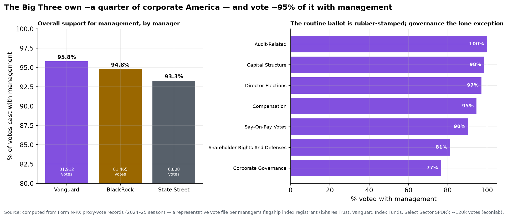

The routine ballot is effectively rubber-stamped — director elections **97%**,
auditor ratifications **100%**, executive pay ("say-on-pay") 90–95%, capital
structure **99%**. Only on **corporate-governance** questions does support dip
(to ~77%). So the quarter of the company they control is voted almost entirely
*for* incumbent boards and managers: the power is real, but it is exercised to
**ratify, not to challenge**.

We can now ground that aggregate — once *a dig for another day* — directly. Parse
the Big Three's structured N-PX records **company by company**, and the concordance
is near-total: across the ~3,000 firms each votes, the *median* company gets **100%**
management support, and each manager backs management on **every single vote at
51–75% of its companies** (Vanguard 75%, BlackRock 67%, State Street 51%). The 95%
is not a handful of dramatic fights — it is quiet, universal ratification.

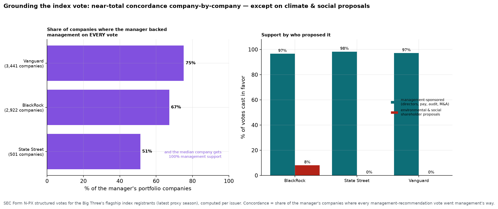

And the one place that ratification breaks is telling. Split the votes by *who
proposed them*: on everything **management** sponsors — directors, pay, audits,
mergers — the Big Three vote in favor **~97–98%**. But on the **environmental and
social shareholder proposals** that are the main external lever to push a board,
support collapses — BlackRock backs **~8%**, and **Vanguard and State Street back
literally none (0%)**. The index bloc is not neutral machinery; it is a reliable
vote *for* incumbent management and *against* the shareholders trying to move it.

Which sharpens the question — who, specifically, points that voting bloc?
Not a CEO you've heard of — a **stewardship team head** most people have never
heard of:

- **Joud Abdel Majeid** runs *BlackRock Investment Stewardship* — she directs
  the proxy votes attached to BlackRock's index funds. **John Galloway** does
  it at Vanguard; **Benjamin Colton** at State Street (he came from Norway's
  fund). A few dozen analysts under each of them decide how ~$14T of equity
  votes at every annual meeting in America. These three names, effectively,
  are the swing shareholder of corporate America.
- Telling them *how* to vote: two firms almost no retail investor has heard
  of. **Gary Retelny's ISS** (owned by Germany's Deutsche Börse) and **Bob
  Mann's Glass Lewis** (owned by a Canadian PE firm) write the voting
  recommendations that move ~95% of institutional proxies — a duopoly a 2025
  Congressional hearing literally titled *"the proxy advisory cartel."*
- Deciding *which companies exist* to the index in the first place: the **S&P
  Dow Jones Indices U.S. Index Committee** — roughly nine full-time,
  unpublicized staff who meet monthly and hold *discretionary* authority over
  S&P 500 membership. When they add a company, the world's index funds are
  forced to buy billions of it; when they drop one, forced to sell. No public
  vote, no famous name.
- Running an entire nation's savings as *one* portfolio: **Nicolai Tangen**,
  CEO of Norway's oil fund — **the single largest owner of stocks on the
  planet, holding ~1.5% of every listed company on Earth.** One Norwegian,
  one fund, a slice of everything.
- And beneath all of it, the plumbing: **Frank La Salla's DTCC** settles
  ~$4.7 *quadrillion* a year and holds custody of ~$114 trillion in
  securities — the ledger on which "who owns what" is actually recorded.
  Almost nobody knows it exists.

This is the real answer to "who makes the decision behind the money." It is
not the centibillionaire founders; it is a **stewardship team lead, a proxy
analyst, an index-committee member, a sovereign-fund CIO** — salaried
professionals, largely anonymous, exercising more concentrated control over
corporate America than any tycoon, precisely because their power is delegated
rather than owned. The founders get the magazine covers; these people cast the
votes.

## F5 — The network: boards, clubs, family, and benefactors

So do the deciders connect — sit on the same boards, belong to the same clubs,
share a family or a patron? Yes, but the honest, scholarship-grounded answer
overturns the intuitive one, and it changed shape over the last half-century.

**The classic answer — interlocking boards — has *faded*.** In the mid-20th
century a genuinely dense network of *interlocking directorates* bound the
corporate elite: the same people sat on each other's boards, and the boards of
the big commercial banks were the meeting rooms where the CEOs of everyone else
convened (Mills' *The Power Elite*, 1956; Useem's "inner circle"). That network
**thinned sharply after the 1970s** — the banks that hosted it declined, the
1980s takeover wave shattered old loyalties, and "overboarding" rules (proxy
advisers now frown on a director serving more than ~4–5 boards) capped the
multi-board "big linkers." Mizruchi's *The Fracturing of the American Corporate
Elite* (2013) and Chu & Davis's *Who Killed the Inner Circle?* document the
decline. Our AI panel, asked to fact-check it, agreed **unanimously (100/100)**.
The naive picture — a handful of tycoons ringing every boardroom — is *less*
true than it was in 1960.

**The cohesion moved somewhere tighter: common ownership.** The reason the
elite no longer *needs* dense board interlocks is F4: the same three firms
already own ~a quarter of *every* large company. Shared owners are a firmer tie than
shared directors ever were — BlackRock, Vanguard, and State Street sit
(through their stewardship votes) on the cap table of all of them at once. The
network didn't disappear; it relocated from the boardroom to the register of
shareholders.

We can now *compute* that thinning directly, from SEC Form-4 insider filings
(every director files when they touch their company's stock). Among the 500
largest US firms, **13.8% of directors sit on two or more of those boards — and
the single busiest sits on just five**:

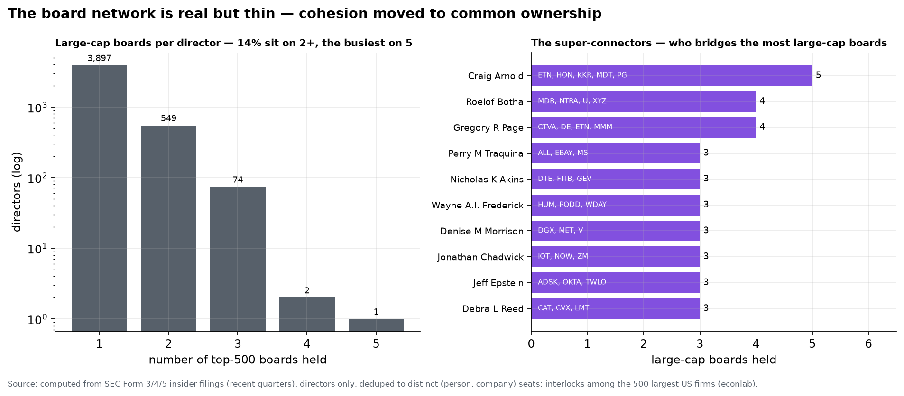

That is a real network but a *thin* one: 3,897 large-cap directors hold exactly
one such seat, only ~625 bridge two or more, and no one approaches the dense
interlock lattice of the mid-20th century (when a J.P. Morgan partner might sit
on twenty boards). The busiest bridges today are a familiar cast — **Craig
Arnold** (Eaton, Honeywell, KKR, Medtronic, P&G), venture chairs like **Roelof
Botha** (Sequoia) and **Egon Durban** (Silver Lake), and a rotation of
ex-CEOs — but they are exceptions, not the structure. The interlock network
thinned exactly as Mizruchi argued; the cohesion it once carried migrated to the
shared *owners* of F4, not shared directors. And, in parallel, to shared
*rooms*.

**And it moved to shared *rooms*.**

The deciders convene, repeatedly and by invitation, in a small set of venues:
the **Business Roundtable** (~200 CEOs of the largest US firms), the **World
Economic Forum's ~100 "Strategic Partners"** (the Davos inner ring), and the
older policy-and-finance circuit — the **Council on Foreign Relations**, the
**Trilateral Commission** (whose roster overlapped CFR's by ~94% in the one
year both were public), **Bilderberg** (invitation-only, Chatham House rules,
no published roster), and social retreats like **Bohemian Grove**. The same
handful of people bridge several at once — **David Rubenstein** (CFR chair *and*
WEF trustee), **Larry Fink**, **Jamie Dimon**, **Eric Schmidt**. This is the
grain of truth in the "same clubs" intuition — documented, measurable overlap —
though the sober sociology (Domhoff's *Who Rules America*) treats these as
coordination *venues*, not a cabal: they set a shared agenda far more than they
issue orders.

**Family** is the oldest tie and the subject of the next chapter. Dynastic
control persists (Chapter 11) — the Walton, Koch, Mars, and Arnault families;
the super-voting share structures of F2 that keep companies in a bloodline;
and, historically, marriage alliances among "old money." But in the US, family
is now a *smaller* share of elite cohesion than ownership or venue — the
founder-controlled firm (Meta, Ford) is the modern echo of the dynasty.

**Benefactors and patrons** are the newest and most visible tie, especially in
tech. The "**PayPal Mafia**" — Peter Thiel, Elon Musk, Reid Hoffman, Max
Levchin, David Sacks, and their colleagues from one late-1990s startup — went
on to found or fund an outsized share of Silicon Valley (Tesla, SpaceX,
LinkedIn, Palantir, YouTube, Yelp, and, through Founders Fund and others, a
long tail of the rest). The other great patronage channel is the **revolving
door** between Goldman Sachs / BlackRock and the Treasury and Federal Reserve —
the same institutions of Chapter 9, staffing the government that regulates
them. These are patronage networks: a common origin or backer, not a shared
boardroom.

The full answer, then: the deciders *are* connected — but through **ownership,
convening venues, and patronage** far more than through the interlocking
boards the question imagines, and less tightly than the conspiratorial version
supposes. The structure is real, measurable, and mostly hidden in plain
sight — which is exactly why it is worth mapping rather than mythologizing.

## F6 — The conferences: measuring what actually happens

The private summits — Davos, Bilderberg, Sun Valley — attract equal parts awe
and conspiracy: secret rooms where the world's leaders supposedly divide up the
future. The honest way to cut through both the hype and the paranoia is this
report's whole method — *measure it*. And the measurement produces a genuine
surprise: **the conferences everyone argues about are not the ones that
demonstrably move anything.**

| Conference | When · who | What it's for | Measurable impact |
|---|---|---|---|
| **Jackson Hole** | Aug · ~120 central bankers | signal monetary policy | **moves global markets** (below) |
| **Sun Valley** (Allen & Co) | Jul · ~300 media/tech moguls | deal-making | **seeded Disney-ABC, Comcast-NBCU, Bezos-WaPo** |
| Milken Global | May · ~4,000 financiers | raise capital | capital flows; the "Predators' Ball" lineage |
| **Davos** (WEF) | Jan · ~2,800 leaders | agenda-setting, networking | **~none measurable** — see below |
| Bilderberg | Jun · ~130 invited | transatlantic dialogue | unmeasurable (Chatham House, no roster) |
| Bohemian Grove | Jul · ~2,500 | social retreat | unmeasurable |

**The one that moves markets — and hardly anyone outside finance discusses —
is the Fed's Jackson Hole symposium.** ~120 central bankers meet in Wyoming
each August; the chair's Friday speech signals the path of interest rates.
Computed from S&P 500 prices:

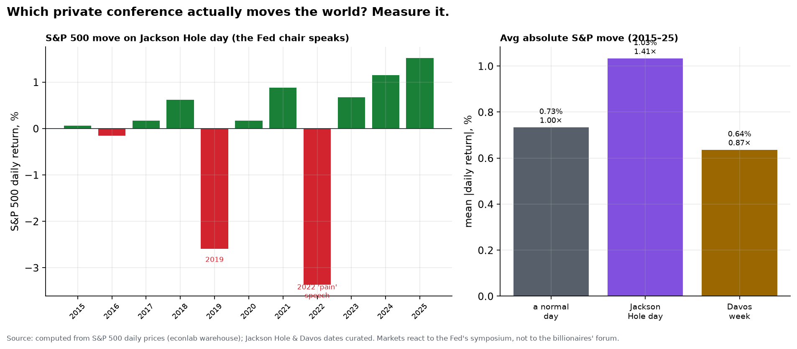

The market moves **1.4× a normal day** on Jackson Hole Friday. Powell's 2022
"some pain" speech knocked the S&P **−3.4% in a single session** (and −12% over
the following month); 2019 fell −2.6%; the dovish 2024 and 2025 speeches
sparked +1.2% and +1.5% rallies. This is a private conference with a *hard,
repeatable, measurable* effect on the wealth of everyone who owns a stock.

**The one everyone argues about — Davos — moves essentially nothing measurable.**
During Davos week the S&P actually moves **0.87× a normal day — *less* than
usual.** And the academic work agrees: a study of listed firms that sent
executives to Davos found **no measurable stock-market or credit benefit**; a
Bloomberg analysis found 2019 attendees *underperformed* the S&P by ~10% that
year. (Our AI panel, asked whether Davos has "no measurable benefit," split
three ways — a fair reflection that the *intangible* value, networking and
agenda-setting, is real even when the *financial* value isn't.) Davos is, in
the memorable phrase, "the Super Bowl of schmoozing": genuine relationship-
building and narrative-setting, not a control room.

**The one that quietly makes the biggest deals is Sun Valley.** Allen & Co's
July retreat in Idaho — no press, no public sessions, ~300 media, tech, and
finance moguls (Bezos, Zuckerberg, Cook, Altman, Iger, Zaslav) — is where the
handshakes behind **Disney's 1995 purchase of ABC, Comcast's of NBCUniversal,
and Bezos's of the Washington Post** reportedly began. Its measurable footprint
isn't in a day's market move; it's in the ownership map of American media.

So the truth behind the private conferences is more mundane and more
interesting than the mythology. The **secretive** ones (Bilderberg, Bohemian
Grove) leave almost no measurable trace — they are elite relationship-building,
not world government. The ones with **real, measurable power** are the boring-
sounding central-bank symposium (which moves every portfolio) and the
deal-shop retreat (which redraws who owns what). The rooms that matter are not
the ones the conspiracy theories point at — and you can prove it with a price
series.

## F7 — The room that actually runs markets: the FOMC

F6 found that the Fed's Jackson Hole symposium moves markets and Davos doesn't.
Follow that thread to its end and you arrive at the single most powerful
recurring private meeting on Earth — and it is not a billionaire retreat. It is
the **Federal Open Market Committee**: **twelve voting members**, **eight
closed-door meetings a year**, no cameras in the room, and a decision released
at 2:00 p.m. that reprices every asset class at once.

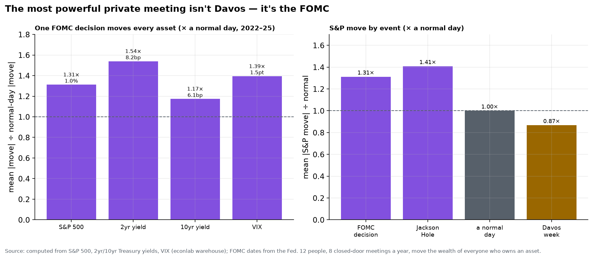

Computed across assets (2022–25), an FOMC decision day moves — *relative to a
normal day* — the **S&P 500 by 1.3×, the 10-year Treasury yield by 1.2×, the
policy-sensitive 2-year yield by 1.5×, and the VIX ("fear gauge") by 1.4×.**
This is the deeper truth behind F6's single-market finding: it isn't just
stocks. **One meeting of twelve people moves equities, interest rates, and
volatility simultaneously** — the whole financial system swings on the wording
of a single statement. Rank the events by their pull on the S&P and the picture
is stark: **FOMC 1.3× and Jackson Hole 1.4× a normal day; Davos 0.87× — *below*
a normal day.**

And *inside* that room, who actually decides? Twelve people hold a vote — but
the vote is not where the power sits. Parsing the FOMC's own policy statements
(the roll call each one ends with), across **130 meetings since 2011 there were
65 dissenting votes — and the chair's proposed action carried every single
time**:

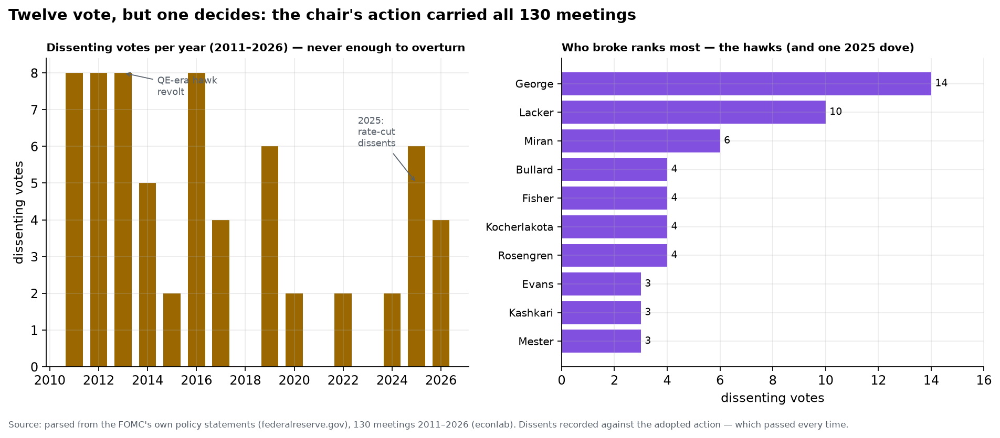

Dissent on the FOMC is real but ceremonial: it peaked during the 2012–13 QE-era
hawk revolt (eight dissents a year) and flared again in 2025 over rate cuts, yet
it has **never once overturned the chair**. The dissenters are a familiar cast
of regional-Fed hawks — Esther **George** (14 dissents), Jeffrey **Lacker** (10),
Fisher, Plosser, Kocherlakota — plus, in 2025, a lone dove (Stephen **Miran**)
pushing the other way. The upshot sharpens the whole section: the most powerful
recurring meeting on Earth is not just concentrated in twelve people — its
outcome is effectively concentrated in **one**, the chair, whose proposal the
committee has ratified 130 times running.

So the answer to "private conferences with the leaders of the world" is hiding
in plain sight, and it inverts the mythology completely. The most consequential
such meeting is **public knowledge, scheduled a year in advance, and held by
civil servants** — yet it is more genuinely *private* (no press, no transcript
for years) and vastly more *powerful* (measured in trillions of repriced
assets) than any Bilderberg. The secretive billionaire summits that draw the
conspiracy theories move markets *less* than an average Tuesday. The room that
actually runs the world's markets is the one nobody makes a documentary about.

This closes the chapter's arc. The concentration this report keeps finding —
in wealth, in banks, in index votes, in chokepoints, in the hands that steer
them — reaches its purest expression here: a **dozen people**, in a **closed
room**, **eight times a year**, whose scheduled words move the wealth of
everyone on Earth who owns a single share or pays a single floating rate. That
is the lever behind all the other levers, and (Chapter 9) it is a *public*
institution — which is either the most reassuring fact in this chapter or the
most sobering, depending on how much you trust the twelve.

## F8 — The revolving door: where public power converts into private money

Chapter 9 admitted a gap: "lobbying intensity, revolving-door careers … real and
mostly unquantified here." This chapter's whole argument is that control funnels
through narrow points — so the narrowest point of all deserves a number, not a
shrug. The revolving door *is* measurable, from the disclosures the law already
requires.

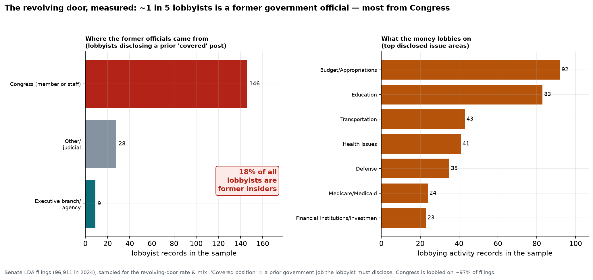

Start with the door itself. Every registered lobbyist must disclose any prior
government job — a "covered position" — and in a sample of 2023 filings,
**about one in five (~18%) of all lobbyists is a former government official.**
And they come overwhelmingly from one place: **~80% held a job in Congress** — a
member, or more often a senior staffer (a chief of staff, a legislative director)
who walked across the street to sell access to their former boss. The scale is
industrial: **~96,900 lobbying filings were lodged in 2024 alone**, and the sample
shows the money concentrates on the levers that spend it — **budget and
appropriations first**, then health, transportation, defense, and financial
regulation. Who gets lobbied? **Congress on ~97% of filings**, then, among
agencies, the health payers (HHS, the Medicare/Medicaid center), the White House,
and the Pentagon — i.e., wherever the checks are written.

The door swings both ways. If lobbying is *power → money* (officials cashing out),
campaign finance is *money → power* (money buying access): in the 2023–24 cycle,
**$23.2 billion flowed through 12,378 federal PACs** (FEC filings). The two form a
loop — the former staffer lobbies the office they used to run, funded by clients
whose PACs also fund the office-holder's re-election.

## F9 — Trading while governing: the conflict inside the building

The purest conflict of interest needs no revolving door at all — it is the
lawmaker who trades the very markets they legislate, while still in office.

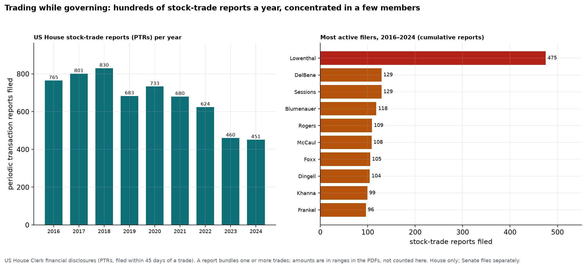

The STOCK Act (2012) forces members of Congress to file a Periodic Transaction
Report within 45 days of a securities trade, which makes the practice countable.
US House members filed **6,027 stock-trade reports from 2016–2024** — hundreds a
year — and, like every other pattern in this chapter, the activity is
**concentrated in a few names**: one representative (Alan Lowenthal) accounts for
**475** of them, more than the next three combined. Honestly, the trend has bent
*downward* since a 2018 peak of 830 (scrutiny, blind trusts, and retirements have
thinned it to ~450), and a report bundles one or more trades rather than being a
single trade — but the point stands that sitting legislators, including members of
the committees that oversee the affected industries, routinely hold and trade
individual stocks. The disclosure exists; the prohibition, so far, does not.

**The doors we still cannot open.** Three channels here are now measured — the
lobbying revolving door, the money flowing in, and trading in office — but the
family is larger, and much of it is deliberately opaque: regulators who join the
industries they policed; the Treasury-and-Fed↔Wall-Street traffic; and the judges,
ambassadors and agency heads whose next job is the reward for the last one. Those
remain, for now, in Chapter 9's honest "cannot measure" column. But one door in
that list *can* be opened all the way — the most storied of them all, the one
Eisenhower warned about — and the next two figures do exactly that.

## F10 — Dig deep: the defense revolving door, part I (the prize)

The "military-industrial complex" is the revolving door's most famous case, and it
is measurable end to end. Start with the prize — the flow of federal money that
makes the door worth walking through.

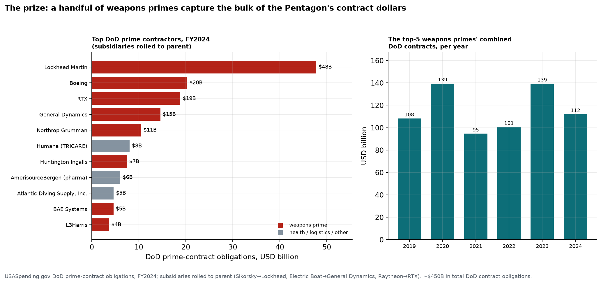

Of the roughly **$450 billion** the Pentagon obligates in prime contracts each
year, an enormous share pools into a handful of "primes." Rolling every subsidiary
up to its parent (Sikorsky into Lockheed, Electric Boat into General Dynamics,
Raytheon into RTX), **Lockheed Martin alone took ~$48 billion in FY2024** — more
than the next two combined — and the **top five weapons primes together captured
~$112 billion**, a figure that has run between $95B and $139B every year since
2019. This is the same pattern the whole chapter keeps finding — a few entities,
over and over — now in the one market the government itself creates by writing the
checks. A contract of this size is not just revenue; it is the reason a retired
four-star is worth a board seat.

## F11 — The defense revolving door, part II (the door)

So who sits on the boards that receive those contracts? Read the five primes' most
recent SEC proxy statements and count the directors who used to run the military
that buys from them.

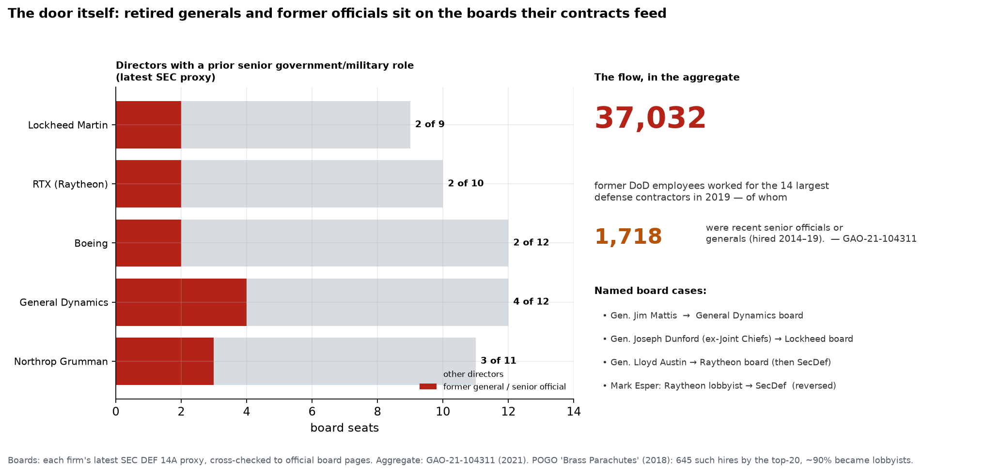

**Thirteen of the fifty-four directors — about one in four — at the five largest
weapons primes are retired generals and admirals or former senior officials.**
General Dynamics' board seats a former Deputy Secretary of Defense (Rudy deLeon)
alongside the retired four-star commanders of Special Operations Command and
Strategic Command; Northrop Grumman seats three four-star officers, including one
(Adm. Christopher Grady) who joined in **2026 straight from being Vice Chairman of
the Joint Chiefs of Staff**; Lockheed and Boeing and RTX each seat a pair of ex-
commanders and ex-service-secretaries. The door turns visibly: Gen. Jim Mattis sat
on General Dynamics' board, left to be Secretary of Defense, and *returned* to it;
Gen. Joseph Dunford went from Chairman of the Joint Chiefs to Lockheed's board four
months after retiring; Lloyd Austin sat on Raytheon's board before becoming
Secretary of Defense; and Mark Esper ran the door in reverse — Raytheon's top
lobbyist, then Secretary of Defense.

And that is only the boardroom. The **GAO** found that in **2019 the fourteen
largest contractors employed 37,032 former Department of Defense personnel** —
**1,718 of them recent senior officials, generals and acquisition officers**
(GAO-21-104311). POGO's *Brass Parachutes* counted **645 such hires by the top
twenty contractors, roughly 90% of whom registered as lobbyists**. The loop is now
fully drawn: the contractor wins the contract (F10); staffs its board and its
lobbying shop with the generals and officials who used to award and oversee those
contracts (F11); those insiders lobby their former colleagues (F8) and fund their
campaigns (the $23B of F8's PACs) — and the next contract is written. Nothing here
is illegal. That is precisely the point of the chapter: **the deepest chokepoints
in the economy are not conspiracies but incentives, operating in the open.**

## F12 — The loop in dollars: lobbying's staggering return, and the door running backward

F10 measured the contracts and F11 measured the people; the last figure prices the
*connection between them* — how much the primes spend influencing the government
that pays them.

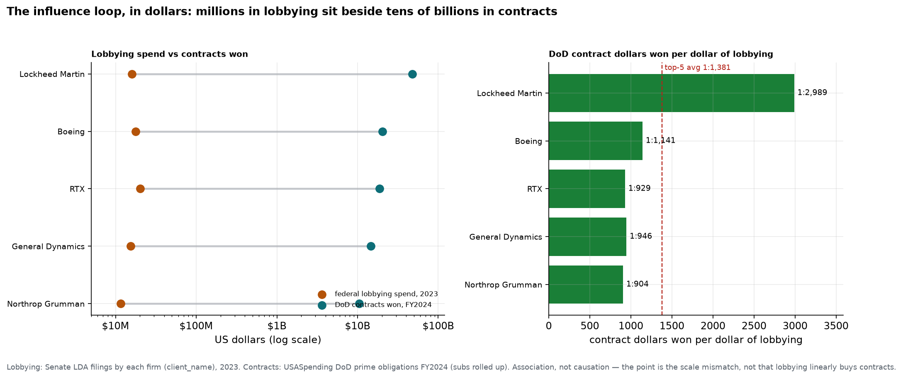

The numbers are almost comically lopsided. In 2023 the five primes spent, on
federal lobbying, **Lockheed $16.0M, RTX $20.3M, Boeing $17.8M, General Dynamics
$15.4M, Northrop $11.6M — about $81 million in total.** Against that they held, in
FY2024, roughly **$112 billion in DoD contracts.** Put those side by side and every
firm's lobbying is a rounding error on its contracts: across the top five, **each
$1 of lobbying sits beside about $1,400 of contracts** — and for Lockheed, whose
$16M of lobbying accompanies $48B in awards, the ratio is **1 to 2,989.** This is an
*association*, not proof that lobbying dollars linearly buy contracts — but that is
almost the point: when the potential prize is four-thousand-fold your outlay, a
lobbying shop and a boardroom of former generals is not corruption, it is
**arithmetic.** No rational contractor would spend less.

And the door runs *both ways*. The people who left government for the primes' boards
(F11) are matched by people who came the other way, from the contractors into the
top of the Pentagon: **Mark Esper** (Raytheon's chief lobbyist → Secretary of
Defense), **Lloyd Austin** (Raytheon's board → Secretary of Defense), **Patrick
Shanahan** (a Boeing executive → Deputy and acting Secretary of Defense), **Ellen
Lord** (Textron CEO → Under Secretary for Acquisition), **William Lynn** (Raytheon's
lobbyist → Deputy Secretary of Defense). The revolving door is not a one-way exit
from public service into private reward — it is a **continuous circulation** of the
same people between the buyer and the sellers, and it turns, administration after
administration, in full public view.

## F13 — The return on lobbying: which *forms* pay best?

F12 found that defense contracts return roughly **$1,400 per $1** of lobbying.
Generalize the question: across the whole economy, which *kind* of lobbying pays
the highest return — and what does "return" even mean?

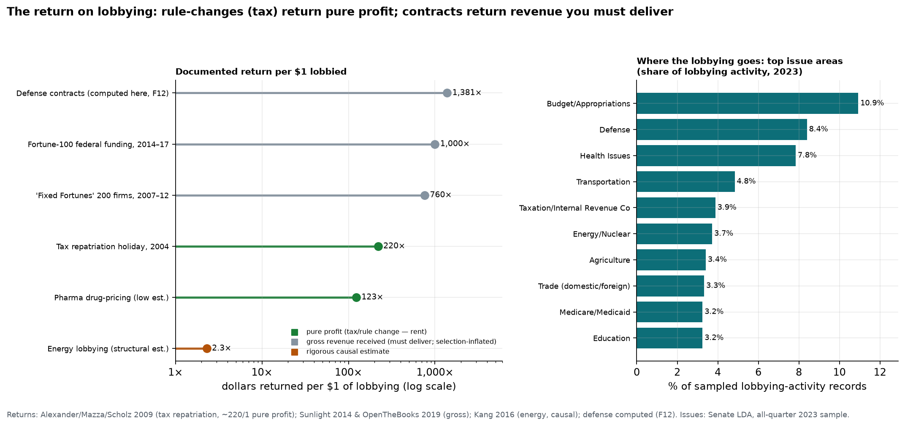

The eye-popping ratios all measure the same crude thing — **gross dollars received
per lobbying dollar** — and they are enormous: the Sunlight Foundation found the 200
most politically active firms turned $5.8B of lobbying-and-donations into **$4.4
trillion** of federal business (**~$760:1**, 2007–12); *OpenTheBooks* put the
Fortune-100 at **~$1,000:1**; our own defense computation, **~$1,400:1**. But those
numbers are **revenue, not profit** — a defense contract is money the firm must
build submarines to earn — and they are inflated by *selection* (big, successful
firms both lobby heavily and win business anyway). The economist's standing warning
(Ansolabehere, de Figueiredo & Snyder, 2003) is decisive: *if the return were really
1,000-to-1, firms would spend vastly more than the few billion they do.* So the
gross ratios overstate the causal payoff.

The number that survives the scrutiny points to a different form entirely. The
best-identified return in the literature is a **tax rule-change**: firms that
lobbied for the 2004 repatriation holiday saved about **$220 in taxes for every $1
spent** (Alexander, Mazza & Scholz, 2009) — Eli Lilly turned **$8.5M of lobbying
into over $2 billion** in tax savings. Peer-reviewed work finds the mechanism
directly: a 1% rise in lobbying lowers a firm's effective tax rate by **0.5–1.6
percentage points** (Richter, Samphantharak & Timmons, 2009). And the one rigorous
*structural* estimate of a whole sector — energy — lands far below the watchdog
headlines, at roughly **130%** (Kang, 2016): still an excellent investment, but
1,000× smaller than the gross ratios imply.

Put together, the forms rank by the **nature of the payoff**, and that is the
finding: **a rule-change returns pure profit; a contract returns revenue.** Lobbying
to win a contract buys you a job you must still perform at a thin margin. Lobbying to
change a tax rate or soften a regulation buys you **economic rent** — money that
drops straight to the bottom line, requires no delivery, and *recurs every year the
rule stands.* A dollar of tax saved is a dollar of profit; a dollar of contract is a
dollar of work. That is why the most sophisticated influence money does not chase
appropriations — it edits a line of the tax code. And it shows in *where* the
lobbying goes (right panel): the activity concentrates on exactly the two high-return
arenas — the money-handout accounts (**appropriations, defense, Medicare**) and the
**rule-writing** ones (**tax, health, energy**). The cheapest thing to buy in
Washington, dollar for dollar, is a favorable rule.

## F14 — The retail end: small local office, huge leverage, no scrutiny

Everything above is federal. But the same incentive — an office worth far more than
it pays — is sharpest, and least watched, at the *bottom* of the system: the county
commission, the city council, the water district board.

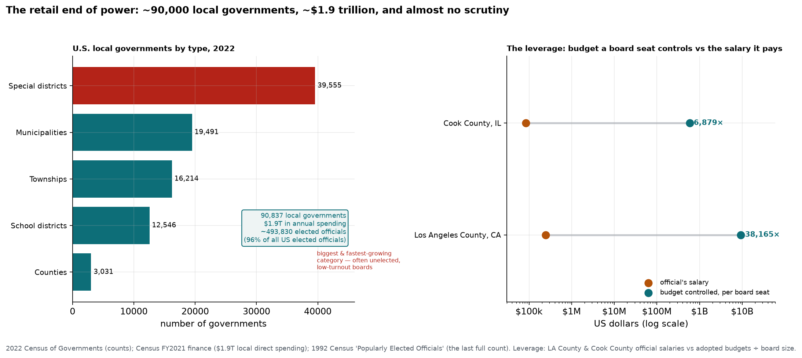

Local government is where the *volume* of American governance actually lives. There
are **90,837 local governments** (2022 Census), spending roughly **$1.9 trillion a
year**, run by about **494,000 elected officials — 96% of every elected official in
the country** (the last full count, tellingly, was in *1992*; no one has counted
since). The largest and fastest-growing category is the one almost no voter can
name — the **39,555 special districts** (water, fire, transit, port, development
authorities), many with appointed or near-unopposed boards, spending on the order of
$200 billion with little public attention.

And the leverage is staggering. A **Los Angeles County supervisor earns $244,727** —
and sits on a five-member board steering a **$46.7 billion** budget: about
**$38,000 of public spending controlled for every $1 of salary.** A **Cook County
commissioner earns $85,000** against a $9.9B budget — **~6,900 to 1.** At the small
end, rural commissioners are paid **$8,000–$25,000 part-time stipends** while still
voting on multi-million-dollar contracts and the zoning that makes or breaks local
fortunes. This is the revolving-door incentive of F8–F13 in its purest, cheapest
form: an office that controls thousands to tens of thousands of times what it pays,
with none of the press, disclosure, or opposition-research that shadows a federal
seat. The *return on capturing* a local office is higher precisely because the office
is small.

## F15 — What it buys: the retail market in access

So the transaction happens where the leverage and the darkness are greatest.

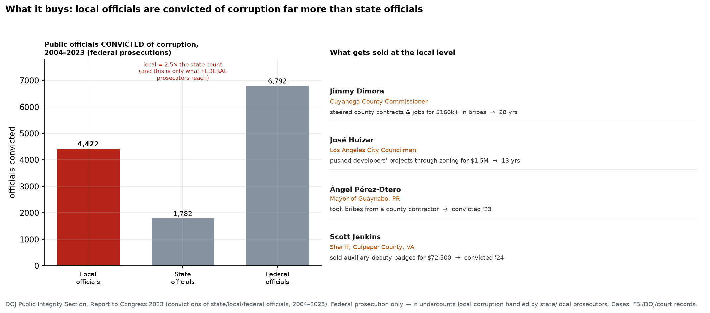

Count the officials federal prosecutors have actually convicted of corruption and
the retail level dominates: **4,422 local officials convicted from 2004–2023 — two
and a half times the 1,782 state officials** — and that is only the fraction that
*federal* prosecutors reach, on top of everything handled (or ignored) by local
DAs. The cases show exactly what is for sale, and it is never abstract: **Jimmy
Dimora**, a Cuyahoga County commissioner, took **$166,000+ in bribes to steer county
contracts and jobs** (28 years); **José Huizar**, an LA city councilman, took
**$1.5 million from developers to push their projects through zoning** (13 years); a
Puerto Rico mayor took a contractor's bribes; a Virginia sheriff literally **sold
deputy badges** for $72,500. The retail menu is contracts, permits, zoning
variances, and jobs — the small, concrete favors a single local vote can grant.

Put F8–F15 together and the chapter's thesis reaches its floor: influence is a
*market*, and it clears most efficiently where the ratio of **power controlled to
scrutiny applied** is highest. At the top that means the tax code (F13); at the
bottom it means a county commission that moves billions while almost no one is
watching. **The most profitable public office to capture is often the smallest one.**

## F16 — Digging deeper: the pots we hadn't counted

The $1.9 trillion operating budget of F14 is the surface everyone watches — the one
with public hearings and a press corps. But it is not even the largest pool a state
or local official steers. Widen the lens to the money surfaces we had not counted,
and each turns out to have its *own* dedicated pay-to-play channel.

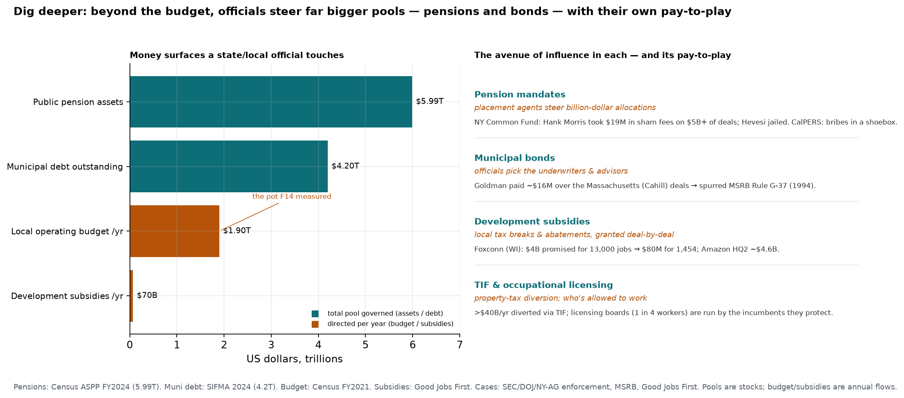

**Public pension funds are the biggest pot of all: ~$6 trillion** in state and local
retirement assets (Census, 2024) — three times the operating budget — invested at
the discretion of boards whose trustees are elected officials and their appointees.
The mechanism is the **placement agent**: a middleman paid by a money manager to win
a billion-dollar allocation, who funnels the value back to the officials who decide.
It produced some of the ugliest corruption on record — New York's Common Retirement
Fund (advisor Hank Morris took **$19M in sham "finder" fees** on $5B+ of deals;
Comptroller Alan Hevesi went to prison), and **CalPERS**, where the CEO took bribes
delivered *in a paper bag and a shoebox*. The scandals were so systemic they forced
a dedicated federal rule (SEC 206(4)-5, 2010). The **$4.2 trillion municipal-bond
market** works the same way — officials hand underwriting business to the banks and
advisors they choose, a pay-to-play so routine it required its own rule back in 1994
(**MSRB G-37**, written after affairs like Goldman's $16M Massachusetts settlement).
And **economic-development subsidies** — an estimated **$45–90 billion a year** in
local tax breaks — are granted deal-by-deal, producing spectacles like Wisconsin's
**Foxconn** package (**$4 billion promised for 13,000 jobs; delivered $80M for
1,454**). Add TIF districts (~$40B/yr of property tax quietly diverted) and
occupational-licensing boards (staffed by the incumbents they protect), and the map
of local influence is far larger than any single budget.

**So yes — there were whole avenues, and whole datasets, we had not touched.** The
public record for them exists and is mostly free: the **Census Annual Survey of
Public Pensions** and **individual-unit government-finance files**, **USASpending**
assistance awards, the **Good Jobs First Subsidy Tracker**, **MSRB EMMA** for muni
deals, **SIFMA** for market size, and **OpenSecrets/FollowTheMoney** for the ~$4.6B
of state-level campaign money that funds these very offices. Each is a natural next
expedition. The pattern they would confirm is already visible: **for every pool of
public money, a channel evolves to convert control of it into private gain — and the
bigger and quieter the pool, the more developed the channel.** The operating budget
was never the whole story; it was just the part with the lights on.

## F17 — The oldest avenue: the public estate, sold below cost

So far influence has meant *money*. But the government also owns a third of the
country's *land* — and hands its wealth to private extractors at rates written into
statute, no bribe required.

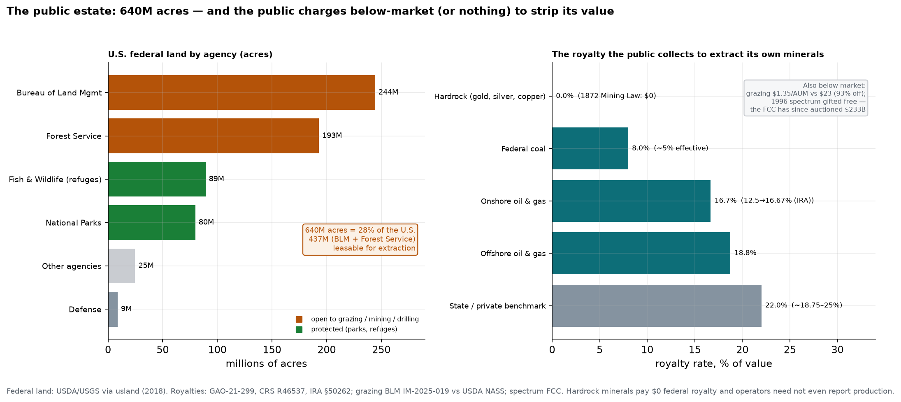

The United States owns **640 million acres — 28% of the country** — and **437
million of them (the Bureau of Land Management's range and the National Forests) are
open to grazing, mining, and drilling.** The terms are the avenue. Under the
**General Mining Law of 1872 — still in force — hardrock minerals pay a $0 federal
royalty**: an estimated **$4.9 billion a year** of gold, silver and copper is
stripped from public land for free, and because no royalty is owed, operators are
not even *required to report* what they take (over a decade, ~870 tons of gold worth
**~$35 billion** came off federal land in Nevada alone). **Grazing** fees are
**$1.35 per animal-unit-month against a ~$23 private-market rate — a 93% discount**
on a program that loses money outright. Federal **oil and gas** royalties (12.5%,
lifted to 16.67% only in 2022) sit *below* the offshore rate (18.75%) and below what
Texas or a private landowner charges (up to ~25%). And **spectrum**: the 1996
Telecommunications Act simply *gave* incumbent broadcasters a second channel worth
an estimated **$70 billion for free** — even as the FCC has raised **$233 billion**
auctioning the same airwaves to everyone else. This is the purest form of the whole
chapter's thesis: capture so old and so structural it needs no scandal — the commons
is transferred to private hands at prices no private landlord would ever accept.

## F18 — What else is here: the map of avenues across every branch

Step all the way back. The chapter began with ownership and index votes; it has now
walked through Congress, the agencies, the states, the localities, and the land
itself. Lay every avenue on one map, and the surface area of private capture — and
how much of it we have and haven't yet measured — comes into view.

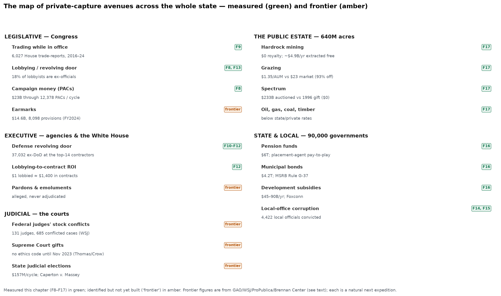

The map organizes the avenues by branch: **legislative** (trading, lobbying, PACs,
earmarks), **executive** (the defense revolving door and its ROI, pardons),
**judicial**, **the public estate** (F17), and **state and local** (F14–F16). When
this map was first drawn, five of the eighteen were still *frontier* — identified and
sourced, but unbuilt. **The three figures that follow open the last of them:** the
judiciary (F19), the pardon power (F20), and earmarks (F21). Every one had a **free,
public dataset** waiting — the Free Law Project's database of judges' financial
disclosures, the DOJ's clemency statistics, GAO's earmark files, the Brennan Center's
judicial-election money — so the whole map is now green.

But the map already answers the question it poses. Across all five domains the same
law holds: **wherever public power or public wealth pools, a channel evolves to
convert it into private gain — by bribe (the county commission), by rule (the tax
code), by statute (the 1872 mining law), or by the quiet gift (spectrum, royalty-free
ore).** The surface area is enormous, it spans every branch, and — this is the
through-line of the entire chapter — **almost all of it is perfectly legal.**

## F19 — Opening the judicial door: buying the judge, and owning the docket

The judiciary was the largest blind spot, and it turns out to be captured from *both*
directions — the money that puts state judges on the bench, and the portfolios
federal judges hold while ruling.

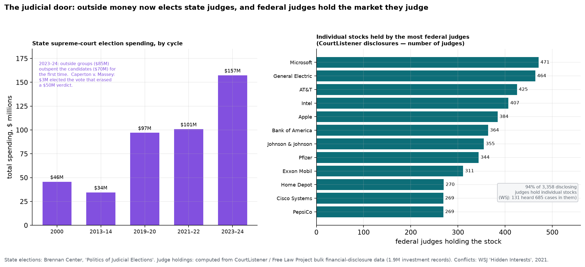

**87% of state judges must face voters** — and the price of a seat has exploded.
State supreme-court election spending rose from **$46M (2000) to a record $157M in
2023–24**, and in that cycle, for the first time, **outside interest groups ($85M)
outspent the candidates themselves ($70M)** — the litigants and lawyers who appear
before these courts now fund the campaigns that seat them. The mechanism's purest
case is *Caperton v. A.T. Massey Coal*: a coal CEO spent **~$3 million to elect a
West Virginia justice**, who then cast the deciding vote to **erase a $50 million
verdict against his company** (the U.S. Supreme Court, 5–4, finally called that a due-
process violation). On the *federal* side the conflict is about holdings, and it is
now **computable** — and I computed it. Joining the Free Law Project's bulk
disclosure data (**1.9 million investment line-items** across 3,358 judges'
financial-disclosure filings) reveals a near-universal conflict surface: **94% of
disclosing federal judges hold individual stocks**, and the market's blue-chips —
the companies that most often turn up as litigants — are each held by *hundreds* of
individual judges: **Microsoft by 471, General Electric 464, AT&T 425, Intel 407,
Apple 384, ExxonMobil 311.** That is exactly why the *Wall Street Journal* could find
**131 federal judges who heard 685 cases involving companies in their own
portfolios**, ruling for their financial interest about two-thirds of the time — with
so many judges holding the same few hundred big companies, the overlaps are not
accidents but arithmetic. And the **Supreme Court had no binding ethics code at all
until November 2023**, adopted amid the Thomas–Crow gift disclosures and still without
an enforcement mechanism. The least-watched branch is bought going in and conflicted
sitting down.
the **Supreme Court had no binding ethics code at all until November 2023**, adopted
amid the Thomas–Crow gift disclosures and still without an enforcement mechanism. The
least-watched branch is bought going in and conflicted sitting down.

## F20 — Opening the executive door: the pardon power

The presidency's most unreviewable act is the pardon — no appeal, no oversight. The
DOJ's own clemency data, president by president, shows what has become of it.

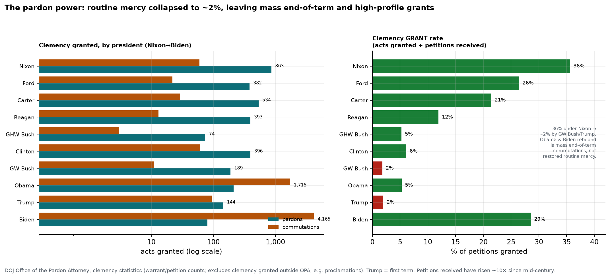

**Routine mercy has collapsed.** The share of clemency petitions granted fell from
**36% under Nixon to about 2% under George W. Bush and Trump**, even as demand
exploded — commutation petitions rose roughly tenfold, to **36,544 under Obama**.
What remains is not steady, case-by-case mercy but two other things: **mass
end-of-term grants** — Biden's record **4,165 commutations**, the bulk in his final
months, echoing Obama's late surge and Clinton's last-day pardons — and the
high-profile individual favor. The pardon has migrated from a routine humanitarian
instrument into a concentrated, discretionary power exercised on the way out the
door. (The other executive avenue on the map, *emoluments*, remains genuinely
un-measured — the Trump-era cases were dismissed as moot with no ruling — the one
door the record leaves ajar.)

## F21 — Opening the legislative door: earmarks return

After a decade-long ban (2011–2021), Congress brought **earmarks** back — member-
directed spending written by name into the appropriations bills — and GAO's line-item
files make it fully countable.

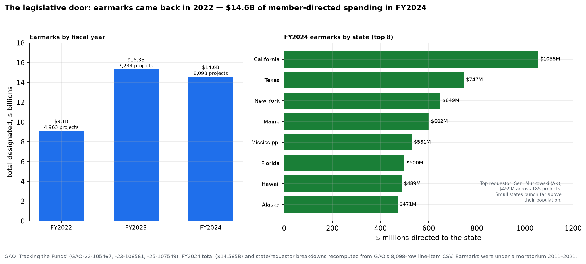

Earmarks went from **$9.1B (FY2022) to $15.3B (FY2023) to $14.6 billion across 8,098
provisions in FY2024.** Recomputing GAO's 8,098-row file by state shows the money
does not follow population — it follows *placement*. California and Texas lead in raw
dollars, but right behind them sit **Maine ($602M), Mississippi ($531M), Hawaii
($489M), and Alaska ($471M)** — small states with senior appropriators. Per resident
the tilt is extreme: Alaska's ~$471M for 730,000 people is **more than twenty times
California's per-capita haul.** The single largest requestor was **Sen. Lisa Murkowski
(AK), ~$459M across 185 projects.** Earmarks are the most direct avenue of all —
putting your district's name in the spending bill — and, disclosed though they now
are, they reward committee seniority and small-state leverage, not need.

**With these three doors open, every avenue on the map is measured.** The chapter's
last word is the map's: the machinery of converting public power into private gain is
vast, it runs through every branch and every level of government, and its most
striking feature is not that it is hidden but that it is **legal.**

## Reality check — is concentration rising *everywhere*?

## Reality check — is concentration rising *everywhere*?

This chapter, and the report's synthesis, keep arriving at concentration. That
deserves a stress test: put *every* concentration measure the warehouse can
compute on one time axis, and ask whether they all bend the same way.

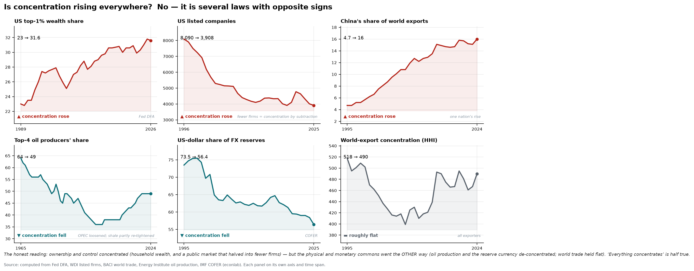

They do not. Concentration is **several laws with opposite signs**. Ownership and
control concentrated hard — the US **top-1% wealth share** climbed from 23% to
~32%, and the **public market itself halved**, from 8,090 listed companies in
1996 to ~3,900 (concentration by subtraction, as buyouts and mega-caps swallow
the rest), while **one nation**, China, tripled its share of world exports from
4.7% to 16%. But the *physical and monetary commons* moved the **other** way: the
**top-4 oil producers' share fell** from 64% to 49% (OPEC's grip loosened, then
US shale partly re-tightened it), and the **dollar's share of FX reserves slid**
from 73% to 56% as the world quietly diversified — while **world trade as a
whole held roughly flat** (export HHI ~490; China's rise was absorbed, not added
to overall concentration).

So the honest verdict on the report's own "concentration spine" is that **it is
real for assets and control, and false for the commons.** The hands tightened on
who *owns* and who *decides* — but loosened on who *pumps the oil* and whose
*money the world holds*. "Everything concentrates" is a half-truth, and the half
that is true is the half about power.

## What it means

The recurring "rule of few" is not a conspiracy; it is a *structure*.
Bottlenecks form wherever physics (EUV), network effects (search, operating
systems), regulation (ratings, proxy advice, payment rails), or geography
(rare earths) make a step hard to replicate — and whoever holds that step
holds everyone downstream of it. The concentration this report keeps
finding — in wealth (Chapter 6), in banks and index votes (Chapter 9), in land
(Chapter 7) — is a general law *of ownership and control* (though, as the
reality check above shows, not of the physical commons). The chokepoint is the
unit of modern power, and there are far fewer hands on the levers than the
diffuse language of "markets" and "shareholders" suggests.

## Caveats

- **Curated, not computed.** Market shares are from industry reports and
  company proxies, with the definitional fuzziness the AI cross-check makes
  visible (F1's TSMC case). Treat them as well-sourced estimates with ±5–10pp
  bands, and the *pattern* (1–4 controllers, 60–100%) as the robust finding.
- The AI panel is a *corroboration* layer, not ground truth — the models share
  training data and can share errors; a ✓ means "not obviously wrong to three
  independent frontier models," a useful but limited signal. Full transcripts
  are logged to `data/panel/runs.jsonl`.
- Voting/economic splits (F2) are point-in-time from the latest proxy
  statements and shift with share sales.
- SWF AUM figures vary by source and by whether central-bank reserves are
  counted; ranks are firmer than exact levels.

*Next: Chapter 11 — Dynasties: whether this kind of control persists across centuries.*
