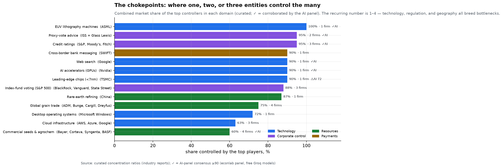
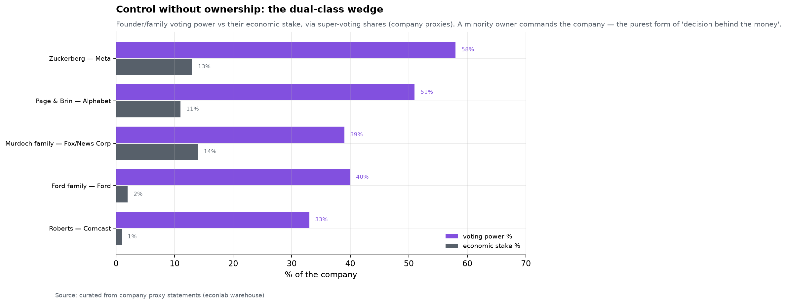
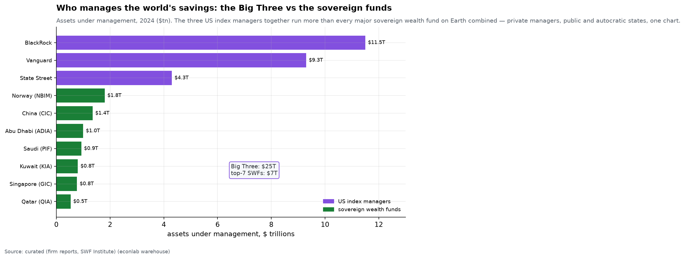
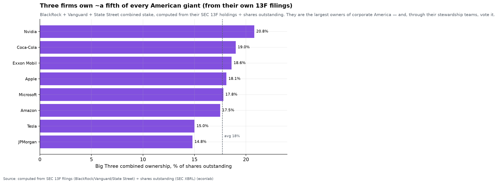
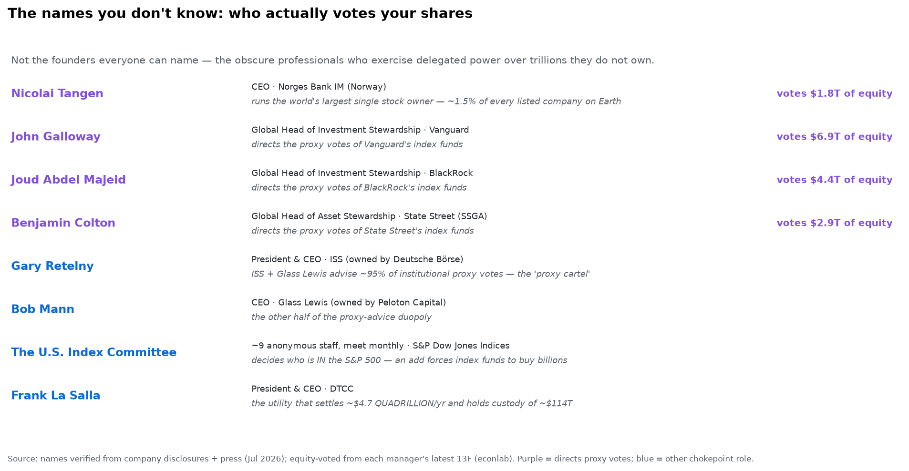
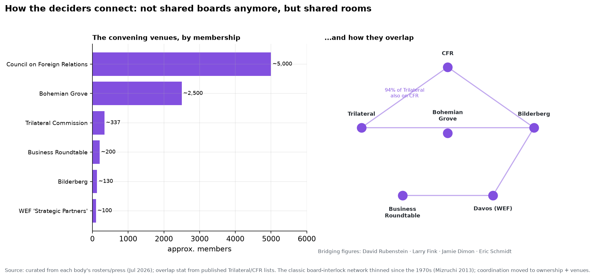

# Chapter 10 — The Chokepoints: where a few control the many

*World Economy Lab. Generated 2026-07-19; module `econlab/analysis/ch10_chokepoints.py`.
Chapter 6 found that three index managers vote most of the S&P 500; this
chapter asks whether that pattern — a handful of hands on a vast lever — is
special to finance. It is not. It is the default structure of the modern
economy.*

**A note on method.** Unlike the rest of this report, most numbers here are
**curated** market-share figures, not computed from primary data — concentration
ratios live in industry reports, not open datasets. So this chapter does
something new: it **cross-checks each headline figure through the AI panel**
(Chapter 0's `econ panel` apparatus, polling three free models — Llama-3.3,
Qwen3, and GPT-OSS — independently). Where the panel's consensus corroborates
the curated number it is marked ✓; where the models diverge, that is flagged
(⚠) as an honest signal that the figure is contested or definition-sensitive.
Verify everything — including with a jury of machines.

## F1 — The map: one, two, or three entities, over and over

Lay the economy's critical bottlenecks side by side and the same number keeps
appearing — **1, 2, 3, at most 4**:

| Chokepoint | Controllers | Share | AI panel |
|---|---|---|---|
| EUV lithography machines | **1** — ASML | **100%** | ✓ 100/100 |
| Proxy-vote advice | 2 — ISS + Glass Lewis | 95% | ✓ 98/100 |
| Credit ratings | 3 — S&P, Moody's, Fitch | 95% | ✓ 100/100 |
| Cross-border bank messaging | 1 — SWIFT | ~90% | — |
| Web search | 1 — Google | ~90% | ✓ 94/100 |
| AI accelerators | 1 — Nvidia | ~90% | ✓ 97/100 |
| Leading-edge chips (<7nm) | 1 — TSMC | ~90% | ⚠ 72/100 |
| Index-fund voting (S&P 500) | 3 — the Big Three | 88% | — |
| Rare-earth refining | 1 — China | ~87% | — |
| Global grain trade | 4 — the "ABCD" | ~75% | — |
| Desktop operating systems | 1 — Windows | ~72% | — |
| Commercial seeds & agrochem | 4 — Bayer/Corteva/Syngenta/BASF | ~60% | ✓ 100/100 |

The purest case is **ASML**: *one company, in one country (the Netherlands),*
makes every extreme-ultraviolet lithography machine on Earth — and without
those machines, no one makes an advanced chip. The AI panel agreed 100/100.
The only figure the panel *contested* was **TSMC's ~90%**: the models split
between 50% and 90% (consensus just 72/100) — correctly, because it depends on
definition. TSMC makes ~90% of the *most advanced* (sub-5nm) chips but ~60% of
*all* foundry output. The cross-check earned its keep by flagging the one
number that needed an asterisk.

Three kinds of force create these bottlenecks, and every row is one of them:
**technology** (the physics of EUV, the network effects of search), **regulation**
(credit ratings and proxy advice are quasi-official gatekeepers written into
rules), and **geography** (China's rare-earth refining, one nation's grip on a
processing step). Concentration is not a coincidence of any single industry;
it is what happens wherever a bottleneck can form.

## F2 — Control without ownership: the dual-class wedge

Chapter 6 drew the line between *stewards* (who run others' money) and *owners*
(who run their own). There is a third move, the most direct answer to "who
makes the decision behind the money": **control the votes without owning the
company.** Through super-voting share classes, a founder or family commands the
firm while holding a small slice of its economics:

| | Voting power | Economic stake |
|---|---|---|
| **Zuckerberg — Meta** | **58%** | 13% |
| Page & Brin — Alphabet | 51% | 11% |
| Ford family — Ford | 40% | **2%** |
| Murdoch family — Fox/News Corp | 39% | 14% |
| Roberts — Comcast | 33% | 1% |

Mark Zuckerberg controls an outright *majority* of Meta's votes — every
director, every acquisition, every strategic pivot for ~3 billion users — on a
13% economic stake; the **Ford family runs Ford on 2%**; the Roberts family
runs Comcast on 1%. This is the ownership society's fine print: the "1.1% of
the stock market" the bottom half owns (Chapter 6) carries votes, but the
votes that *decide* are welded to founders through a share structure the index
funds cannot touch. Ownership is diffuse; control is not.

## F3 — Who manages the world's savings

Zoom out to the pools of investable capital themselves — the money that buys
the shares that carry the votes. Set the private US index managers beside the
sovereign wealth funds of entire nations:

- **BlackRock alone ($11.5T)** manages more than the six largest sovereign
  wealth funds *combined*. The **Big Three together (~$25T)** exceed **every
  major SWF on Earth put together (~$7T)** by more than threefold.
- The largest state pools — Norway's oil fund ($1.8T), China's CIC ($1.4T),
  Abu Dhabi ($1.0T), Saudi Arabia's PIF ($0.9T) — are each a single
  decision-making body directing a nation's collective savings.

So the world's savings are managed by a startlingly short list: **three
private American firms and a dozen state funds.** Whether the manager is a
Boston mutual, a Gulf monarchy, or the Chinese state, the structure is
identical — an enormous pool, a tiny committee.

## F4 — The names you don't know: who actually casts the votes

The founders are a distraction. Musk, Zuckerberg, the Google pair — everyone
can name them, and their fame is exactly why they are *not* the answer to "who
decides." The people who quietly wield the most concentrated power over
corporate America are ones almost no one can name, because they exercise
*delegated* authority over trillions they do not own.

Start with what the Big Three actually own — not curated this time, but
**computed from their own SEC 13F filings** ÷ shares outstanding:

| Company | BlackRock + Vanguard + State Street own |
|---|---|
| Nvidia | **20.8%** |
| Coca-Cola | 19.0% |
| Exxon Mobil | 18.6% |
| Apple | 18.1% |
| Microsoft | 17.8% |
| Amazon | 17.5% |
| JPMorgan | 14.8% |

Three firms are the **largest owners of essentially every American giant —
~18% on average**, and because voter turnout is far below 100%, that ~18% of
*shares* becomes ~**25% of votes cast** (Chapter 6). Each holds 4,000–5,000
US companies. So who, specifically, points that voting bloc? Not a CEO you've
heard of — a **stewardship team head** most people have never heard of:

- **Joud Abdel Majeid** runs *BlackRock Investment Stewardship* — she directs
  the proxy votes attached to BlackRock's index funds. **John Galloway** does
  it at Vanguard; **Benjamin Colton** at State Street (he came from Norway's
  fund). A few dozen analysts under each of them decide how ~$14T of equity
  votes at every annual meeting in America. These three names, effectively,
  are the swing shareholder of corporate America.
- Telling them *how* to vote: two firms almost no retail investor has heard
  of. **Gary Retelny's ISS** (owned by Germany's Deutsche Börse) and **Bob
  Mann's Glass Lewis** (owned by a Canadian PE firm) write the voting
  recommendations that move ~95% of institutional proxies — a duopoly a 2025
  Congressional hearing literally titled *"the proxy advisory cartel."*
- Deciding *which companies exist* to the index in the first place: the **S&P
  Dow Jones Indices U.S. Index Committee** — roughly nine full-time,
  unpublicized staff who meet monthly and hold *discretionary* authority over
  S&P 500 membership. When they add a company, the world's index funds are
  forced to buy billions of it; when they drop one, forced to sell. No public
  vote, no famous name.
- Running an entire nation's savings as *one* portfolio: **Nicolai Tangen**,
  CEO of Norway's oil fund — **the single largest owner of stocks on the
  planet, holding ~1.5% of every listed company on Earth.** One Norwegian,
  one fund, a slice of everything.
- And beneath all of it, the plumbing: **Frank La Salla's DTCC** settles
  ~$4.7 *quadrillion* a year and holds custody of ~$114 trillion in
  securities — the ledger on which "who owns what" is actually recorded.
  Almost nobody knows it exists.

This is the real answer to "who makes the decision behind the money." It is
not the centibillionaire founders; it is a **stewardship team lead, a proxy
analyst, an index-committee member, a sovereign-fund CIO** — salaried
professionals, largely anonymous, exercising more concentrated control over
corporate America than any tycoon, precisely because their power is delegated
rather than owned. The founders get the magazine covers; these people cast the
votes.

## F5 — The network: boards, clubs, family, and benefactors

So do the deciders connect — sit on the same boards, belong to the same clubs,
share a family or a patron? Yes, but the honest, scholarship-grounded answer
overturns the intuitive one, and it changed shape over the last half-century.

**The classic answer — interlocking boards — has *faded*.** In the mid-20th
century a genuinely dense network of *interlocking directorates* bound the
corporate elite: the same people sat on each other's boards, and the boards of
the big commercial banks were the meeting rooms where the CEOs of everyone else
convened (Mills' *The Power Elite*, 1956; Useem's "inner circle"). That network
**thinned sharply after the 1970s** — the banks that hosted it declined, the
1980s takeover wave shattered old loyalties, and "overboarding" rules (proxy
advisers now frown on a director serving more than ~4–5 boards) capped the
multi-board "big linkers." Mizruchi's *The Fracturing of the American Corporate
Elite* (2013) and Chu & Davis's *Who Killed the Inner Circle?* document the
decline. Our AI panel, asked to fact-check it, agreed **unanimously (100/100)**.
The naive picture — a handful of tycoons ringing every boardroom — is *less*
true than it was in 1960.

**The cohesion moved somewhere tighter: common ownership.** The reason the
elite no longer *needs* dense board interlocks is F4: the same three firms
already own ~18% of *every* large company. Shared owners are a firmer tie than
shared directors ever were — BlackRock, Vanguard, and State Street sit
(through their stewardship votes) on the cap table of all of them at once. The
network didn't disappear; it relocated from the boardroom to the register of
shareholders.

**And it moved to shared *rooms*.**

The deciders convene, repeatedly and by invitation, in a small set of venues:
the **Business Roundtable** (~200 CEOs of the largest US firms), the **World
Economic Forum's ~100 "Strategic Partners"** (the Davos inner ring), and the
older policy-and-finance circuit — the **Council on Foreign Relations**, the
**Trilateral Commission** (whose roster overlapped CFR's by ~94% in the one
year both were public), **Bilderberg** (invitation-only, Chatham House rules,
no published roster), and social retreats like **Bohemian Grove**. The same
handful of people bridge several at once — **David Rubenstein** (CFR chair *and*
WEF trustee), **Larry Fink**, **Jamie Dimon**, **Eric Schmidt**. This is the
grain of truth in the "same clubs" intuition — documented, measurable overlap —
though the sober sociology (Domhoff's *Who Rules America*) treats these as
coordination *venues*, not a cabal: they set a shared agenda far more than they
issue orders.

**Family** is the oldest tie and the subject of the next chapter. Dynastic
control persists (Chapter 11) — the Walton, Koch, Mars, and Arnault families;
the super-voting share structures of F2 that keep companies in a bloodline;
and, historically, marriage alliances among "old money." But in the US, family
is now a *smaller* share of elite cohesion than ownership or venue — the
founder-controlled firm (Meta, Ford) is the modern echo of the dynasty.

**Benefactors and patrons** are the newest and most visible tie, especially in
tech. The "**PayPal Mafia**" — Peter Thiel, Elon Musk, Reid Hoffman, Max
Levchin, David Sacks, and their colleagues from one late-1990s startup — went
on to found or fund an outsized share of Silicon Valley (Tesla, SpaceX,
LinkedIn, Palantir, YouTube, Yelp, and, through Founders Fund and others, a
long tail of the rest). The other great patronage channel is the **revolving
door** between Goldman Sachs / BlackRock and the Treasury and Federal Reserve —
the same institutions of Chapter 6, staffing the government that regulates
them. These are patronage networks: a common origin or backer, not a shared
boardroom.

The full answer, then: the deciders *are* connected — but through **ownership,
convening venues, and patronage** far more than through the interlocking
boards the question imagines, and less tightly than the conspiratorial version
supposes. The structure is real, measurable, and mostly hidden in plain
sight — which is exactly why it is worth mapping rather than mythologizing.

## What it means

The recurring "rule of few" is not a conspiracy; it is a *structure*.
Bottlenecks form wherever physics (EUV), network effects (search, operating
systems), regulation (ratings, proxy advice, payment rails), or geography
(rare earths) make a step hard to replicate — and whoever holds that step
holds everyone downstream of it. The concentration this report keeps
finding — in wealth (Chapter 5), in banks and index votes (Chapter 6), in land
(Chapter 7) — is one instance of a general law. The chokepoint is the unit of
modern power, and there are far fewer hands on the levers than the diffuse
language of "markets" and "shareholders" suggests.

## Caveats

- **Curated, not computed.** Market shares are from industry reports and
  company proxies, with the definitional fuzziness the AI cross-check makes
  visible (F1's TSMC case). Treat them as well-sourced estimates with ±5–10pp
  bands, and the *pattern* (1–4 controllers, 60–100%) as the robust finding.
- The AI panel is a *corroboration* layer, not ground truth — the models share
  training data and can share errors; a ✓ means "not obviously wrong to three
  independent frontier models," a useful but limited signal. Full transcripts
  are logged to `data/panel/runs.jsonl`.
- Voting/economic splits (F2) are point-in-time from the latest proxy
  statements and shift with share sales.
- SWF AUM figures vary by source and by whether central-bank reserves are
  counted; ranks are firmer than exact levels.

*Next: Chapter 11 — Dynasties: whether this kind of control persists across
centuries.*
