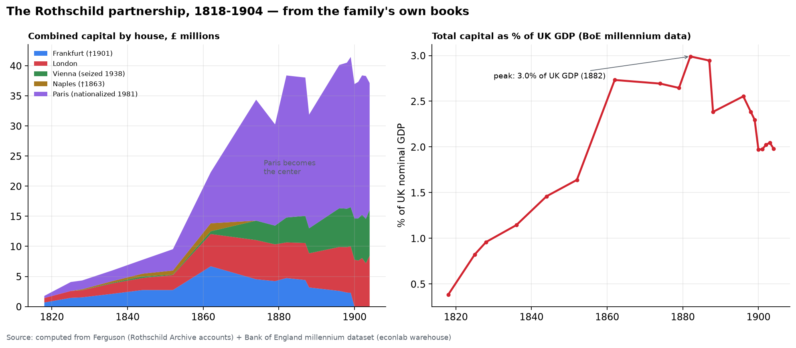
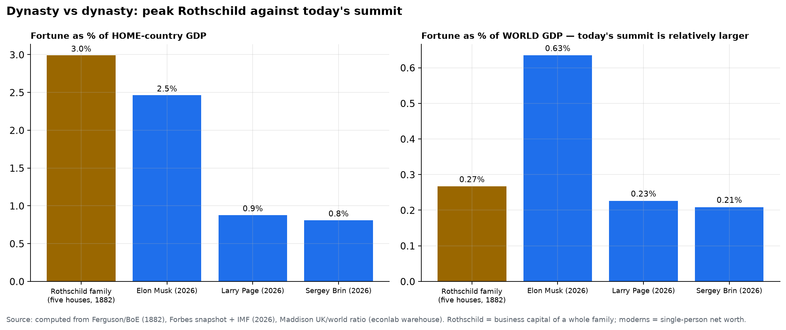
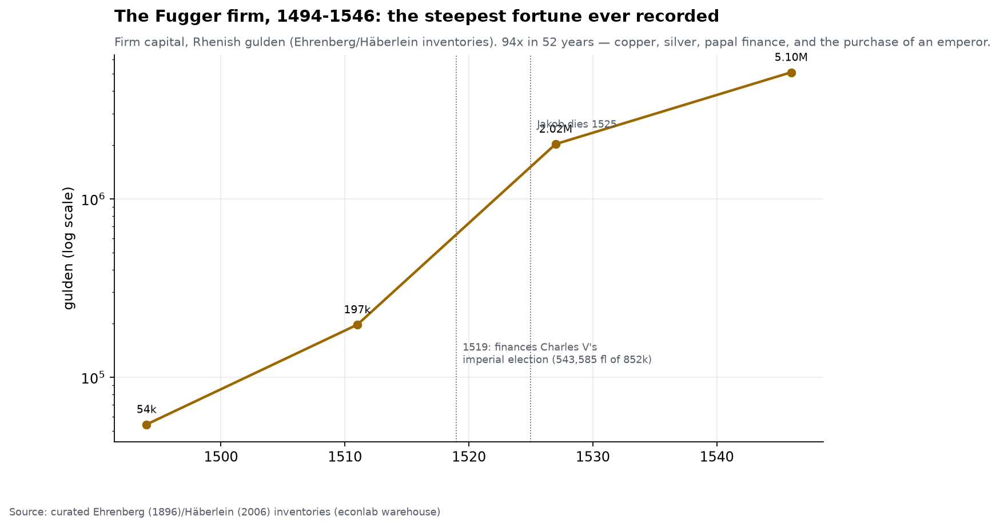
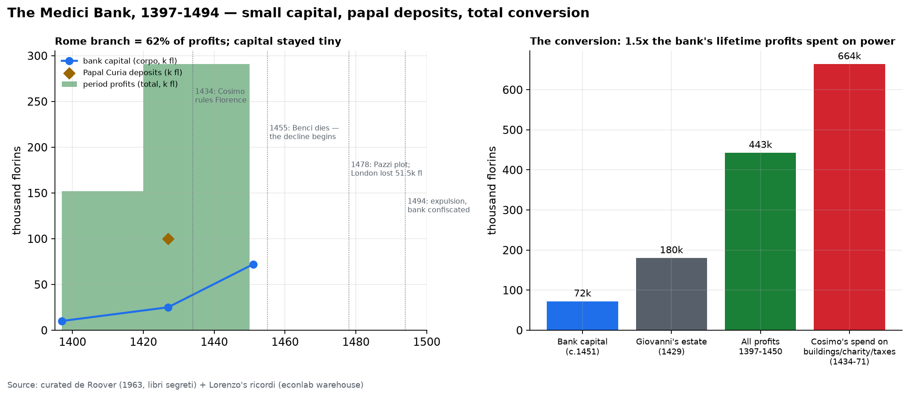
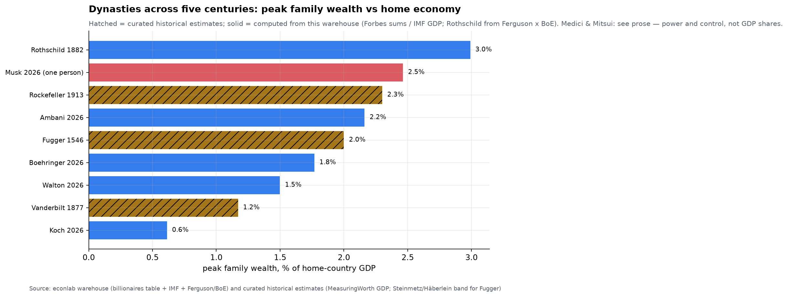
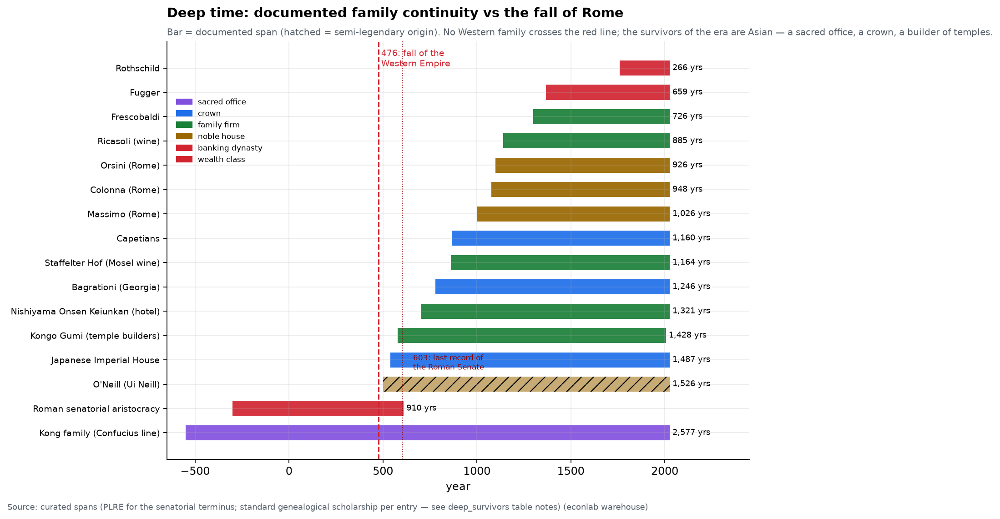
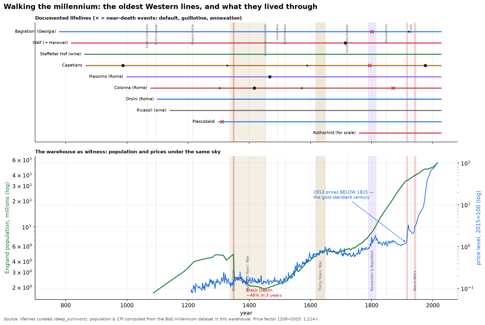
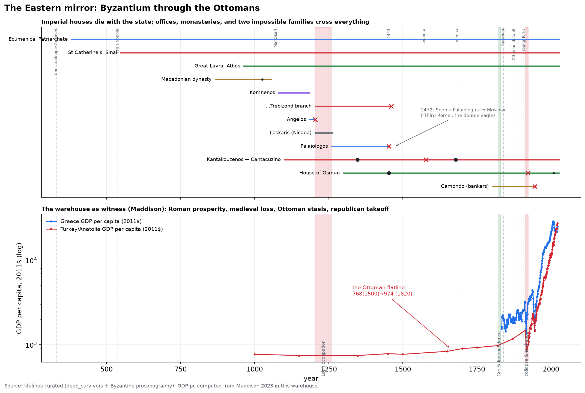
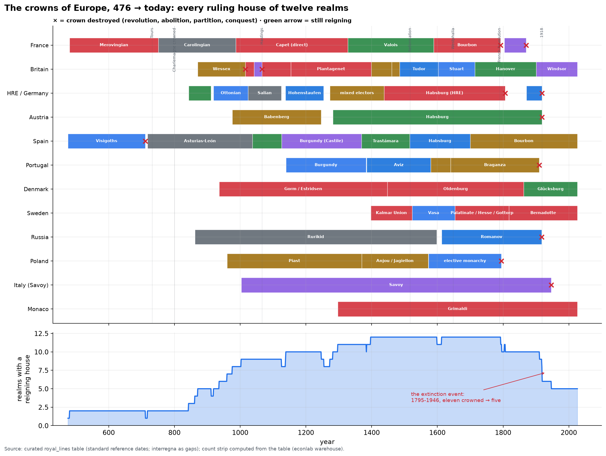

# Chapter 10 — Dynasties: The Rothschild Ledger

*World Economy Lab. Generated 2026-07-18; module `econlab/analysis/ch10_dynasties.py`,
findings pinned by tests. Sources: the family's own partnership accounts
(Ferguson's archival series, transcribed digit-for-digit into the warehouse),
the Bank of England millennium dataset as denominator, and our Forbes table
for the ending. The Rothschilds are both the best-documented fortune in
history and the most mythologized; this chapter is the ledger, not the myth.*

## F1 — How it was amassed

Five phases, each visible in the capital table:

1. **Court agency (1760s–1800).** Mayer Amschel Rothschild, coin dealer in
   the Frankfurt Judengasse, becomes financial agent to Wilhelm IX of
   Hesse-Kassel — learning the business of princely money and placing five
   sons in five cities: Frankfurt, London, Paris, Vienna, Naples.
2. **The Napoleonic machine (1808–1815).** Nathan in London smuggles
   textiles past the Continental Blockade, then wins the contract that made
   the fortune's foundation: moving **British subsidies and bullion to
   Wellington's armies** through enemy territory — the state's logistics
   problem became the family's franchise. (The "Waterloo early-news stock
   coup" of legend is heavily embellished; the documented profits came from
   the bullion commissions and the post-war funding operations.)
3. **The sovereign-bond oligopoly (1818–1852).** The five-house structure —
   one family, five capitals, a private courier network faster than
   governments' — let them underwrite loans to Prussia (1818), Austria,
   Naples, France, Belgium… inventing the fixed-sterling international bond
   an investor in London could buy without currency risk. Capital: **£1.8M
   (1818) → £9.5M (1852)**, already 9× Barings by 1825.
4. **Railways and the Paris surge (1852–1874).** James's Chemin de Fer du
   Nord and Second-Empire finance make **Paris the center of the
   partnership — £20.1M of £34.4M by 1874** (the purple flood in the
   chart). Capital doubles in a decade (1852–62: £9.5M → £22.3M).
5. **Resources (1875–1900).** Rio Tinto copper (1888), a founding stake in
   De Beers (1887), Baku oil (1886), the Bank of England's 1890 Barings
   rescue with Rothschild coordination. **Peak: £41.5M in 1899 — 3.0% of UK
   GDP at the 1882 high-water mark.**

That 3.0%-of-GDP figure is the honest measure of the legend: roughly *one
year's income of three percent of Britain* held as the working capital of a
single family firm — the largest bank on Earth for most of the century,
achieved without limited liability, deposits, or a stock listing.

## F2 — Where it went

The decline is not a mystery; it is an itemized ledger:

- **1863 — Naples closes** with Italian unification (visible in the table:
  the £0.7–1.3M column simply ends).
- **1901 — Frankfurt wound up**: no male heirs in the founding house. The
  fortune's birthplace exits first.
- **Partible inheritance, compounding heads.** Five brothers → dozens of
  partners and non-partner heirs by 1900. A fortune split among N heirs per
  generation shrinks *per capita* even when it grows in total — and the
  unlimited-liability partnership had to **pay out each deceased partner's
  share**, a structural capital drain listed in the accounts.
- **Consumption at ducal scale**: 40+ great houses (Waddesdon, Mentmore,
  Ferrières…), collections, patronage — magnificent, and all *outside* the
  business capital.
- **1914–1945 — the European catastrophe.** The franchise was lending to
  *European* states; two wars destroyed the asset class, inflation ate the
  bonds, and the sovereign-loan business migrated to New York (a market the
  family had declined to enter seriously — the single costliest decision in
  its history).
- **1938 — Vienna seized** by the Nazis; Louis von Rothschild ransomed for
  the family's Czech steelworks. **1940 — Paris aryanized** under Vichy.
- **1949→ — taxation.** UK death duties (up to 80% mid-century) hit each
  generational passage; the French house, rebuilt after the war, was
  **nationalized outright in 1981** by Mitterrand (Compagnie Financière —
  David de Rothschild restarted from three employees as "Rothschild & Cie").
- **Today**: Rothschild & Co (the merged Paris-London advisory house) was
  taken private by the family concordat in 2023 at ≈ **€3.7B** enterprise
  value; Edmond de Rothschild (Geneva) manages ~CHF 160–190B *of client
  assets* (AUM is not wealth); RIT Capital and Waddesdon (given to the
  National Trust, 1957) carry the English legacy.

## F3 — Dynasty vs dynasty: the comparison the myths never make

| | vs home GDP | vs world GDP |
|---|---|---|
| **Rothschild five houses, 1882** | **3.0% of UK** | **0.27%** |
| Musk, 2026 | 2.5% of US | **0.63%** |
| Arnault & family, 2026 | 4.2% of France | 0.12% |

Two honest readings at once: against its *home economy*, the 1882
partnership sits in the same league as today's mega-fortunes (Arnault-
vs-France actually exceeds it). But against the *world* economy, **Musk
alone is ~2.4× the peak Rothschild partnership** — because Britain was ~9%
of world GDP then and the US is 26% now. The Gilded-Age-was-bigger
intuition is backwards at world scale.

And the ending, from our own Forbes table: **the only "Rothschild" among
Earth's 3,385 billionaires is Jeff Rothschild (#1,197, $3.6B) — a Facebook
engineer with no relation to the family.** The banking Rothschilds, as
individuals, no longer clear the billionaire threshold that 3,385 other
people do. Two centuries of partible inheritance, four state seizures, two
world wars, and death duties did what no competitor could.

## F4 — The myth audit

The Rothschilds are the central object of two centuries of antisemitic
conspiracy literature — from 1846 pamphlets to "$500 trillion" internet
memes. The ledger's answer:

- Peak capital, 1899: £41.5M = **≈£3.8B in 2015 pounds (~$6B)**. Real, vast
  for its century — and smaller than ~340 *individual* fortunes today.
- "Half the world's wealth" would have required hundreds of times the
  documented peak. The actual peak was **about a quarter of one percent of
  one year's world GDP** (0.27%, 1882).
- The "$500T family" meme exceeds **total world household wealth** (~$470T).
  It fails arithmetic before it fails history.
- The archive that debunks the myths is the family's own: the partnership
  accounts Ferguson published are the *source* of every number here. The
  documented story — state finance, information networks, five brothers,
  and a century of European catastrophe — needs no embellishment.

---

## Part II — The Fuggers: the steepest fortune ever recorded

**How it was amassed** (firm inventories, Ehrenberg/Häberlein): from
Augsburg weavers (1367) to **54,385 gulden (1494) → 196,791 (1511) →
2,021,202 (1527) → 5,100,000 (1546)** — a **94× rise in 52 years**, the
fastest documented ascent of any fortune before the industrial age:

1. **Tyrol silver (1487–96)** — Jakob lends to Archduke Sigismund and takes
   repayment in silver *below market price*: the loan-for-output template.
2. **Hungarian copper (1494→)** — the Thurzo partnership: mines, smelters,
   and roads vertically integrated into a European copper near-monopoly.
3. **Papal finance** — the Curia's banker north of the Alps; handler of
   indulgence revenues (including the 1517 St. Peter's indulgence that
   provoked Luther) and lessee of the papal mint.
4. **1519 — the purchase of an emperor.** Charles V's election cost 852,000
   gulden in payments to the seven electors; **the Fuggers financed 543,585
   of it**. Jakob's later dunning letter to the Emperor — "it is well known
   that Your Majesty without me might not have acquired the Imperial
   Crown" — is the most audacious invoice in history. Collateral: the
   Maestrazgo leases and the Almadén mercury and Guadalcanal silver mines
   of Spain.
5. **Peak under Anton (1546):** capital 5.1M gulden, gross assets over 7M —
   at a moment when a skilled craftsman earned ~50 gulden a year.

**Where it went:** the firm's fate was chained to one debtor. The Spanish
crown's serial bankruptcies — **1557, 1575, 1596, 1607** — converted the
Fugger loan book into near-worthless *juros*; the firm lost several million
gulden (scholarship: ~8M across the defaults), bled through the Thirty
Years' War, and wound up by 1657. The family converted, deliberately, from
finance to *land and nobility* — counts of the Empire, castles in Swabia —
and so, unlike the fortune, **the family institutions survive**: the
**Fuggerei** (1521), the world's oldest social housing, still charges its
annual rent of **0.88 gulden ≈ €0.88** plus three daily prayers; and a
Fürst Fugger private bank still operates in Augsburg. Lesson one of
dynasty studies: *sovereign lending giveth, and sovereign default taketh
away* — the Rothschilds a century later solved the Fugger problem by
diversifying across five states and selling bonds to the public rather
than holding king-sized exposures themselves.

## Part II·b — The Medici: the smallest fortune with the largest afterlife

De Roover reconstructed the bank from its *libri segreti* — the secret
books — and the numbers overturn the popular image. The Medici Bank was
**small**: capital of 10,000 florins at the 1397 founding, **~25,000 at its
1427 peak era — while holding ~100,000 florins of Papal Curia deposits**.
Four florins of the Pope's money for every florin of their own: the bank
was less a treasure chest than a *leveraged franchise on the Church's cash
flow* — the Rome branch alone produced **62% of profits** (Venice 13%).
Lifetime profits, 1397–1450: **442,611 florins** (151,820 + 290,791).

**How it was amassed:** the Curia relationship (Giovanni di Bicci backed
Baldassare Cossa's cardinalate and rode him to the papal account); the
**holding-company structure** de Roover considered the real innovation —
each branch a separate partnership with a local junior partner holding
equity, the Medici holding control: risk-isolated, incentive-aligned, the
15th-century franchise model; wool and silk workshops; and from 1466 the
papal **alum monopoly** at Tolfa.

**Where it went — the decline:** the same disease that would kill the
Fuggers, a century early. Branch managers court princes: London lends to
Edward IV (Wars of the Roses; **51,533 florins lost** at the 1478
liquidation), Bruges's Portinari lends to Charles the Bold (**Bruges +
London: ~70,000 florins lost**). After general manager Giovanni Benci died
(1455), no one minded the store; Lorenzo the Magnificent was a poet-prince,
not a banker, and leaned on public funds as the bank sank. The **Pazzi
conspiracy (1478)** — rival bankers, with papal backing, knifing the Medici
at Mass — shows how completely banking and politics had fused. In **1494**
the family was expelled and the bank confiscated: dead as a firm.

**The conversion — the point of the Medici:** Cosimo spent, by Lorenzo's
own accounting, **663,755 florins** on "buildings, charities and taxes"
(1434–71) — **1.5× everything the bank earned in its great half-century,
nine times its capital** — buying not luxury but *Florence itself*. The
returns on that conversion: de facto rule from 1434, **two popes** (Leo X:
"God has given us the papacy — let us enjoy it"; Clement VII), **two queens
of France** (Catherine, Marie), Grand Dukes of Tuscany 1537–1737. And when
the bloodline died with Gian Gastone in 1737, the last Medici — **Anna
Maria Luisa — signed the Patto di Famiglia**, binding the family's entire
collections to Florence "for the ornament of the state... and to attract
the curiosity of foreigners" in perpetuity. The Medici fortune's terminal
form is the **Uffizi** — the only dynasty whose wealth converted into a
public art museum, still paying Florence dividends after 590 years:
arguably the best-performing endowment in history.

## Part III — Ten dynasties, five centuries

| # | Dynasty | Era | Peak & basis | Fate |
|---|---|---|---|---|
| 1 | **Fugger** | 1487–1657 | 5.1M fl (1546), ~2% of German-lands product *(band)* | Spanish defaults; converted to nobility; Fuggerei endures |
| 2 | **Medici** | 1397–1737 | bank capital ~72k florins — *modest*; converted to **power** | Two popes, Grand Dukes of Tuscany; line extinct 1737 |
| 3 | **Rothschild** | 1810– | **3.0% of UK GDP (1882, computed)** — the all-time record here | Part I: fragmentation, seizures, taxes; no Forbes entry |
| 4 | **Vanderbilt** | 1810–1970s | $100M (1877) ≈ 1.2% of US GDP | The cautionary tale: heirs dissipated it within 3 generations |
| 5 | **Rockefeller** | 1870– | $900M (1913) ≈ 2.3% of US GDP | Institutionalized: ~$10B across 200+ heirs + foundations |
| 6 | **Mitsui** | 1673–1946 | largest zaibatsu: ~10% of Japan's corporate capital | Dissolved by US occupation, 1946 — killed by decree |
| 7 | **Walton** | 1962– | **$485B, 7 heirs (computed) = 1.5% of US GDP** | The richest family on Earth, two generations in |
| 8 | **Koch** | 1940– | $168B incl. Marshall stake (computed) | Privately held; succession underway |
| 9 | **Ambani** | 1957– | **$90B = 2.2% of India (computed)** | A Rockefeller-scale dynasty, live, generation two |
| 10 | **Boehringer** | 1885– | $96B across 15 listed heirs (computed) ≈ 1.8% of Germany | The quiet model: private pharma, five generations |

*Honorable mentions:* Mars ($86B, two listed heirs), Cargill-MacMillan
(**17 billionaires — the most of any family** — $42B listed), Wertheimer/
Chanel ($79B), Quandt/BMW ($48B), Thomson/Reuters, Hermès-Dumas (largest
European family fortune by outside estimates, but its ~100 heirs are mostly
*unlisted* in Forbes — a measurement lesson in itself), Krupp (firm became
a foundation, 1967 — family exit by design), Astor and Du Pont (diluted),
and the **House of Saud — excluded as sovereign**: where family and state
are one balance sheet, "family wealth" stops being a measurable category.

### Part IV — Deep time: did anything survive the fall of Rome?

**No Western family — and no fortune anywhere — has documented continuity
across the fall of the Western Empire.** The late-Roman senatorial
aristocracy was likely the richest private class yet recorded: Olympiodorus
reports the greatest senators drawing **~4,000 Roman pounds of gold a year
(≈1.3 tonnes) plus produce**. The Anicii — Boethius's in-laws, the last
great gens — are last securely attested in the **early 600s**; the Senate
itself vanishes from the record by **603**. The Gothic Wars and the Lombard
invasion didn't tax the senatorial estates — they erased them: **the
richest class in history, gone in roughly five generations.** It is the
terminal proof of this chapter's first law: *no fortune survives its
state* — and here the state itself died.

**The thousand-year maybes:** Rome's princely houses — **Massimo**
(documented ~1000, claiming Fabius Maximus; the Prince's famous reply when
asked if the descent was real: *"I cannot prove it; it has only been said
in our family for twelve hundred years"*), **Colonna** (1078, one pope,
still in Palazzo Colonna), **Orsini** (~1100, three popes). A millennium of
documented continuity each — the bridge to antiquity is legend.

**The true survivors of Rome's era are not Roman:** the **Kong family**
(Confucius's line, 551 BC → today, ~80 generations — older than the Roman
Republic and still going); the **Japanese Imperial House** (documented from
539, reigning while Rome's Senate dissolved, reigning now); **Kongō Gumi**
(temple builders, 578–2006 — forty generations, the oldest family firm
ever recorded). What crossed the centuries was never a *fortune*: it was a
**sacred office, a crown, and a craft** — wealth-adjacent institutions
whose value could not be confiscated, inflated away, or divided among
heirs. And Europe's quiet champion ties the chapter's threads together:
the **Frescobaldi**, medieval bankers **ruined by English royal default
c. 1311** — the sovereign-default disease, again — who pivoted to wine and
are still bottling it 26 generations later. The only permanent cure ever
found for banking's occupational disease: stop banking.

### Part V — Walking the millennium

Take the surviving Western lines — Bagrationi (780), Welf (819), a Mosel
wine estate (862), the Capetians (866), Rome's princes (~1000–1100), two
Tuscan wine families — and walk them through everything, with the
warehouse's own series (English population from 1086, prices from 1209) as
witness:

- **900s–1000s** — Europe reassembles from the post-Carolingian wreck. 987:
  a Robertian becomes King Hugh Capet; the Roman princes emerge from the
  city's feudal chaos. England, 1086 (Domesday, in our data): **1.7M
  people**.
- **1100s–1200s** — the Medieval Boom: crusades, communes, cathedrals.
  England *triples* to 4.7M by 1300 (our series); Italian banking is born —
  and in 1311 the **English crown defaults on the Frescobaldi**, the first
  × on the chart.
- **1300s** — catastrophe. The **Black Death takes 46% of England in three
  years (4.81M → 2.60M, 1348–51)** — and every lifeline on the chart passes
  through the red band unbroken. Population doesn't regain 1300 levels for
  *over two centuries*; land is cheap, labor dear — the landowning dynasties'
  worst relative era, and they survive it anyway.
- **1400s** — Renaissance: a Colonna becomes Pope Martin V (1417), ending
  the Schism; **Italy's first printing press operates inside Palazzo
  Massimo (1467)** — a thousand-year-old family hosting the technology that
  ends the medieval world. 1453: Constantinople falls; the *Eastern* Roman
  lines (Palaiologos) go extinct within decades — a controlled experiment
  in what state-death does to dynasties.
- **1500s–1600s** — the Price Revolution: American silver drives our CPI
  series up **~6.7× from 1500 to 1650**, quietly taxing every fixed rent a
  noble family lived on; Reformation splits Christendom (a Colonna commands
  at Lepanto, 1571); the Thirty Years' War band darkens the Fugger's
  Germany.
- **1700s** — a Welf becomes King of Great Britain (George I, 1714): a
  9th-century Saxon line takes the crown of the coming superpower. 1720's
  South Sea/Mississippi bubbles preview modern finance; 1789–1815 the
  purple band: **Louis XVI Capet guillotined (1793)** — the deepest × any
  surviving line carries — yet cadet branches carry on; Bagrationi Georgia
  is annexed by Russia (1801).
- **1800s** — the take-off: England's population line goes vertical (5.9M
  in 1750 → 16.6M by 1850) while the price line stays *flat* — the
  **gold-standard century: 1913 prices sat BELOW 1815's**, the only long
  deflation-with-growth in the record. 1870: Porta Pia — papal Rome falls,
  and the world the Colonna/Orsini/Massimo were built for politically
  ends; the families persist as the Rothschilds' era peaks.
- **1900s** — the two red bands: the wars that broke every *fortune* in
  Chapter 10 (Vienna 1938, Paris 1940, Mitsui 1946) barely nick the
  *lines*: every lifeline crosses both bands. Prices, having been stable
  for a century, rise **~80-fold from 1913 to 2015**; the millennium total,
  1209→2015: **1,214×**.

The moral of the walk: over a thousand years, the things that killed
dynasties were never plagues or inflations — the lines sail through the
Black Death and the price revolutions untouched. What kills lines is
**states and heirs**; what kills *fortunes* is everything. And the two
quietest lifelines on the chart — the wine estates of the Mosel and
Chianti, making the same product on the same land since 862 and 1141 —
outlasted every bank, every crown but one, and every fortune above them.

### Part VI — The Eastern mirror: Byzantium through the Ottomans

The East inverts the Western experiment. In the West the state died once
(476) and family lines re-rooted in the wreckage. In the East **the Roman
state lived a thousand years longer** — and yet *fewer* private lines
crossed. The reason is an economic institution:

- **Byzantium** ran on confiscation as statecraft: imperial houses were
  *successive families seizing an office*, not a bloodline — eleven
  dynasties in eleven centuries, and when each fell (the ×'s: 1204, 1453,
  1461) its property fell with it.
- **The Ottomans perfected it as *müsadere***: the ruling elite were
  legally *kul* — slaves of the sultan — and great fortunes were escheated
  at death or execution. Grand Vizier Rüstem Pasha died (1561) with an
  inventory of legend — 815 farms, 476 mills, 1,700 slaves, thousands of
  horses and camels — and none of it founded a dynasty. **The Ottoman
  state solved the dynasty problem by prohibiting dynasties.** The
  warehouse shows the macro price: Anatolian GDP per capita **$768 (1500)
  → $974 (1820)** — three centuries, +27% total — the flatline of an
  economy where large private property was never safe; then **28× after
  1820** once reform, and later the Republic, changed the rules.

**Who crossed anyway:**
- **The offices and the monasteries** — the Ecumenical Patriarchate (381→,
  still in Istanbul, having outlived both empires), **St Catherine's of
  Sinai (548→, founded under Justinian)** and the **Athonite houses
  (Great Lavra, 963→)**: property-holding corporations that Byzantium
  endowed and the Ottomans *chose to protect*. The Eastern echo of the
  Western finding — office, monastery, craft — with the monastery as the
  East's supreme survivor technology.
- **The impossible family: Kantakouzenos → Cantacuzino.** Imperial line
  (John VI, emperor 1347) → richest Greek of the Ottoman Empire ("Şeytanoğlu,"
  strangled 1578, fortune seized — *müsadere applied to the survivor
  itself*) → Phanariot princes of Wallachia and Moldavia (Șerban, 1678) →
  Romanian nobility → extant. Nine centuries, three empires, one line —
  the only imperial Byzantine family with documented continuity to today.
- **The House of Osman itself**: 726 years of documented male line
  (1299→), sultans until the 1922 ×, and then the strangest afterlife in
  dynasty history — private citizens, the head of the imperial house dying
  in 2009 in a Manhattan walk-up he'd rented for decades.

**Where the *idea* went** (because in the East the idea outlived every
family): Mehmed II took the title **Kayser-i Rûm** — Caesar of Rome — in
1453; and in 1472 **Sophia Palaiologina married Ivan III of Moscow**,
carrying the double-headed eagle and the "Third Rome" claim north, into
the Rurikids and every Russian ruler since. Rome's dynasty died twice; its
*franchise* never did.

And one modern elegy closes the Eastern ledger: the **Camondo** — Istanbul
bankers called "the Rothschilds of the East," who moved to Paris in 1869
at the empire's sunset. Nissim died flying for France in 1917; his father
built the Musée Nissim de Camondo in grief; **Béatrice and her children
were murdered at Auschwitz** — the line extinct by 1945, the museum
standing as their Uffizi. In the same decade that ended Vienna's
Rothschilds and dissolved Mitsui, the East's greatest banking family was
not dispersed but annihilated.

### Part VII — The crowns of Europe, 476 → today

Fifty-two ruling houses across twelve realms, from the wreck of the Western
Empire to this morning — with the count of reigning realms computed from
the table itself. The shape of fifteen centuries:

- **The assembly (500–1000):** from two crowned realms (Merovingian Gaul,
  Visigothic Spain — the latter destroyed at a stroke in 711) the roster
  builds through Charlemagne (800) toward the full medieval dozen.
- **The plateau (1400–1790):** for four centuries *every* charted realm
  wears a crown. Houses die constantly — but by **cadet branch and female
  line**, not abolition: Capet → Valois → Bourbon is one bloodline under
  three names; Tudor gives way to Stuart by inheritance, not revolution.
  Royal "extinction" in this era means the *name* changes; the blood and
  the institution continue. (The polite fictions persist today: "Windsor"
  is a 1917 rebranding of Saxe-Coburg-Gotha; "Glücksburg" is an Oldenburg
  cadet line.)
- **The extinction event (1795–1946):** the same 150 years that destroyed
  every great fortune in this chapter destroyed most of Europe's crowns —
  **Poland partitioned (1795), the Holy Roman Empire dissolved (1806),
  France finally republican (1870), Portugal (1910), Russia (1917), Germany
  and Austria (1918), Italy (1946)**. Eleven reigning realms became five.
  The killers were the chapter's usual suspects: revolution and the world
  wars — the ×'s on this chart and the ×'s on the fortune charts are the
  same events.
- **The survivors** — Britain, Spain, Denmark, Sweden, Monaco on the chart
  (plus Norway, the Netherlands, Belgium, Luxembourg, and Liechtenstein
  beyond it: ten European monarchies today) — share one trait: they
  **constitutionalized early and completely**. The crowns that insisted on
  ruling (Bourbon France, Romanov Russia, Hohenzollern Germany) died of
  it; the crowns that settled for *reigning* are still here. Spain adds
  the only resurrection: abolished 1931, restored 1975 — the Bourbon
  fourth life.

Three curiosities the table yields: **Monaco's Grimaldi** hold the longest
single-name run — 729 years on one rock. **Denmark** is the deepest
continuous monarchy — Gorm the Old (~936) to Frederik X with only
name-changes between. And the finest irony in the whole chapter: the
**Capetians**, guillotined out of France, reign today in Madrid — **the
French royal line outlived the French monarchy**, in someone else's
country. Crowns, like fortunes, survive best by conceding what they once
were.

**What ten cases teach:**
1. **No dynasty survived its own state.** Fugger fell with Spain's credit,
   Mitsui by occupation decree, Vienna Rothschild by annexation, Paris by
   nationalization. The state that makes a fortune can unmake it.
2. **Peak-vs-home-GDP is remarkably bounded: ~1–3%, for five centuries.**
   Whatever the era's technology — copper, bonds, oil, retail — the summit
   of family wealth lands in the same narrow band. (Only sovereign-family
   blends escape it.)
3. **Survival correlates with *institutionalization*, not size**:
   Rockefeller's foundations, Boehringer's private company, the Fuggerei —
   versus Vanderbilt's heirs and the Medici bloodline.
4. **Today's list is younger than folklore thinks**: of the ten largest
   living fortunes, most are first- or second-generation. Dynasties are
   made by inheritance *law and structure*, and the great testing of the
   current crop (Walton gen-3, Ambani succession) is happening now.

## Caveats

- Capital figures are **business capital of the partnership** — personal
  estates, houses, and collections excluded (direction: understates family
  wealth; Ferguson's own caveat).
- Benchmarks transcribed from the published appendix table (image scan);
  the 1874/1875 and 1887/1888 columns follow the printed years.
- % - of-GDP compares a stock to a flow — standard for fortune-scaling, but
  it is a scale metric, not a "they owned X% of Britain" claim.
- Modern comparators are single-person Forbes estimates vs a whole family's
  business capital; both flagged where used.
