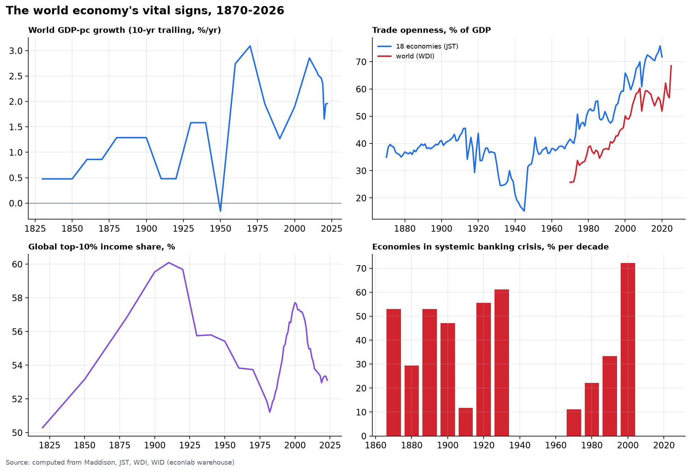

# Chapter 10 — Synthesis: how it got this way

*World Economy Lab. Generated 2026-07-19; module `econlab/analysis/ch10_synthesis.py`.
The capstone: every claim below points at a computation in Chapters 0–9,
and the chapter closes with the state of the world computed fresh from the
warehouse each build.*

## The arc, 1870 → 2026

**1870–1913 — The first globalization.** Openness climbs to 45% of GDP
(Ch. 8); the gold standard holds r−g near zero (Ch. 2); the West's share of
world output peaks at 59.2% in 1913 (Ch. 1) and the *global* top-10% income
share peaks near 60% (Ch. 5) — global inequality's all-time maximum was the
colonial world, not ours. Banking crises hit ~half of economies each decade
(crisis panel, Ch. 3): integrated, gold-constrained finance was crisis-prone.

**1914–1945 — The demolition.** Trade integration *un-happens*: openness
27% by 1938. Deflation and inflation whipsaw (US: +24% in 1917, −16% in
1921, −10% in 1932; Ch. 0). The 1930s put 61% of economies into systemic
banking crisis. Two war mobilizations take US debt to 119% of GDP. Every
"it can't reverse" about integration died in this window.

**1946–1973 — Bretton Woods: the anomaly.** The fastest world growth ever
recorded (2.79%/yr per person, Ch. 1) *and* the only two decades in 150
years with **zero systemic banking crises** (repressed, segmented finance) —
while financial repression's r−g of **−2.7pp** quietly melted the war debt
(Ch. 2) and top-1% shares compressed to ~10% (Ch. 5). Fast growth, stable
finance, falling inequality — the combination has not been repeated.

**1973–2000 — The great reordering.** The anchor breaks in 1971; by 1980,
**74% of countries have inflation above 10%** (Ch. 2). Volcker flips r−g to
+1.7pp — debt now compounds — and finance deregulates: crisis frequency
returns (Ch. 10). The US top-1% share starts its round trip back to 20%
(Ch. 5); labor's share begins its seven-point slide. Meanwhile poor
countries *diverge* through 2000 (Ch. 1) — globalization's first act lifted
the West and Japan, not yet the rest.

**2000–2026 — The China era, on leveraged foundations.** Convergence finally
flips positive (~2000, Ch. 1); world growth per person runs at 2.40%/yr —
second only to the Golden Age — and global inequality *falls* for the first
time in two centuries (Ch. 5). China goes from #1 supplier of 8 countries to
**96** (Ch. 8). The same era's finance: the 2000s put **72% of economies
into systemic crisis** — broader than the 1930s — answered by QE, a debt
ratchet (high-income median 43% → 60%), and by 2026 a CAPE of 41 at the
99th percentile (Ch. 3). Openness plateaus at ~57%, three points below the
2008 peak: not deglobalization — reconfiguration under a leveraged sky.

## The state of the world — July 2026 (computed live)

| Metric | Value | Context |
|---|---|---|
| World population | 8.30B | peaks 10.29B in 2084 (UN medium) |
| World median age | 31.1 yrs | 21.5 in 1980 → 36.1 by 2050 |
| World GDP | $126T | sum of 190 countries, current US$ |
| World real growth 2026 | 2.6%/yr | GDP-weighted |
| US inflation (CPI yoy) | 4.2% | above target four years running |
| Fed funds / 10-yr Treasury | 3.63% / 4.57% | curve re-steepened, +0.4pp |
| High-yield spread | 2.71pp | top-decile tightness |
| Fed balance sheet | $6.74T | down from $8.97T peak |
| S&P 500 / CAPE | 7,458 / 41.4 | 99th percentile of 145 years |
| US federal debt / GDP | 121% | above the 1946 war peak |
| US r−g | ≈ −1.3pp | debt melts — while growth holds |
| US top-1% wealth share | 31.6% | bottom 50%: 2.5% |
| Global top-10% income share | 53% | falling since 2000 |
| China share of world exports | 16% | #1 supplier to 96 countries |
| World trade / GDP | 57% | 2008 peak was 60% |
| World primary energy | 177 PWh/yr | GDP intensity −42% since 1973 |

## What the arc teaches

1. **Growth is a 200-year-old anomaly** that shifted its address — West
   (1820–1950), then East (1980–) — and now runs on productivity alone as
   population fades (Ch. 1).
2. **Integration reverses.** 1913 → 1938 proved it; 2008's plateau is the
   live experiment (Ch. 8).
3. **Finance's stability is a policy regime, not a natural state** — zero
   crises under repression, 72%-breadth under liberalization (Ch. 3, 6).
4. **Debt arithmetic beats debt rhetoric**: r−g regimes — repression,
   Volcker, today's mild melt — decide what budgets never do (Ch. 2).
5. **Distribution is chosen.** Same century, same technology: America's U,
   Europe's L (Ch. 5).
6. **The 2026 configuration** — record-valuation markets, war-level debt,
   above-target inflation, fading demographics, plateaued trade, and the
   fastest hegemonic supply-chain handover ever measured — is historically
   novel *as a combination*. The warehouse now watches it move.

*The apparatus (Phase 3) turns this report from a snapshot into an
instrument: every number above regenerates with one refresh.*
