# Chapter 11 — Levers of the World: What Can Actually Move It, and Who Holds the Handles

*World Economy Lab. Generated 2026-07-22; module `econlab/analysis/ch11_levers.py`,
findings pinned by tests. Computed from the warehouse wherever a connector reaches
(sipri, sanctions, cofer, tic, nyfedswaps, energy, pinksheet, shiller, maddison);
the era scoreboard and parts of the lever map are curated with citations and
AI-panel cross-checks (✓ = panel agrees, ⚠ = contested), the Chapter 10 convention.*

**The question.** Everything influences the world; almost nothing can *steer* it.
This chapter is about the short list — the tangible levers whose holders can, by a
deliberate act, change prices, borders, and the ranking of nations: **violence,
money, energy, food, sanctions, technology**. Chapters 9 and 10 found where control
concentrates; this chapter asks what the control is *of*. Part I replays history's
biggest lever pulls as computed event studies. Part II maps who holds each handle
today. The deliberately excluded levers — religion, ideology, narrative — are real
but not tangibly measurable in a warehouse; they get an honesty section, not a map.

---

## Part I — The levers that moved the world

### F1 — Violence: the arsenal decides

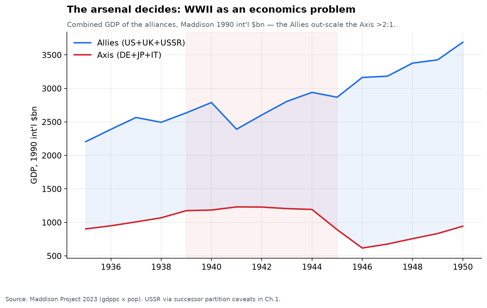

War is the oldest lever, and its modern form is an economics problem. Sum the
alliances' GDP (Maddison, 1990 int'l $) and WWII reads like a ledger: by 1943 the
Allies out-scaled the Axis **2.3×** in output, and the US alone out-produced the
Axis roughly **3:1 in munitions** ✓. Strategy, courage, and atrocity decided
*where* the lines moved; the production ratio decided *that* they moved. The oil
below Texas mattered as much as the men above it — the US pumped **~70% of the
world's crude** through the war years (F11).

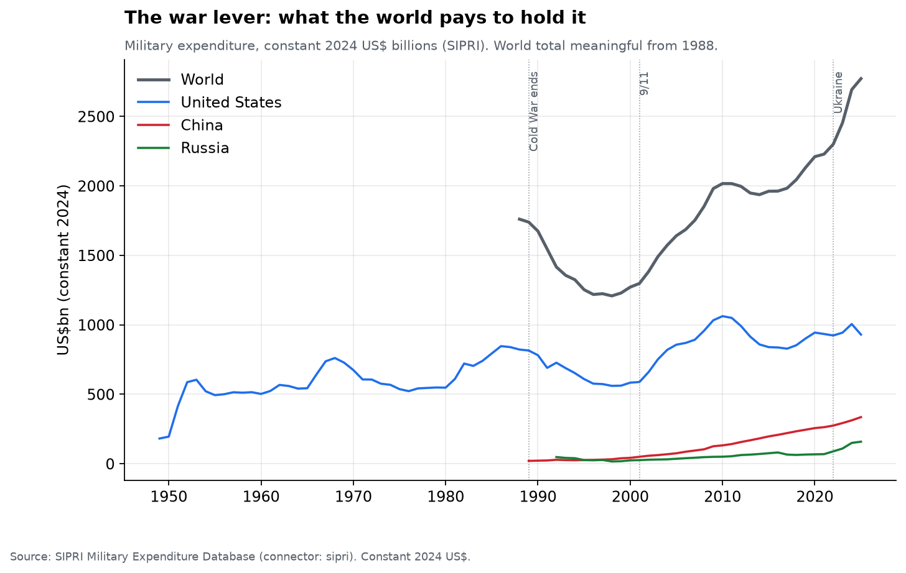

What the world pays to keep the lever cocked: **$2.77 trillion in 2025** (SIPRI,
constant 2024 $) — past the Cold War peak, after a post-1989 "peace dividend" that
lasted barely a decade. The US line explains most of the world line's shape;
China's climb from ~$20bn (1990s) to **$335bn** is the first sustained bid to
contest the lever since the USSR.

### F2 — Money: the lever pulled twice in a decade

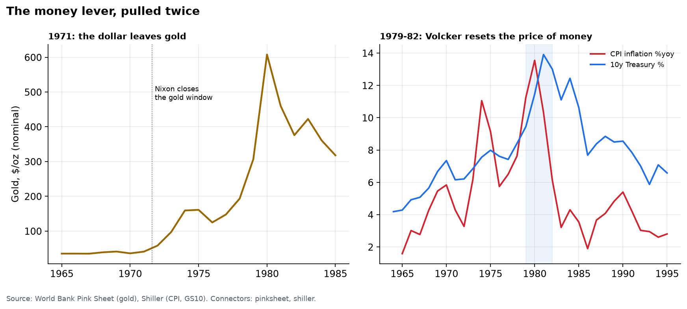

Two pulls, both American, both unilateral. **August 1971**: Nixon closes the gold
window, severing the anchor the whole Bretton Woods system pegged to — gold goes
from $35/oz to a 1980 annual average of **$608** while every currency on earth
becomes a floating claim on policy. **1979–82**: Volcker resets the price of the
dollar itself — inflation peaks at **13.5%**, the 10-year at **13.9%** — and in
doing so resets every dollar-indebted country on the planet; Latin America's lost
decade (Ch. 5's default wave) starts in a Washington conference room. No other
lever reprices the world this fast with no shots fired.

### F3 — Energy: the price is the weapon

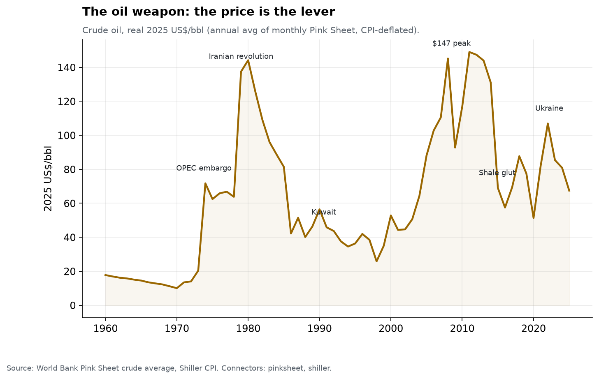

October 1973: OPEC's embargo takes real oil from **$20 to $72** (2025 $) in a
single year — ×3.5 — and the 1979 Iranian revolution doubles it again. Terms of
trade for every importer collapse; the stagflation that Volcker later kills (F2)
walks in through the fuel line. It remains the cleanest demonstration that a
minority producer with spare capacity can tax the entire world at will — and the
1970s shaded band in F11 shows exactly when that capacity was theirs.

### F4 — Food: the quietest lever

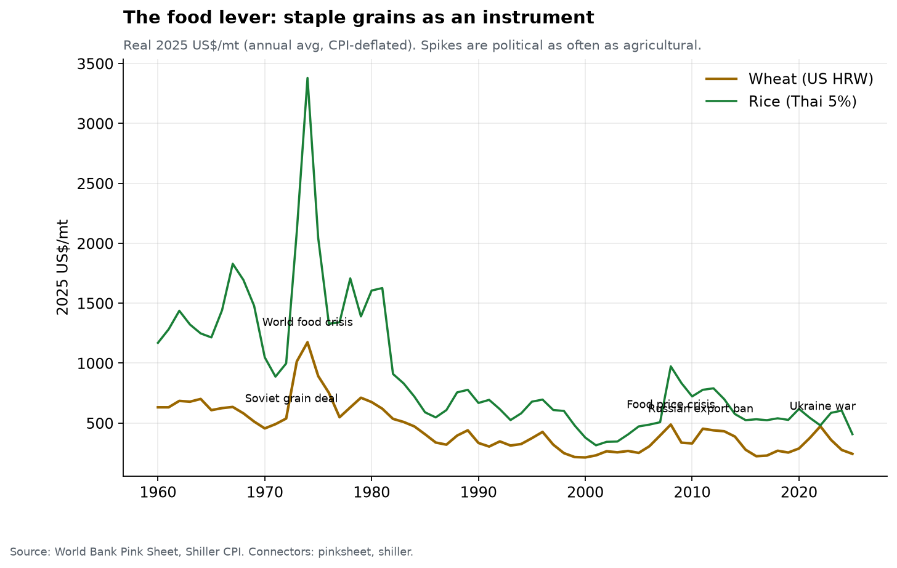

Grain spikes are political as often as agricultural: the 1972 Soviet grain deal
(the USSR quietly buying the US surplus), the 1974 world food crisis, 2007-08
(export bans cascade, food riots in ~30 countries), Russia's 2010 export ban
(a plausible spark under the Arab Spring), 2022 (two countries at war held ~25%
of wheat exports). Food is the lever nobody brags about holding, because using
it openly is starvation policy — but exporter states ban shipments in every
crisis, and the price transmits instantly to the world's poorest ledgers (Ch. 8's
inflation-inequality machinery, applied globally).

### F5 — Sanctions: the blockade becomes paperwork

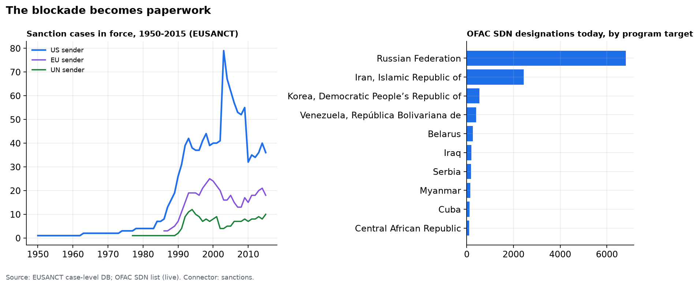

The 20th century blockaded harbors; the 21st blockades bank accounts. The EUSANCT
panel (computed, connector `sanctions`) shows US-sender cases in force going from
**1 (1950) to a peak of 79 (2003)**; the EU builds a sanctions arm from nothing
after 1986; the UN's line is the thinnest — the veto sees to that. Today the
instrument is OFAC's SDN list: **19,170 designations** in force, Russia the
largest bloc at **6,815**. What made it a *world* lever rather than an American
preference is the dollar system itself (F2, F10): if your trade clears in dollars,
New York's law reaches your harbor.

### F6 — Technology: the lever that re-ranks nations

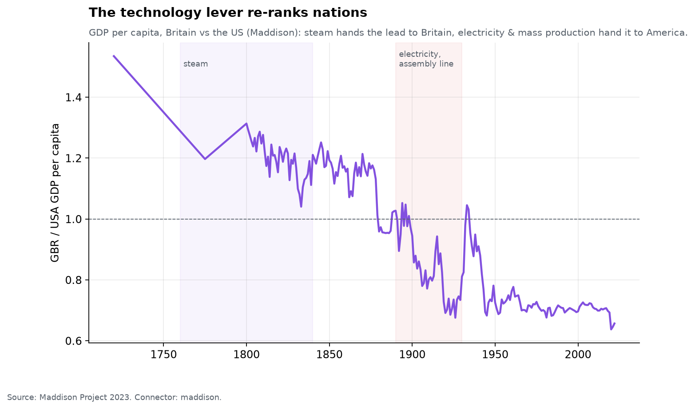

Each general-purpose technology re-ranks the world. Steam industrialized the
British lead (shaded left); electricity and the assembly line handed it to
America — the computed crossover in GDP per head is **1880**, and the gap never
closed again. The chip era runs the same play at higher resolution: the nations
that hold the semiconductor stack (F8) are re-ranking everyone else now, and
export controls have made the technology lever and the sanctions lever the same
handle.

### F7 — The scoreboard: which lever, when

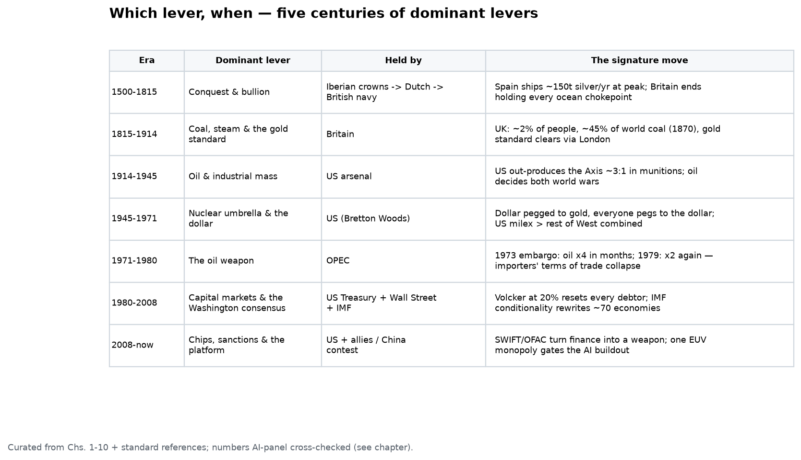

Five centuries compressed: conquest & bullion (Spain shipping **~150-300t of
silver a year** at peak ✓), then coal & the gold standard (Britain: ~2% of the
world's people, **~45% of its coal** in 1870 ⚠ — panel estimates range 34-55%),
then oil & industrial mass, the nuclear-dollar condominium, OPEC's decade, the
capital-markets era (Volcker + IMF conditionality), and now chips-and-sanctions.
Two regularities: **the dominant lever changes roughly every 30-70 years**, and
**the money lever is the only one that has never rotated away from the leading
power** — it moved *with* hegemony (London → New York), not against it.

---

## Part II — Today's levers and who holds them

### F8 — The lever map

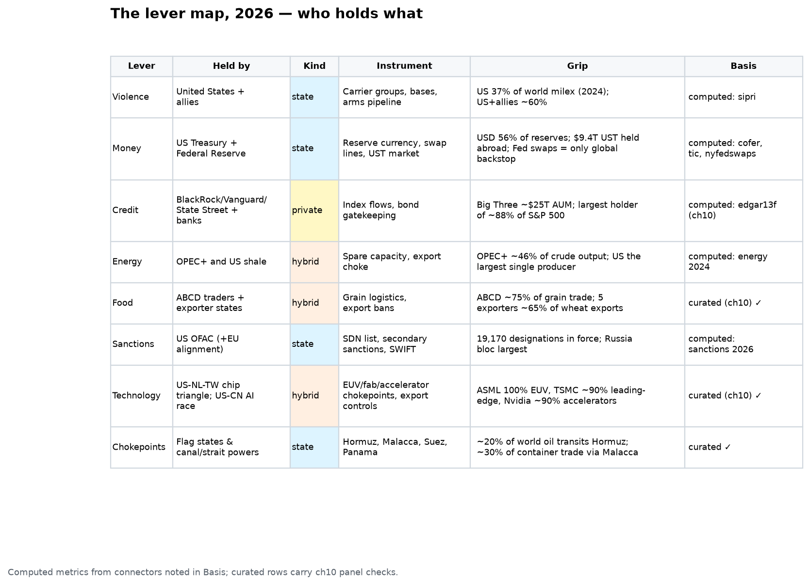

The 2026 map in one table. Read the *Kind* column: the classical levers
(violence, money, sanctions, chokepoints) are **state** handles, and in every
case the state is principally the United States. The newer levers — credit,
energy, food, technology — are **hybrid or private**: index-fund complexes,
cartel-plus-shale, trading houses, one Dutch lithography monopoly. Chapter 10's
chokepoint map and this one differ in altitude: chokepoints are *where* the
grip is; levers are *what pulling feels like*.

### F9 — The violence lever today

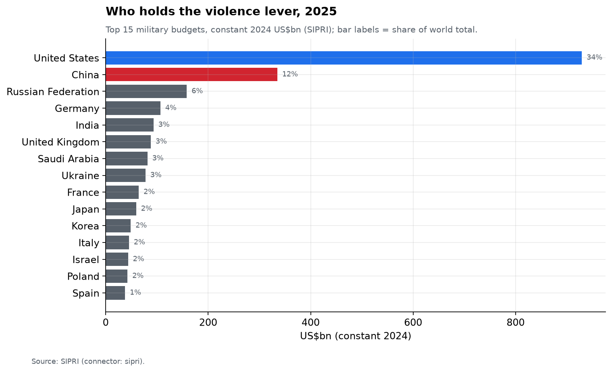

The US budget (**$929bn**, 34% of the 2025 world total) is still roughly the
next nine combined — but the *growth* is elsewhere: China at ~$335bn compounding,
Russia in war economy mode, Europe rearming past its post-1989 floor. SIPRI's
constant-dollar panel (connector `sipri`) replaces the hand-curated milex table
this report used in Chapter 2.

### F10 — The money lever today: three gauges of the dollar's grip

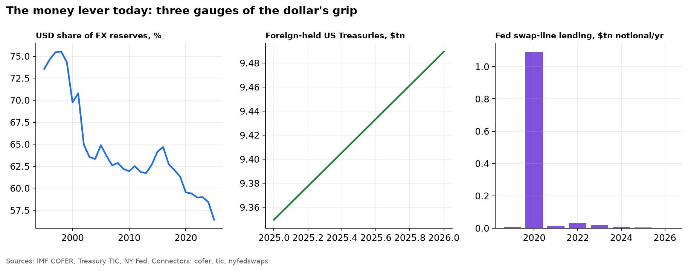

Gauge 1: **56%** of allocated FX reserves — eroding from 71% (1999), with no
successor (Ch. 2's F10: the erosion goes to a basket of small currencies, not to
the renminbi). Gauge 2: **$9.5tn** of Treasuries held abroad — the world's savings
parked inside US jurisdiction. Gauge 3: the Fed's swap lines — the only facility
on earth that can print the world's money for foreigners in a panic (Ch. 2 F9,
Ch. 13's "deepest lever"). Eroding share, undiminished machinery: nobody else
*has* a gauge 3.

### F11 — The energy lever today

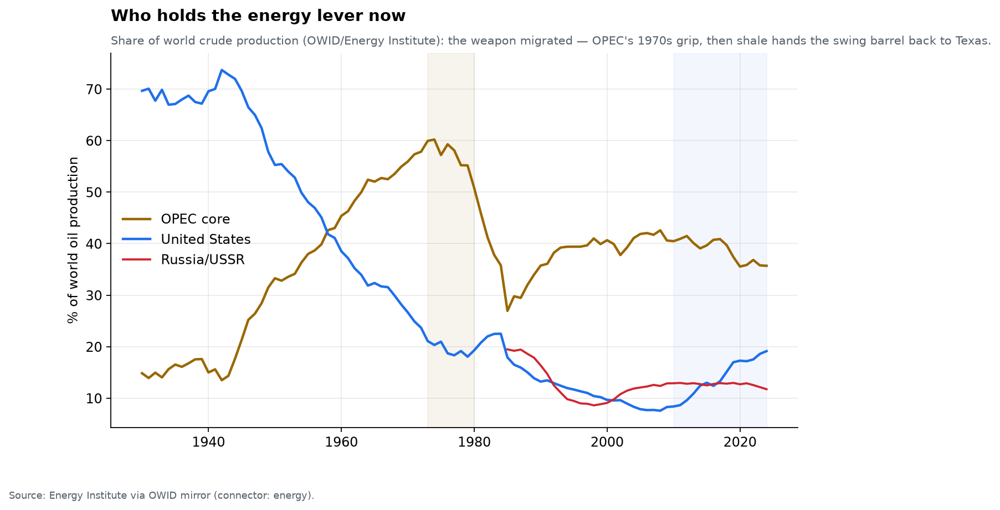

The lever migrated twice: America held it through WWII (~70% of world crude —
the arsenal ran on Texas), OPEC seized it in the 1970s (60% at peak, the F3
embargo years shaded), and shale quietly handed the swing barrel back: the US is
again the **largest single producer (~19%)**, with OPEC-core at ~36% and OPEC+
(with Russia) at roughly half of world output. That is why the 2022 oil shock
(F3) faded in months rather than years — for the first time since 1973, the
embargo-vulnerable side owns the marginal barrel.

### F12 — Life under the lever

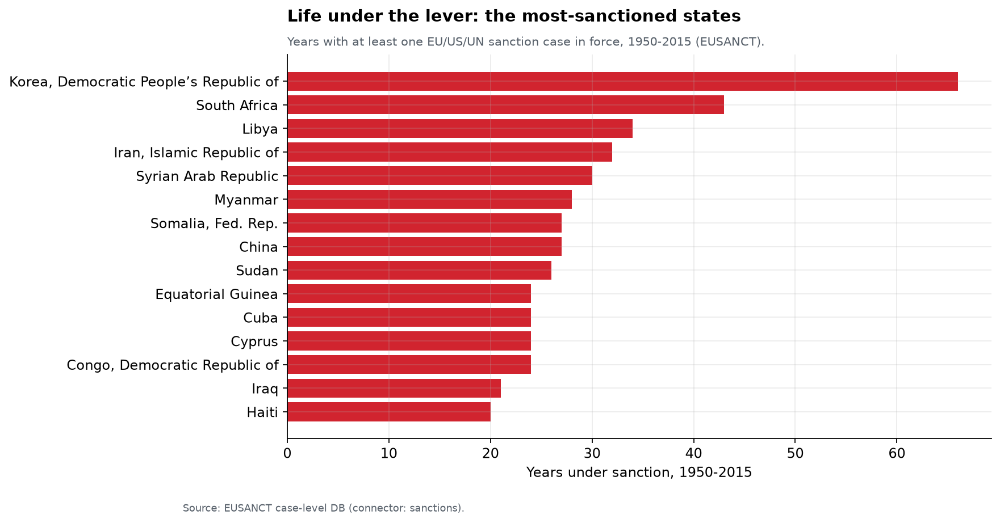

The receiving end, computed: **North Korea — 66 years** with at least one case in
force, effectively every year the panel covers; Cuba close behind. The list is a
map of the American century's unfinished arguments. Note what sanctions did *not*
do in most of these cases: change the regime. The EUSANCT success codings put
clear policy success in a minority of cases — the lever reliably impoverishes;
it unreliably persuades.

---

## What the map cannot hold

**The intangible levers are real; they are just not warehouse-measurable.**
Religion moved more borders than oil ever has — but its balance sheet (Ch. 12's
survivors: the papacy, the monasteries, the Kong lineage) is the *residue* of
power, not a gauge of it. Ideology, narrative, and now platform-mediated
attention are levers whose pulls this report can only see indirectly — in
Chapter 10's media chokepoints (search ~90%, two proxy advisers ~95%) and in
who owns the venues where narratives are set (Sun Valley, Davos). We map the
tangible and name the rest, rather than pretend a number.

## Caveats

- **SIPRI constant-2024 series**: the 2025 figures are at 2025 prices in the
  source file's final column; treat final-year cross-country comparisons as
  approximate. World total only meaningful from 1988 (USSR gap).
- **EUSANCT horizon is 2015**: in-force counts are capped there; the post-2015
  sanctions boom (Russia 2014/2022, secondary-sanctions era) appears only in the
  OFAC snapshot, so the F5 arc *understates* today's level.
- **The OFAC snapshot is designations, not severity**: 6,815 Russia entries and
  173 Cuba entries are not 39× more sanction — Cuba's is a comprehensive embargo
  held in one program.
- **GSDB (1,547 cases, 1950-2023) would be the better spine** but is
  email-request-only, which breaks `econ refresh` reproducibility; its headline
  arc informs the prose and is flagged curated where used.
- **Era scoreboard is curated**: it compresses contested historiography into one
  row per era; panel checks mark the two numbers models argued about (⚠).
- **Oil-producer shares** use OWID/Energy Institute production (energy content),
  not export volumes; "OPEC+" grip is about exportable surplus and spare
  capacity, which shares only proxy.

*Next: Chapter 12 — Dynasties: whether the hands that pull the levers can keep them across centuries.*
