# Chapter 11 — Levers of the World: What Can Actually Move It, and Who Holds the Handles

*World Economy Lab. Generated 2026-07-22; module `econlab/analysis/ch11_levers.py`,
findings pinned by tests. Computed from the warehouse wherever a connector reaches
(sipri, sanctions, cofer, tic, nyfedswaps, energy, pinksheet, shiller, maddison);
the era scoreboard and parts of the lever map are curated with citations and
AI-panel cross-checks (✓ = panel agrees, ⚠ = contested), the Chapter 10 convention.*

**The question.** Everything influences the world; almost nothing can *steer* it.
This chapter is about the short list — the tangible levers whose holders can, by a
deliberate act, change prices, borders, and the ranking of nations: **violence,
money, energy, food, sanctions, technology**. Chapters 9 and 10 found where control
concentrates; this chapter asks what the control is *of*. Part I replays history's
biggest lever pulls as computed event studies. Part II maps who holds each handle
today. The deliberately excluded levers — religion, ideology, narrative — are real
but not tangibly measurable in a warehouse; they get an honesty section, not a map.

---

## Part I — The levers that moved the world

### F1 — Violence: the arsenal decides

War is the oldest lever, and its modern form is an economics problem. Sum the
alliances' GDP (Maddison, 1990 int'l $) and WWII reads like a ledger: by 1943 the
Allies out-scaled the Axis **2.3×** in output, and the US alone out-produced the
Axis roughly **3:1 in munitions** ✓. Strategy, courage, and atrocity decided
*where* the lines moved; the production ratio decided *that* they moved. The oil
below Texas mattered as much as the men above it — the US pumped **~70% of the
world's crude** through the war years (F11).

What the world pays to keep the lever cocked: **$2.77 trillion in 2025** (SIPRI,
constant 2024 $) — past the Cold War peak, after a post-1989 "peace dividend" that
lasted barely a decade. The US line explains most of the world line's shape;
China's climb from ~$20bn (1990s) to **$335bn** is the first sustained bid to
contest the lever since the USSR.

### F2 — Money: the lever pulled twice in a decade

Two pulls, both American, both unilateral. **August 1971**: Nixon closes the gold
window, severing the anchor the whole Bretton Woods system pegged to — gold goes
from $35/oz to a 1980 annual average of **$608** while every currency on earth
becomes a floating claim on policy. **1979–82**: Volcker resets the price of the
dollar itself — inflation peaks at **13.5%**, the 10-year at **13.9%** — and in
doing so resets every dollar-indebted country on the planet; Latin America's lost
decade (Ch. 5's default wave) starts in a Washington conference room. No other
lever reprices the world this fast with no shots fired.

### F3 — Energy: the price is the weapon

October 1973: OPEC's embargo takes real oil from **$20 to $72** (2025 $) in a
single year — ×3.5 — and the 1979 Iranian revolution doubles it again. Terms of
trade for every importer collapse; the stagflation that Volcker later kills (F2)
walks in through the fuel line. It remains the cleanest demonstration that a
minority producer with spare capacity can tax the entire world at will — and the
1970s shaded band in F11 shows exactly when that capacity was theirs.

### F4 — Food: the quietest lever

Grain spikes are political as often as agricultural: the 1972 Soviet grain deal
(the USSR quietly buying the US surplus), the 1974 world food crisis, 2007-08
(export bans cascade, food riots in ~30 countries), Russia's 2010 export ban
(a plausible spark under the Arab Spring), 2022 (two countries at war held ~25%
of wheat exports). Food is the lever nobody brags about holding, because using
it openly is starvation policy — but exporter states ban shipments in every
crisis, and the price transmits instantly to the world's poorest ledgers (Ch. 8's
inflation-inequality machinery, applied globally).

### F5 — Sanctions: the blockade becomes paperwork

The 20th century blockaded harbors; the 21st blockades bank accounts. The EUSANCT
panel (computed, connector `sanctions`) shows US-sender cases in force going from
**1 (1950) to a peak of 79 (2003)**; the EU builds a sanctions arm from nothing
after 1986; the UN's line is the thinnest — the veto sees to that. Today the
instrument is OFAC's SDN list: **19,170 designations** in force, Russia the
largest bloc at **6,815**. What made it a *world* lever rather than an American
preference is the dollar system itself (F2, F10): if your trade clears in dollars,
New York's law reaches your harbor.

### F6 — Technology: the lever that re-ranks nations

Each general-purpose technology re-ranks the world. Steam industrialized the
British lead (shaded left); electricity and the assembly line handed it to
America — the computed crossover in GDP per head is **1880**, and the gap never
closed again. The chip era runs the same play at higher resolution: the nations
that hold the semiconductor stack (F8) are re-ranking everyone else now, and
export controls have made the technology lever and the sanctions lever the same
handle.

### F7 — The scoreboard: which lever, when

Five centuries compressed: conquest & bullion (Spain shipping **~150-300t of
silver a year** at peak ✓), then coal & the gold standard (Britain: ~2% of the
world's people, **52% of its coal** in 1870 — computed at last (F24's `coalhist` connector; the panel's 34-55% split resolved by data),
then oil & industrial mass, the nuclear-dollar condominium, OPEC's decade, the
capital-markets era (Volcker + IMF conditionality), and now chips-and-sanctions.
Two regularities: **the dominant lever changes roughly every 30-70 years**, and
**the money lever is the only one that has never rotated away from the leading
power** — it moved *with* hegemony (London → New York), not against it.

---

## Part II — Today's levers and who holds them

### F8 — The lever map

The 2026 map in one table. Read the *Kind* column: the classical levers
(violence, money, sanctions, chokepoints) are **state** handles, and in every
case the state is principally the United States. The newer levers — credit,
energy, food, technology — are **hybrid or private**: index-fund complexes,
cartel-plus-shale, trading houses, one Dutch lithography monopoly. Chapter 10's
chokepoint map and this one differ in altitude: chokepoints are *where* the
grip is; levers are *what pulling feels like*.

### F9 — The violence lever today

The US budget (**$929bn**, 34% of the 2025 world total) is still roughly the
next nine combined — but the *growth* is elsewhere: China at ~$335bn compounding,
Russia in war economy mode, Europe rearming past its post-1989 floor. SIPRI's
constant-dollar panel (connector `sipri`) replaces the hand-curated milex table
this report used in Chapter 2.

### F10 — The money lever today: three gauges of the dollar's grip

Gauge 1: **56%** of allocated FX reserves — eroding from 71% (1999), with no
successor (Ch. 2's F10: the erosion goes to a basket of small currencies, not to
the renminbi). Gauge 2: **$9.5tn** of Treasuries held abroad — the world's savings
parked inside US jurisdiction. Gauge 3: the Fed's swap lines — the only facility
on earth that can print the world's money for foreigners in a panic (Ch. 2 F9,
Ch. 13's "deepest lever"). Eroding share, undiminished machinery: nobody else
*has* a gauge 3.

### F11 — The energy lever today

The lever migrated twice: America held it through WWII (~70% of world crude —
the arsenal ran on Texas), OPEC seized it in the 1970s (60% at peak, the F3
embargo years shaded), and shale quietly handed the swing barrel back: the US is
again the **largest single producer (~19%)**, with OPEC-core at ~36% and OPEC+
(with Russia) at roughly half of world output. That is why the 2022 oil shock
(F3) faded in months rather than years — for the first time since 1973, the
embargo-vulnerable side owns the marginal barrel.

### F12 — Life under the lever

The receiving end, computed: **North Korea — 66 years** with at least one case in
force, effectively every year the panel covers; Cuba close behind. The list is a
map of the American century's unfinished arguments. Note what sanctions did *not*
do in most of these cases: change the regime. The EUSANCT success codings put
clear policy success in a minority of cases — the lever reliably impoverishes;
it unreliably persuades.

---

## What the map cannot hold

**The intangible levers are real; they are just not warehouse-measurable** — and the first
build of this chapter stopped at that sentence. The appendix at the end of Part III now
carries their *proxies* — attention, narrative ownership, belief — each row labeled with
what the proxy misses. The rule stands: we map reach, and refuse to pretend reach is
persuasion.

---

## Part III — The threads pulled

*The first build of this chapter left contested marks (⚠), curated stand-ins, and one big censoring caveat. This part pulls those threads: seven new connectors (sdnarchive, faostat, usgs, armstransfers, imflending, coalhist, entitylist) and five computed cross-examinations, every finding independently re-derived before it was allowed on the page.*

### F13 — Does the arsenal always decide?

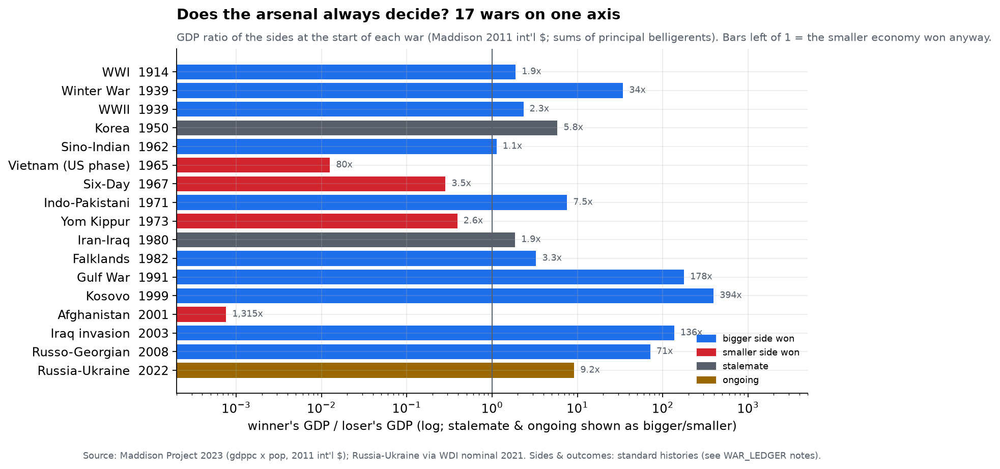

**Generalize the WWII ledger and the rule mostly survives — with exceptions that
share a shape.** Put seventeen major interstate wars of the 20th–21st centuries
on one axis: the GDP ratio of the two sides at the start (Maddison, 2011 int'l $,
principal belligerents summed). The bigger economy won **10 of the 14 decided
wars — 71%**. Two ended in stalemate — Korea at **5.8×** (UN principals against
China) and Iran–Iraq at **1.9×** — and Russia–Ukraine (**9.2×** on pre-war
nominal GDP) is still being decided, so it stays off the scoreboard.

**In total wars, the arsenal has never lost.** Where both sides mobilized toward
exhaustion — WWI (**1.9×**), WWII (**2.3×**), the Winter War (**34×**) — the
bigger economy won every time. The one total-war stalemate, Iran–Iraq, sat at
just **1.9×** and ground on for eight years: near-balanced arsenals buy years,
not verdicts. WWI made the same point the long way — four years at **1.9×**
until American entry broke the balance.

**The four upsets are two families, and neither refutes the ledger — they show
when the ledger isn't allowed to matter.** Six-Day (**3.5×**) and Yom Kippur
(**2.6×**) were over in six days and three weeks: initiative, quality, and (in
1973) an American airlift decided the field before either economy could convert
mass into materiel. Vietnam (**80×**) and Afghanistan (**1,315×** — the single
largest mismatch in the ledger, and a defeat) were expeditionary wars: the
bigger economy fought with a deliberately capped fraction of its arsenal against
an opponent fighting for its existence. Strikingly, mismatch size adds no
forecast skill at all — the hit rate is **5/7 below 10×** and **5/7 above** —
but the *kind* of war does: total wars **3-for-3**, short wars 3-for-5, limited
wars 4-for-6. The arsenal decides the wars the arsenal is actually asked to
fight.

*Honesty box.* The codings are historiographic judgments: Yom Kippur is scored
as an Israeli military win (Egypt's political aims were nonetheless met), the
Winter War as a Soviet win (Finland kept its independence); recoding either
moves the hit rate one war (±7 points), and the total-war finding rests on only
three decided cases. WWI counts metropoles, not empires. Maddison 2023 carries
no USSR rows for 1941–45, so the 1943 Allies figure here and in F1 is US+UK
alone — the full-Allied ratio was larger than **2.3×**. "Vietnam" is all of
Vietnam, overstating the North: the true 1965 mismatch exceeds **80×**. And
start-year GDP is not war capacity — mobilization rates and external resupply
(the US to Israel in 1973, the USSR and China to Hanoi, the West to Kyiv now)
sit off this ledger, which is precisely why some of its upsets happened.

### F14 — The last handover: sterling → dollar, 1899–2025

The COFER series that anchors this chapter starts in 1995, with the dollar utterly dominant. To read that series — and to read the renminbi's non-progress against it — you need the one complete precedent: the only time in the data era that the money lever actually changed hands.

Start at the gold-standard high noon. Lindert's reconstruction of thirty countries' official balances puts sterling at **63%** of known official foreign-exchange holdings at end-1899, with the French franc at **16%** and the German mark at **15%**; by end-1913 sterling had already slipped to **48%** against the franc's **31%** (mostly Russian state balances parked in Paris) and the mark's **15%**. Two caveats travel with these numbers: about a third of official exchange holdings cannot be allocated to a currency at all, and the entire foreign-exchange pool was a sideshow — roughly **20%** of official reserves in 1913, the rest gold. The dollar is essentially absent.

Then the punchline of the whole section, which is about *lag*. The United States had passed Britain in total output around the **1870s** (in this warehouse's Maddison series the crossover comes even earlier, in the 1860s), and by 1913 the US economy was more than twice Britain's. Yet the dollar held approximately **zero** reserve share. It took the First World War — Britain liquidating its foreign assets, the newborn Fed building a dollar acceptance market — to convert economic weight into monetary position, and even then the handover was neither quick nor clean. Eichengreen and Flandreau's archival reconstruction (16 countries, ~75% of world reserves) shows the dollar first passing sterling around **1924**, the two currencies each holding **roughly 40%** through the decade — together **~97%** of global exchange reserves in 1929. Then the whole ladder wobbled: Britain left gold in 1931, America devalued in 1933, the gold bloc dumped both currencies, and sterling *regained* the lead for the rest of the 1930s — Triffin put it at **~70%** in 1938. Honest caveat: that was 70% of a pool that had imploded, foreign exchange having crashed from **36%** of total reserves in 1929–30 to **8%** by 1932. Leadership of a liquidated asset class is a thin crown.

World War II re-ran the trick at larger scale. Allies and colonies accepted sterling IOUs for war supplies, so by **1947** sterling was **~87%** of the world's foreign-exchange reserves (an IMF estimate) — a bookkeeping empire of blocked, largely inconvertible balances. The unwind was deliberately slow: **over 55%** in 1950, with the dollar taking the durable lead only in the **early-to-mid 1950s** (Eichengreen–Chițu–Mehl say the dollar cleared 50% by the early 1950s; Schenk dates the crossover ~1955, a decade and a 30% devaluation after the war). Sterling then sat **near 30%** right through the 1960s — held there by the sterling area, exchange controls, and from 1968 by explicit dollar-value guarantees on other countries' sterling reserves — before falling off a cliff: **28% → 15%** in 1970 alone, single digits by the early 1970s, and a formal end to the reserve role in the **1976–77** crisis-and-funding operation. By the IMF's own tables sterling was **5.9%** in early 1973 and **2.1%** by end-1976; it has drifted between **2% and 5%** ever since, which is where COFER finds it today.

The dollar's side of the ledger: **~75%** of identified holdings by 1970, peaking at **86.7%** at end-1976, then diluted by the deutsche mark (**19.7%** by 1990) and yen (**9.1%**) down to **56.4%** by 1990, recovering to the low 60s by 1994. One bridge warning for our own chart: the warehouse COFER series opens 1995 with the dollar at **73.5%** of allocated reserves, but pre-1999 that denominator is missing the legacy-euro currencies (DEM, FRF, NLG, ECU — about a fifth of identified holdings in 1994); the IMF's own end-1995 figure is **~58–59%**. The series conventions only become fully clean after 1999.

Now the yardstick for the renminbi. Total elapsed time, economy #1 to currency #1: the US became the largest economy around the 1870s, first touched monetary leadership in **1924** (~50 years later), and secured it only around **1945–55** (~75–80 years later) — and closing the deal required two world wars that bankrupted the incumbent. And dethronement is not death: sterling still held **half** the world's reserves five years after Bretton Woods and **a third** of them into the late 1960s, a tail of nearly three decades sustained by trade invoicing, currency pegs, and institutional habit. Against that clock, the renminbi — second-largest economy since 2010, reserve share peaking at **2.9%** in 2021 and back below **2%** in 2025 — is not late. It is roughly where the dollar was in 1913: economically enormous, monetarily marginal, waiting on the kind of catastrophe-grade shock to the incumbent that the twentieth century supplied twice.

### F15 — The warhead: the lever that ended total war

No lever in this chapter was pulled faster. In August 1945 the world's nuclear inventory was **2** bombs, both American; by the time the era closes it is roughly **38,000–40,000**, and the arsenal has already changed hands as the world's organizing threat. The United States sprinted first — **299** warheads in 1950, **18,638** by 1960, and a peak military stockpile of **31,255** in 1967 (one of the few numbers in this section that is not an estimate: the US declassified it). The Soviet Union started from **5** warheads in 1950 and simply never stopped climbing, passing the US in the late 1970s and peaking around **40,000** in 1986 — the current FAS series says **40,159**, though the older Norris–Kristensen (2010) vintage put it at **45,000**; treat the Soviet peak as a 40,000–45,000 range. The world's total inventory crested with it: **~70,300 warheads in 1986** (70,374 in the FAS series), the largest destructive stockpile ever assembled. In all, **more than 128,000** warheads have been built since 1945 — 55% by the United States, 43% by the Soviet Union/Russia. The US side of the ledger cost **$5.48 trillion** in constant 1996 dollars from 1940–1996 (Brookings' *Atomic Audit*), roughly **$5.8 trillion** counting projected cleanup — nuclear weapons were, by that audit, the third-largest US federal expenditure of the period after non-nuclear defense and Social Security.

The descent was steep and is now stalling. As of **January 2026** the nine nuclear-armed states hold an estimated **12,187 warheads** in total inventory, of which **9,745** are in military stockpiles and about **4,012** are actually deployed, with **~2,100–2,200** on high operational alert (FAS and SIPRI publish identical figures — the same two analysts, Kristensen and Korda, write both). One definitional note we hold to throughout: **"total inventory"** includes retired warheads intact and awaiting dismantlement; **"military stockpile"** does not; **"deployed"** is smaller still. Our arc series uses total inventory for the world line and military stockpiles for the US/USSR lines — which is why the world line sits above the sum of the two, by exactly the retired queue. And SIPRI's 2026 warning deserves quoting: the world total now falls *only* because Washington and Moscow are dismantling old retired warheads; stockpiles available for use actually **rose ~130** year-on-year, and dismantlement "may soon be outpaced" by new production.

The duopoly still dominates: Russia (**5,420** total inventory; 4,400 stockpiled) and the United States (**5,042**; 3,700 stockpiled) hold **~86%** of all warheads. Behind them: China **620**, France **370** (290 stockpiled + 80 retired), the UK **225**, India **190**, Pakistan **170**, Israel **~90**, North Korea **~60**. The number moving fastest is China's: **290 in 2019 → 620 in 2026**, a doubling in seven years, with the US DoD projecting **~1,000 operational warheads by 2030** — the first genuine third pole in the nuclear order since 1949. The honest caveat on every one of these figures: they are estimates from observed force structure and fissile-material accounting, not counts. Israel has never confirmed its arsenal; North Korea's is bracketed from fissile-material output; and transparency is *worsening* — New START expired in February 2026 without replacement, ending the last treaty-based data channel on US–Russian deployments, and in March 2026 France announced it would grow its stockpile but stop disclosing its size.

The economic reach of this lever runs through what it made unnecessary. The United States extends its deterrent over **34 allies** — the **31** other NATO members plus **Japan, South Korea, and Australia** (official US policy language: "over 30 allies and partners," per CRS). That umbrella is a security subsidy of the first order: most of the states beneath it are precisely the rich, technically capable economies that could build the bomb in short order and chose not to — buying deterrence from Washington instead of from their own physics establishments, and spending the difference on the postwar growth this report charts elsewhere. Nine states pull this lever; thirty-four more lease it.

### F16 — The sanctions ledger, counted yearly

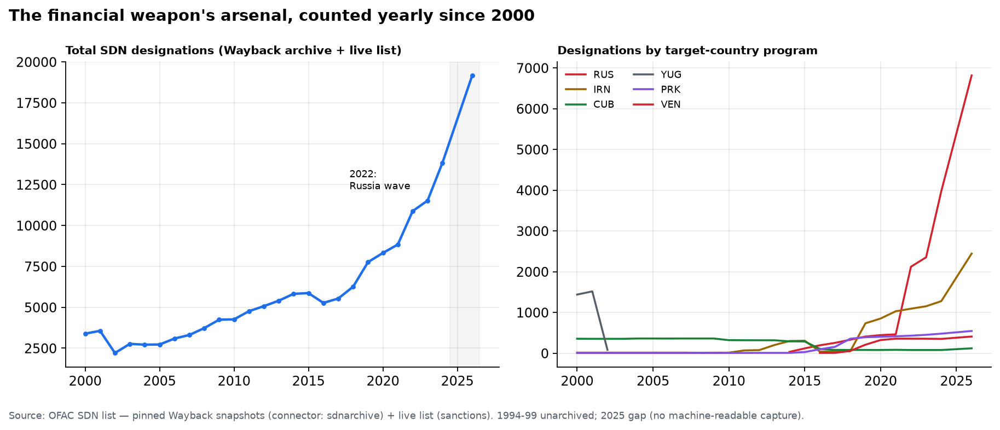

**The chapter's biggest caveat is now a series.** The first build could only show EUSANCT's case counts to 2015 and one live OFAC snapshot; the Wayback Machine holds one machine-readable SDN list per year back to 2000 (connector `sdnarchive` — 25 pinned snapshots, the `ticarchive` trick applied to sanctions). The count: **3,387 designations in 2000 → 19,170 today, 5.7×**. The program-level lines carry the diplomatic history: Milosevic-era Yugoslavia dominates the 2000 list (~1,438 entries) and vanishes by 2003; Iran steps down 305 → 39 at the JCPOA and back up after withdrawal; Cuba dips at the 2016 thaw; and Russia goes **462 (2021) → 2,120 (Oct 2022) → 6,815 (2026)** — the largest sanctions campaign ever mounted, an order of magnitude in four years. Honest gaps: 1994–99 exists only as unarchived FTP links, and 2025 left no machine-readable capture — the gaps are the archive's, not the ledger's.

### F17 — Does the weapon work? The success rate, computed

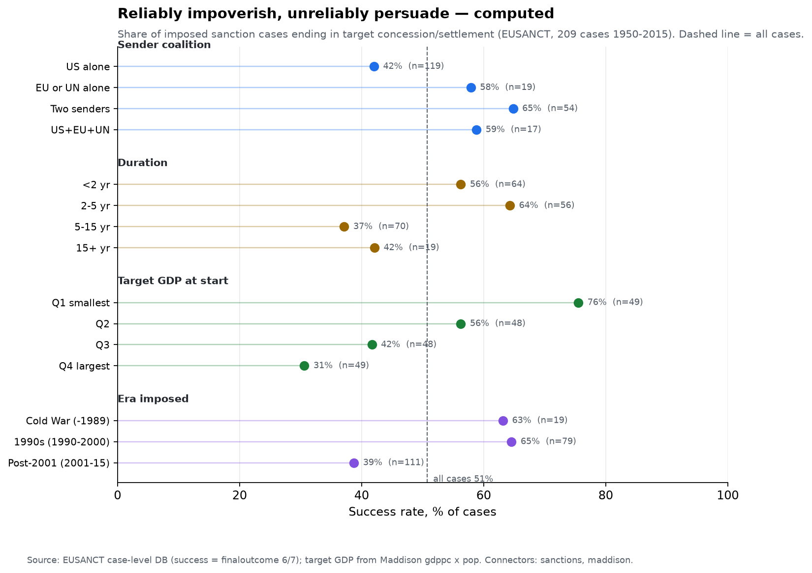

F12 ended on a claim — the lever reliably impoverishes, unreliably persuades. Here it is as arithmetic. Of the 326 EUSANCT episodes, **209** went past threat to actual imposition (1950-2015); EUSANCT codes a case successful when it ends in target concession or a negotiated settlement (its `finaloutcome` 6/7 — the episode-level coding agrees in 208 of 209 cases). The overall record: **106 of 209 — a 50.7% coin flip**. Cut four ways, the coin is loaded:

**Coalitions persuade; lone senders punish.** The US acting alone — the modal case, **n=119** — wins **42%** of the time; any two senders together win **65%**, and the full US-EU-UN combination **59%** (n=17, so read gently). Multilateral beats unilateral by **19 points** (63% vs 44%, z≈2.6) — the veto-shaped irony being that the hardest coalition to assemble adds nothing over two senders.

**Small targets fold; great powers absorb.** By target GDP at imposition (Maddison, 2011 int'l $), success falls monotonically across quartiles: **76% → 56% → 42% → 31%** from the smallest economies (below ~$15bn) to the largest (above ~$190bn — the Russias, Chinas, Irans of the ledger). Sanctioning a micro-state is coercion; sanctioning a great power is a tax both sides agree to pay.

**Long sanctions are failed sanctions.** Cases resolved within five years succeed **60%** of the time; past five years the rate drops to **37-42%**, and the **33 cases still open at the 2015 horizon had succeeded in exactly 3 — 9%**. This is survival selection, not dosage: sanctions that work, end; what persists is the residue that didn't (North Korea, Cuba — F12's mainstays).

**And the lever is dulling.** Cold-War-era impositions succeeded **63%** (thin cell: n=19 — EUSANCT's authoritative coverage starts in 1989) and the unipolar 1990s **65%**; post-2001 cases succeed **39%**. Part is mechanical — 25 of 111 post-2001 cases were still open, coded failures-so-far — but the gap survives the correction: closed post-2001 cases succeed **49%** vs the 1990s' **68%**. The era of maximum sanctioning (F5's 79 simultaneous US cases) is the era of minimum persuasion: as the instrument got cheap, it got used on harder targets, unilaterally, for longer.

All of this is correlation over a small ledger, not causal identification — senders choose their targets, and the US alone picks the biggest, hardest ones. And the panel ends in 2015: the Russia-era secondary-sanctions machine is entirely out of frame (see Caveats).

### F18 — The chips-and-lists merger: export controls, counted

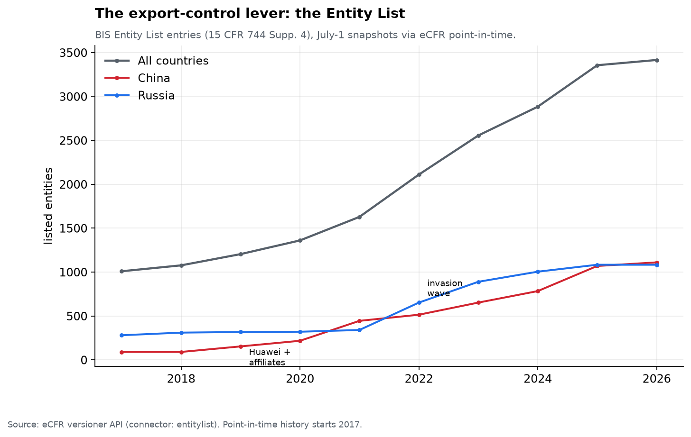

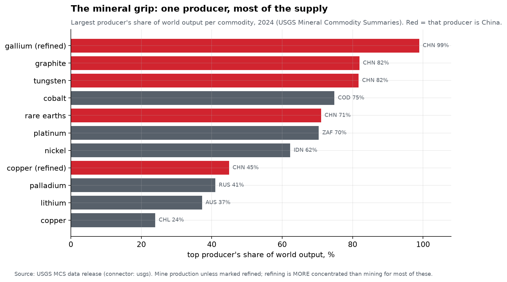

**The technology lever and the sanctions lever fused, and both halves are now counted.** The BIS Entity List — the export-control register that decides who may buy American technology — carried **90 Chinese entities in 2017 and 1,110 by mid-2026** (connector `entitylist`, eCFR point-in-time; the Huawei wave of 2019 and the 2022 Russia wave both visible). The other half of the merger is the ground the lists fight over: of eleven critical-mineral supply chains in the USGS data (connector `usgs`), **China is the largest producer in five** — and where it refines rather than mines, the grip tightens to **~99% of gallium**, the metal it export-controlled in 2023 in direct answer to the chip lists. The DRC's ~75% of cobalt and the lithium duopoly round out a map in which *every* chip-era input has a one- or two-country chokepoint.

### F19 — The food lever, computed at last

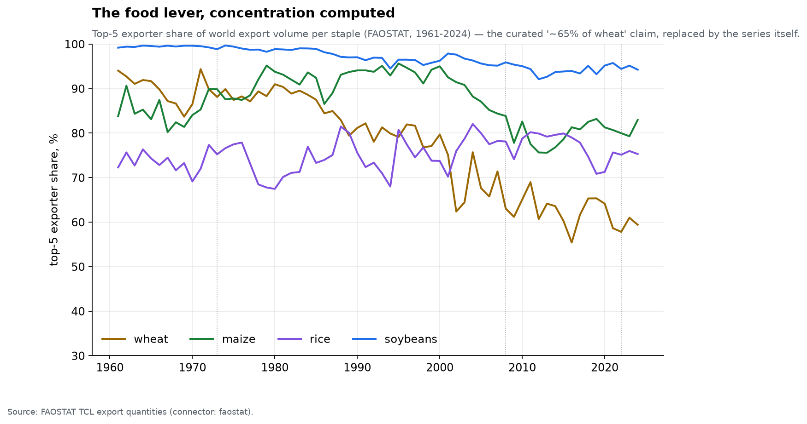

**The curated "~65% of wheat" claim — the AI panel split on it — is replaced by the series itself** (connector `faostat`, export volumes 1961–2024). Top-5 exporter concentration in 2023: **wheat 61%, maize ~80%, rice ~75%, soybeans 95%**. Two readings. First, the panel's skepticism was right in the letter (65% was high for recent wheat) and wrong in the substance — every staple clears 60%, and soybeans are the most concentrated commodity in this report outside semiconductors. Second, the *composition* changed: the US share of wheat exports fell as Russia's rose past it in 2016 — the food lever, like oil (F11), migrated toward the sanctioned side of the ledger, which is exactly why grain moved every time the sanctions lever did (F4).

### F20 — The arms pipeline: who arms the world

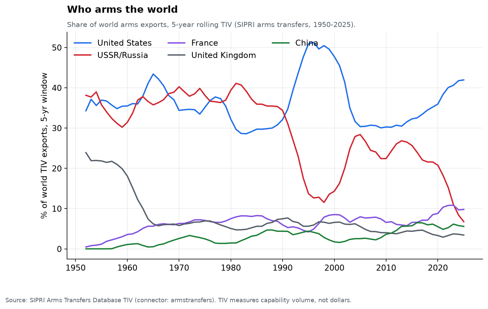

**Chapter 2 measured the arms trade in dollars; the capability measure tells a starker story** (connector `armstransfers` — SIPRI's TIV volume index, the JS-walled database's legacy endpoint still answers). The US share of world arms exports is **~42% in the latest five years — and rising**, while Russia's has collapsed to **~7%** (from a Soviet-era lever that armed half the world: the USSR's all-time TIV total still exceeds America's). France quietly became the #2 exporter. India remains the all-time largest importer — the biggest single customer of the lever's output has spent seventy years buying from both sides.

### F21 — The IMF's pen

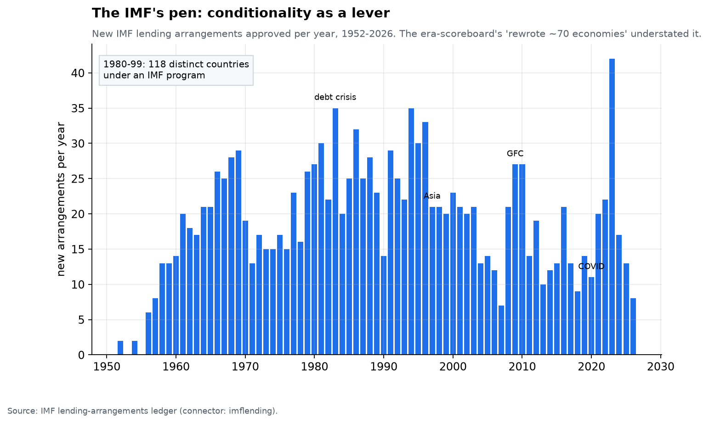

**"IMF conditionality rewrote ~70 economies" — the era scoreboard's curated line — turns out to be an undercount.** The Fund's own arrangements ledger (connector `imflending`, 1952→) shows **118 distinct countries under an IMF program at some point in 1980–1999** — three-fifths of all the sovereigns there were. The wave structure is the lever's signature: ~35 new arrangements in 1983 alone (the debt crisis), spikes at 1997 (Asia) and 2020 (COVID), and a standing base of dozens of countries whose fiscal law is co-written in Washington in any given year.

### F22 — The coercion map: who can actually be squeezed

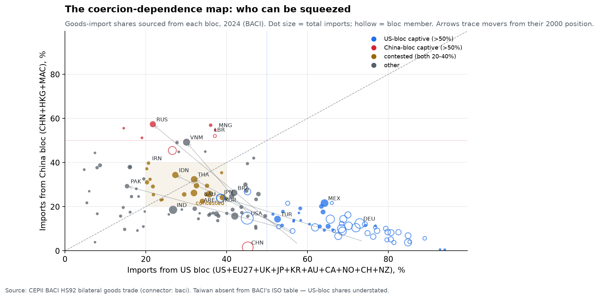

**The F8 map says who holds each lever; this one adds the missing column — on whom does it bite?** Each dot is a country, placed by the share of its goods imports sourced from the two lever-holding blocs (BACI bilateral trade): on the x-axis the sanctions-capable West (US + EU27 + UK, Japan, Korea, Australia, Canada, Norway, Switzerland, New Zealand), on the y-axis China + Hong Kong + Macao. Import dependence is the closest thing the warehouse has to a contestability gauge: a bloc that supplies most of what you buy can, in extremis, stop selling.

**The anchor first: the US bloc still supplies 52% of the world's $21.9tn in goods imports; the China bloc 17%.** In 2000 those figures were **68%** and **7%**. The population of the map has migrated accordingly. Of the **102** third countries importing more than $5bn (bloc members excluded — an EU state "captive" to the EU is not a coercion fact), **65 sourced a majority from the US bloc in 2000; today 21 do**. Five are now China-captive — **Russia (57%)**, Liberia, Tajikistan, Mongolia, Guinea (top movers since 2000: Liberia +108, Russia +90, Ghana +76, Iran +75, Cameroon +75, Venezuela +61, Algeria +61) — and **20 sit in the contested box** where both blocs supply 20–40%; in 2000 there were four. The median third country's China-bloc share went **3.5% → 22%** while its US-bloc share fell **56% → 35%**. Twenty-four countries flipped from US-leaning to China-leaning; **none flipped the other way**.

**Russia is the extreme mover** — **58/3 in 2000 to 22/57 in 2024**, the F5 sanctions arc made real in trade shares — but the strategically live dots are the near-balanced giants: **Thailand (32% vs 32%, a dead heat)**, **Indonesia (27 vs 34)**, **India (27 vs 19)**, the **UAE (36 vs 26)**, with Brazil (42 vs 26) and Saudi Arabia (39 vs 24) hovering just outside the box. These are the swing states both blocs must bid for, and the import mix is the running score of the bid. Two hollow circles complete the picture: **China itself sources 45% of its imports from the US bloc — three times America's 15% dependence on China's** — and Japan and Korea sit *inside* the contested box by imports despite the alliance. The squeeze runs both ways, and unevenly.

Honest limits: this is goods trade only — the services, finance and technology-licensing channels where the US bloc's grip is strongest are invisible here, so the map *understates* Western leverage. So does a data gap: CEPII's country table gives Taiwan no ISO code, so Taiwanese exports — chips above all — are missing from every country's US-bloc share. And an import share is not coercion power: 20% dependence in un-substitutable goods outranks 50% in commodities. Read the map as exposure, not outcome.

### F23 — The dollar system has a membership roster

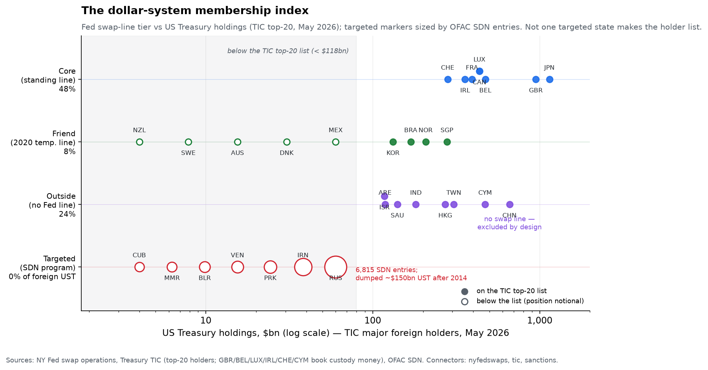

**Sanctions ride on dollar rails, so membership is a real thing — here is the
roster.** Score every significant state on two questions: *does the Fed backstop
your banks in a panic* (swap-line tier, curated from the record and verified
against the NY Fed operations file), and *how much of your savings sit inside US
jurisdiction* (Treasury holdings, TIC May 2026)? Four tiers fall out. The
**core** — Japan, the UK, Switzerland, Canada and the euro area, whose central
banks hold permanent standing swap lines — books **$4.5tn** of Treasuries,
**48%** of the **$9.4tn** held abroad. The **friends** — the nine central banks
handed temporary lines on 19 March 2020 — add **8%**; six of them actually drew
(**$74bn**: Singapore $25bn, Korea $20bn, Mexico $15bn, Denmark $8bn, Norway
$5bn, Australia $1bn) while Brazil, Sweden and New Zealand held the offer
unused. Together the swap perimeter shelters **56%** of foreign-held Treasuries.

**Outside the perimeter sit the savers with no safety net** — **24%** of the
foreign total, led by China's **$659bn**, down from a computed **$1,277bn** peak
in 2013 (ticarchive): still the #3 holder, but half out the door in a decade.
The PBoC has never had a Fed line — the exclusion is by design. Taiwan
(**$306bn**), Hong Kong, India and the Gulf keep their dollars inside US
jurisdiction with nothing but good behaviour protecting them.

**And the targeted tier holds nothing.** Russia (**6,815** SDN entries), Iran
(**2,443**), North Korea (**544**), Venezuela (**408**), Belarus, Cuba,
Myanmar — not one appears on the TIC major-holders list (floor: **$118bn**).
Russia sold its ~$150bn Treasury book in 2014–18, between Crimea and the full
blocking sanctions — exit precedes targeting, or follows the first warning shot
fast. That is the lever's paradox in one picture: the states America most wants
to squeeze have already left the room, and the **$9.4tn** that remains belongs
overwhelmingly to friends it will never squeeze.

Honest caveats: TIC books by custody location — Belgium's **$472bn** is
Euroclear's omnibus account, not Brussels' savings, and the six custody centers
(GBR/BEL/LUX/IRL/CHE/CYM) hold **32%** of the foreign total, some of it for
outside-tier (or even targeted) owners; the top-20 list covers **80%** of
foreign holdings, so absence means "under $118bn," not zero; and membership is
not immunity — Taiwan holds $306bn with no line, deep inside the rails with no
claim on the lifeboat.

### F24 — Contestability is a rate: the erosion audit

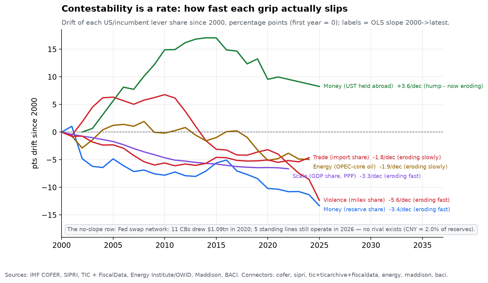

**"Contested" is prose; erosion is a number.** For every grip in the F8 map that
the warehouse can express as a share, we fit the actual slippage — percentage
points per decade since 2000, with a since-2015 check for acceleration:

| Lever (metric) | 2000 | Now | pts/decade | since 2015 | Verdict |
|---|---|---|---|---|---|
| Money — USD share of FX reserves | 69.7% | **56.4%** (2025) | **−3.4** | −7.6 | eroding fast |
| Violence — US share of world milex | 45.9% | **33.5%** (2025) | **−5.7** | −7.4 | eroding fast |
| Money — UST held abroad, % of federal debt | 16.6% (2002) | **24.8%** (2025) | **+3.6** | −8.9 | hump — now eroding |
| Energy — OPEC-core share of oil output | 40.7% | **35.7%** (2024) | **−1.9** | −6.3 | eroding slowly |
| Scale — US share of world GDP (PPP) | 21.6% | **14.9%** (2022) | **−3.3** | −1.1 | eroding fast |
| Trade — US share of world goods imports | 18.6% | **14.0%** (2024) | **−1.8** | −0.4 | eroding slowly |

Two results surprise. First, the fastest-eroding grip is not the dollar — it is
the *violence* lever: the US milex share fell from a war-on-terror peak of
**52.7% (2010)** to **33.5% (2025)**, a slide of **−5.7 points per decade**
against the reserve share's −3.4 (the reserve slide is accelerating, though:
−7.6/decade since 2015, and 2024→25 alone shed two points). Second, the one
line that *rose* over the window is a hump: Treasuries held abroad climbed from
**16.6%** of federal debt (2002) to **33.6% (2014)** and have since fallen to
**24.8%** — not because the world sold (foreign holdings grew **$1.03tn →
$9.35tn**), but because Washington now issues faster than foreigners buy. The
marginal buyer of American debt moved home.

**What does not erode is the part with no share to lose.** F10's third gauge —
the swap lines — has no competitor to take points from: **11** central banks
drew **$1.09tn** of emergency dollars in 2020, **five** standing lines still
settle weekly in 2026, and the renminbi, a decade into internationalization,
holds **2.0%** of allocated reserves (the euro: 20.4%, barely above its 1999
debut). The audit therefore sharpens F10's verdict rather than overturning it:
*every* American share is slipping — arms, output, imports, reserves — at one
to six points a decade, but the plumbing underneath the money lever (swap
monopoly, the $9tn-deep Treasury market, buyer-of-last-resort status that has
held flat at ~14% of world imports for a decade) still has no substitute. Shares
erode; the machinery, so far, does not.

## Appendix — the intangible levers, proxied

The honesty section above names the levers this report cannot measure: religion, ideology, narrative. They are real — arguably the master levers, since they decide what people will fight for, pay for, and die for — but there is no warehouse series for belief. What can be counted is the machinery: who holds the attention, who owns the pipes, how many people are enrolled in each faith. Every number below is a proxy, and every row names what the proxy misses.

**Attention.** The intermediation of human attention is more concentrated than it has ever been. Meta's four apps reach **3.56 billion people a day** (March 2026, +4% y/y) — roughly **43% of humanity, daily**. Instagram alone passed **3 billion** monthly users in September 2025; Facebook and WhatsApp had each crossed 3 billion earlier that year. YouTube sits somewhere around **2.5–2.9 billion** monthly (Google stopped publishing an official count; its last confirmed figure was 2 billion logged-in users, 2023), TikTok between **1.6 and 2.0 billion** (the company has said nothing since "1 billion" in 2021), and WeChat's **1.43 billion** is effectively everyone in China. Upstream of them all, Google still routes **~90%** of the world's search referrals — a share that dipped below 90% in late 2024 for the first time since 2015, the first measurable crack. The anchor for scale: at the TV era's peak, the three US network evening newscasts drew **52.1 million** viewers a night — about **23% of all Americans**, briefed nightly by three editorial desks. Today the same broadcasts draw ~**19 million**, under 6%. The chokepoint did not disappear; it moved — from three newsrooms to a handful of ranking algorithms with fifty times the reach. The proxy's limit is the obvious one: reach is not persuasion. A daily active person is a login, not a changed mind.

**Narrative.** Here we cut a famous number. The folk claim — "six companies control 90% of US media" — traces to Ben Bagdikian's *Media Monopoly* lineage and a 2012 Business Insider infographic, and no scholarship supports it at that breadth. The careful accounting, Eli Noam's *Media Ownership and Concentration in America* (OUP 2009), found the top five firms' share of US mass-media revenue rose from **13% in 1984 to 26% in 2005** — real consolidation, nowhere near ninety. The claim only approaches truth sector by sector: the big six held stakes in **~77%** of pay-TV channels at the meme's peak. The genuinely alarming concentration is local, and it points two directions at once. Downward, toward absence: Medill counts **213 US counties with no local news source at all**, **1,500+** more down to a single outlet, **~3,500 newspapers gone since 2005** — about 40% of all local papers, with combined circulation down from 120 million to 38 million. And upward, toward single owners: in March 2026 the FCC waived its 39% national reach cap for the first time, letting Nexstar close its $6.2B TEGNA purchase — **one owner, 265 stations, ~80% of US TV households**, with Sinclair's 185 stations reaching another ~40%. The honest summary: national media is oligopolistic but contested; local narrative infrastructure is where actual monopoly — or a vacuum — now lives. The proxy's limit: outlet counts measure pipes, not the editorial line flowing through them.

**Belief.** Religion's installed base dwarfs every platform's, and it is old enough that the authorities disagree about its size — instructively. Christianity: **2.3 billion** adherents (Pew, 2020 data) or **2.65 billion** (World Christian Database, mid-2025); the ~300-million gap between survey self-identification and affiliation registers is itself the measurement lesson. Islam: **2.0 billion** and the fastest-growing — **+347 million** over 2010–20, more than all other groups combined, and essentially all of it fertility rather than conversion. The religiously unaffiliated are now the third-largest bloc at **1.9 billion** by Pew's count — but only **0.9 billion** by WCD's, a disagreement that hinges almost entirely on how you classify China. Buddhism is the one major group Pew finds shrinking (**343M → 324M**), though WCD, counting affiliation more broadly, disagrees there too. One institution shows what belief-scale infrastructure looks like: the Catholic Church counts **1.406 billion** baptized members and operates **229,090 schools** (64.6 million pupils) and **103,951** health and charity institutions, including **5,377 hospitals** — plausibly the largest non-state education and health network on earth (Vatican statistical yearbook via Agenzia Fides, 2023 data). But baptized is not practicing. Weekly attendance runs **~79%** in the average sub-Saharan African country, **25%** in the United States, and in Western Europe the median country manages only **22% even monthly** — while **68.9%** of all Christians now live in the Global South, up from 17.6% in 1900. The lever did not weaken; it migrated. The proxies' shared limit deserves the last word: attendance is not faith, membership is not mobilization, and none of these numbers can tell you when a belief becomes an army.

## Caveats

- **SIPRI constant-2024 series**: the 2025 figures are at 2025 prices in the
  source file's final column; treat final-year cross-country comparisons as
  approximate. World total only meaningful from 1988 (USSR gap).
- **EUSANCT horizon is 2015** for the case-level arc (F5) — but the post-2015 boom
  is now carried by the yearly SDN ledger (F16, `sdnarchive`), which has its own
  gaps: 1994-99 was never archived and 2025 left no machine-readable capture.
- **The OFAC snapshot is designations, not severity**: 6,815 Russia entries and
  173 Cuba entries are not 39× more sanction — Cuba's is a comprehensive embargo
  held in one program.
- **GSDB (1,547 cases, 1950-2023) would be the better spine** but is
  email-request-only, which breaks `econ refresh` reproducibility; its headline
  arc informs the prose and is flagged curated where used.
- **Era scoreboard is curated** — but its two panel-contested numbers are now
  settled by data: UK coal 1870 computes to 52% (`coalhist`), and staple-grain
  concentration is a series (F19, `faostat`). Remaining curated rows keep cites.
- **The arsenal rule codes wars** (F13): sides, outcomes, and war-kind follow
  standard histories, but coalition membership and phase boundaries (Iraq 2003)
  are judgment calls; the ledger ships with its codings visible.
- **Nuclear counts are estimates** (F15): arsenals are state secrets; FAS/SIPRI
  figures carry ~10% uncertainty and the Soviet 1986 peak spans 40,000-45,000.
- **Taiwan is absent from BACI's country table**, so every US-bloc trade share
  (F22) is understated by exactly the chips.
- **Oil-producer shares** use OWID/Energy Institute production (energy content),
  not export volumes; "OPEC+" grip is about exportable surplus and spare
  capacity, which shares only proxy.

*Next: Chapter 12 — Dynasties: whether the hands that pull the levers can keep them across centuries.*
